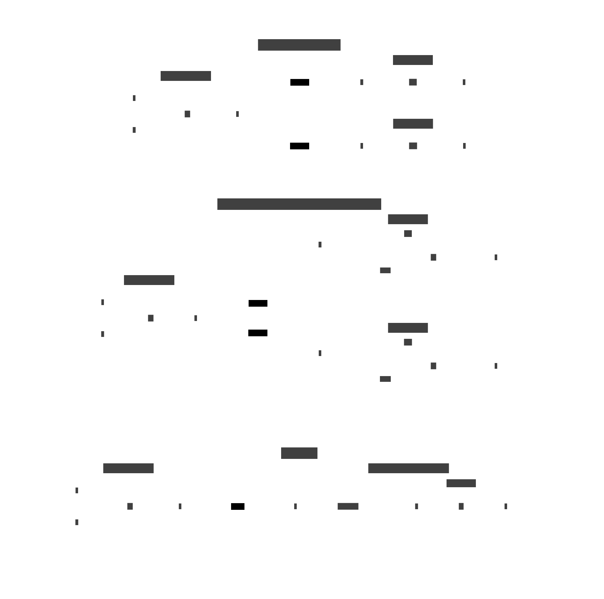

# Functional Programming

## Introduction




## Composition


### Examples

implementation of "composition" and usage

#### C\#

```csharp
static Func<Ta, Tc> Compose<Ta, Tb, Tc>(
    Func<Tb, Tc> g,
    Func<Ta, Tb> f
) {
    return x => g(f(x));
}

// use:
var h = Compose(g,f);
```

#### Ruby

```ruby
# Patch Proc and add * operator
class Proc
    def self.compose(g, f)
        lambda { |*args| g[f[*args]] }
    end

    def *(f)
        Proc.compose(self, f)
    end
end

# use:
h = g * f
```

#### C++

```c++
#include <functional>

template <typename A, typename B, typename C> 
std::function<C(A)> compose(
    std::function<C(B)> g,
    std::function<B(A)> f
) {
    return [g,f](A x) { return g(f(x)); };
}

// use:
auto h = compose(g,f);
```

#### JavaScript

```js
const compose = (g, f) => x => g(f(x));

// use:
const h = compose(g,f);
```

#### Python

```py
def compose(g, f):
    return lambda x: g(f(x))

# use:
h = compose(g,f)
```

#### Haskell

Compose natively exists in form of the . operator

```hs
h = g . f
```
