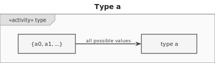
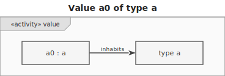
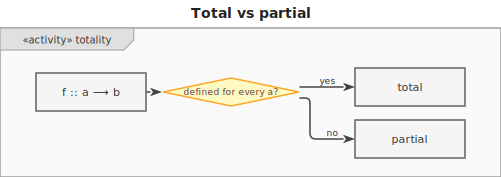
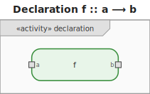
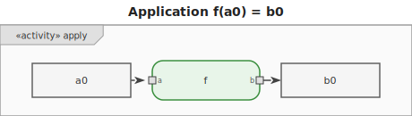

# 1. Function

> Mathematical background: [Lambda Calculus](../ct/lambda-calculus.md) — abstraction, β-reduction,
> and the Church-Turing thesis

A **function** `f :: a ⟶ b` takes a value of type `a` (the domain) and produces a value of type `b`
(the codomain).

## Key distinctions

### Pure vs impure

A **pure function** has no side effects — its result depends solely on its arguments. You could
memoize it. It is easy to test and reason about.

An **impure function** may read/write files, access global state, call non-deterministic operations
(time, RNG), or throw exceptions. These effects are _not_ visible in the type signature.

### Total vs partial

A **total function** produces a result for every value in the domain.

A **partial function** is undefined on some inputs (e.g. division by zero, head of an empty list).

## Declaration and application

- **Declaration**: `f :: a ⟶ b` — `f` maps any value of type `a` to a value of type `b`.

- **Application**: `f(a0) = b0` — applying `f` to a specific value `a0 :: a` yields `b0 :: b`.

