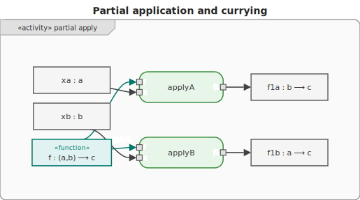

# 4. Partial Application & Currying

These two techniques are closely related but distinct. Both build on functions being first-class
values.



## Partial application

**Partial application** fixes one or more (but not all) arguments of a function, producing a new
function of lower arity. The original function may take any number of arguments.

```text
f2  :: (a, b) ⟶ c          -- two-argument function

fix a=x:   f1a :: b ⟶ c    -- one argument fixed; one remains
fix b=y:   f1b :: a ⟶ c    -- other argument fixed; one remains
```

The key result is a **new function** that "remembers" the fixed value as a closure.

## Currying

**Currying** transforms a multi-argument function into a **chain of single-argument functions**. No
argument is applied yet — only the shape of the function changes.

```text
f2     :: (a, b) ⟶ c          -- takes a pair
curry  :: ((a, b) ⟶ c) ⟶ (a ⟶ b ⟶ c)
curry f2 :: a ⟶ (b ⟶ c)       -- takes a, returns a function that takes b
```

## How they relate

> **Currying** transforms the function signature. **Partial application** uses that signature to
> produce a specialised function.

A curried function makes partial application trivial: applying a curried `f :: a ⟶ b ⟶ c` to just
`x :: a` is partial application — the result `f x :: b ⟶ c` is the specialised function.

In Haskell and F#, all functions are **curried by default**, so every multi-argument function is
already in the form that enables effortless partial application.

## Examples

Each example shows both operations: first currying (or how the language encodes it), then partial
application to produce a specialised `add5`.

### C\#

```csharp
// C# functions are not curried by default.

// Currying: manually rewrite add to return a function
Func<int, Func<int, int>> curriedAdd = a => b => a + b;

// Partial application: apply only the first argument
Func<int, int> add5 = curriedAdd(5);   // b => 5 + b

add5(3); // 8

// Alternative: partial application without currying, via a closure
Func<int, int, int> add = (a, b) => a + b;
Func<int, int> add5b = b => add(5, b); // closure captures 5
add5b(3); // 8
```

### F\#

```fsharp
// F# functions are curried by default — no manual currying needed.
let add a b = a + b
// add : int -> int -> int  (already a -> b -> c)

// Partial application: supply only the first argument
let add5 = add 5   // int -> int
add5 3             // 8

// Explicit curry of a tupled function:
let addTupled (a, b) = a + b
let curriedAdd = fun a b -> addTupled (a, b)
let add5c = curriedAdd 5
add5c 3  // 8
```

### Ruby

```ruby
# Ruby lambdas are not curried by default.

# Currying: call .curry to transform a lambda
add = ->(a, b) { a + b }
curried_add = add.curry          # returns ->(a) { ->(b) { a + b } }

# Partial application: supply only the first argument
add5 = curried_add.(5)           # ->(b) { 5 + b }
add5.(3)                         # 8

# Alternative: partial application via a closure
add5b = ->(b) { add.(5, b) }
add5b.(3)                        # 8
```

### C++

```cpp
#include <functional>

// C++ lambdas are not curried by default.

// Currying: a lambda that returns a lambda
auto curriedAdd = [](int a) {
    return [a](int b) { return a + b; };
};

// Partial application: supply only the first argument
auto add5 = curriedAdd(5);   // lambda: (int b) -> 5 + b
add5(3);                     // 8

// Alternative: partial application via std::bind
auto add = [](int a, int b) { return a + b; };
auto add5b = std::bind(add, 5, std::placeholders::_1);
add5b(3);                    // 8
```

### JavaScript

```js
// JavaScript functions are not curried by default.

// Currying: manually write add as a chain of arrow functions
const curriedAdd = (a) => (b) => a + b;

// Partial application: supply only the first argument
const add5 = curriedAdd(5); // b => 5 + b
add5(3); // 8

// Alternative: partial application via bind (no currying needed)
function add(a, b) {
  return a + b;
}
const add5b = add.bind(null, 5);
add5b(3); // 8
```

### Python

```py
# Python functions are not curried by default.

# Currying: manually write add as nested lambdas
curried_add = lambda a: lambda b: a + b

# Partial application using the curried form
add5 = curried_add(5)   # lambda b: 5 + b
add5(3)                 # 8

# Alternative: partial application via functools.partial (no currying needed)
from functools import partial

def add(a, b):
    return a + b

add5b = partial(add, 5)
add5b(3)  # 8
```

### Haskell

```hs
-- Haskell functions are curried by default.
add :: Int -> Int -> Int   -- already a -> b -> c
add a b = a + b

-- Partial application: supply only the first argument
add5 :: Int -> Int
add5 = add 5

add5 3  -- 8

-- uncurry converts to a tupled form; curry converts it back
addTupled :: (Int, Int) -> Int
addTupled = uncurry add

curriedAgain :: Int -> Int -> Int
curriedAgain = curry addTupled
```

### Rust

```rust
// Rust closures are not curried by default.

// Currying: a closure that returns a closure
let curried_add = |a: i32| move |b: i32| a + b;

// Partial application: supply only the first argument
let add5 = curried_add(5); // closure: |b| 5 + b
add5(3); // 8

// Alternative: partial application via a capturing closure
let add = |a: i32, b: i32| a + b;
let add5b = |b: i32| add(5, b);
add5b(3); // 8
```

### Go

```go
// Go functions are not curried by default.

// Currying: a function that returns a function
curriedAdd := func(a int) func(int) int {
	return func(b int) int { return a + b }
}

// Partial application: supply only the first argument
add5 := curriedAdd(5)
add5(3) // 8

// Alternative: partial application via a closure
add := func(a, b int) int { return a + b }
add5b := func(b int) int { return add(5, b) }
add5b(3) // 8
```
