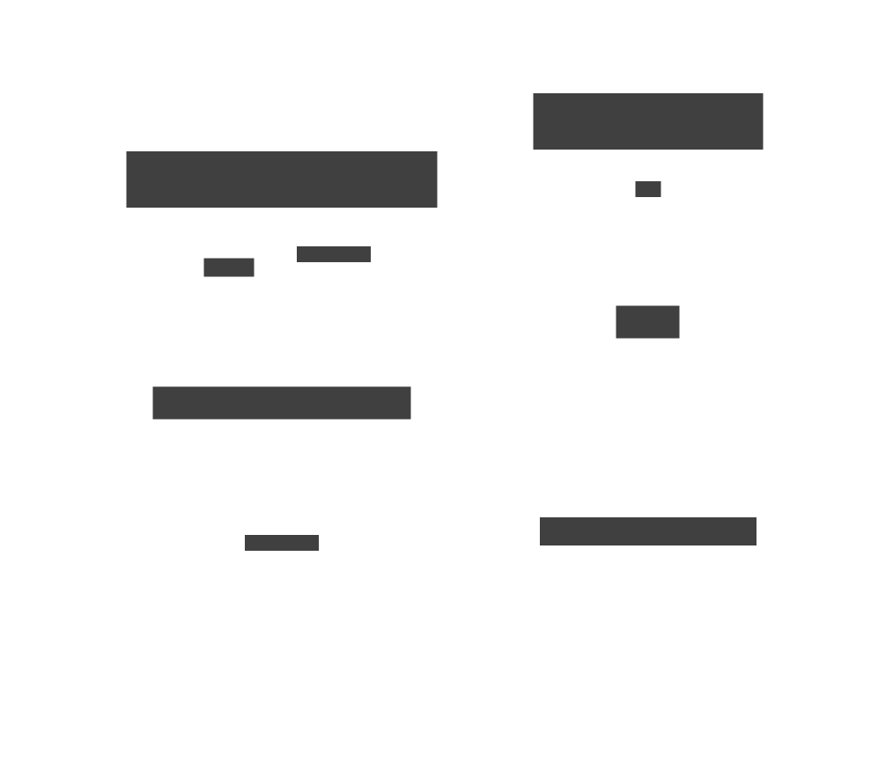

# 5. Higher-Order Functions

A **higher-order function** (HOF) is a function that either takes one or more functions as
arguments, or returns a function as its result — or both. Because [1. Function](./01-function.md)
established that functions are values, passing them around is no different from passing an integer.
Combined with [4. Composition](./04-composition.md), HOFs are the primary mechanism by which
functional programs build large behaviour from small, reusable pieces.



## Core combinators

| Combinator     | Signature                           | What it does                                       |
| -------------- | ----------------------------------- | -------------------------------------------------- |
| `map` / `fmap` | `(a → b) → [a] → [b]`               | Apply a function to every element                  |
| `filter`       | `(a → Bool) → [a] → [a]`            | Keep elements satisfying a predicate               |
| `zipWith`      | `(a → b → c) → [a] → [b] → [c]`     | Combine two lists element-wise                     |
| `flip`         | `(a → b → c) → b → a → c`           | Swap the first two arguments                       |
| `const`        | `a → b → a`                         | Return first argument, ignore second               |
| `id`           | `a → a`                             | Return the argument unchanged                      |
| `on`           | `(b → b → c) → (a → b) → a → a → c` | Apply a transform before a comparison              |
| `fix`          | `(a → a) → a`                       | Find the fixed point; enables recursion as a value |

## Point-free style

A function defined without mentioning its arguments — only by combining other functions — is
**point-free** (or _tacit_). It emerges naturally from composition and HOFs:

```text
-- point-ful: argument xs is mentioned explicitly
sumSquares xs = sum (map square xs)

-- point-free: argument suppressed; read as a pipeline of operations
sumSquares = sum . map square
```

Point-free style emphasises _what_ the transformation is rather than _how_ values flow through it,
and composes cleanly with other functions.

## Closures

When a HOF returns a function, that returned function may **capture** variables from its surrounding
scope — this is a **closure**:

```text
addN n = \x -> x + n      -- returns a function; n is captured

add3 = addN 3             -- add3 is \x -> x + 3
add3 10 = 13
```

This is the mechanism behind [6. Currying & Partial Application](./06-currying.md): a curried
function is a chain of closures, each capturing the arguments received so far.

## Motivation

```text
-- without HOFs: a separate function for every type of transformation
sortByAge   users = sortBy (\a b -> compare (age a)  (age b))  users
sortByName  users = sortBy (\a b -> compare (name a) (name b)) users
sortByScore users = sortBy (\a b -> compare (score a)(score b)) users
-- every new sort key needs a new function; logic is duplicated
```

```text
-- with HOFs: one combinator handles all cases
sortOn :: (a -> b) -> [a] -> [a]
sortOn key = sortBy (compare `on` key)

sortByAge   = sortOn age
sortByName  = sortOn name
sortByScore = sortOn score
-- the transformation (which key to use) is passed in as a function
```


## Examples

### C\#

```csharp
using System;
using System.Collections.Generic;
using System.Linq;

// HOF: takes a function, returns a function (curried-style via Func<>)
static Func<int, int> Adder(int n) => x => x + n;
var add3 = Adder(3);
Console.WriteLine(add3(10)); // 13

// map, filter, zipWith via LINQ
int[] nums = [1, 2, 3, 4, 5];
var squares   = nums.Select(x => x * x);          // map
var evens     = nums.Where(x => x % 2 == 0);      // filter
var doubled   = nums.Zip([10, 20, 30, 40, 50], (a, b) => a + b); // zipWith

// flip: swap arguments of a two-argument function
static Func<B, A, C> Flip<A, B, C>(Func<A, B, C> f) => (b, a) => f(a, b);
Func<int, int, int> subtract = (a, b) => a - b;
var subtractFrom10 = Flip(subtract);
Console.WriteLine(subtractFrom10(3, 10)); // 10 - 3 = 7
```

### F\#

```fsharp
// HOF returning a function (closure capturing n)
let adder n = fun x -> x + n
let add3 = adder 3
printfn "%d" (add3 10) // 13

// map, filter, zipWith
let nums = [1; 2; 3; 4; 5]
let squares = List.map (fun x -> x * x) nums
let evens   = List.filter (fun x -> x % 2 = 0) nums
let sums    = List.map2 (+) nums [10; 20; 30; 40; 50]

// flip: swap first two arguments
let flip f b a = f a b
let subtract a b = a - b
let subtractFrom = flip subtract
printfn "%d" (subtractFrom 3 10) // 10 - 3 = 7

// Point-free: compose without mentioning arguments
let sumSquares = List.sum << List.map (fun x -> x * x)
printfn "%d" (sumSquares nums) // 55
```

### Ruby

```ruby
# HOF: a method returning a lambda (closure)
def adder(n)
  ->(x) { x + n }
end

add3 = adder(3)
puts add3.call(10) # 13

# map, filter (select), zip
nums = [1, 2, 3, 4, 5]
squares = nums.map  { |x| x * x }        # [1, 4, 9, 16, 25]
evens   = nums.select { |x| x.even? }    # [2, 4]
sums    = nums.zip([10, 20, 30, 40, 50]).map { |a, b| a + b }

# flip via lambda wrapping
flip = ->(f) { ->(b, a) { f.call(a, b) } }
subtract = ->(a, b) { a - b }
subtract_from = flip.call(subtract)
puts subtract_from.call(3, 10) # 7
```

### C++

```cpp
#include <algorithm>
#include <functional>
#include <vector>

// HOF: function returning a lambda (closure)
auto adder(int n) {
    return [n](int x) { return x + n; };
}
auto add3 = adder(3);
// add3(10) == 13

// map (std::transform), filter (std::copy_if), zipWith (std::transform on two ranges)
std::vector<int> nums = {1, 2, 3, 4, 5};
std::vector<int> squares(nums.size());
std::transform(nums.begin(), nums.end(), squares.begin(),
               [](int x) { return x * x; });

// flip: reverse argument order of a binary function
template<typename F>
auto flip(F f) {
    return [f](auto b, auto a) { return f(a, b); };
}
auto subtract  = [](int a, int b) { return a - b; };
auto fromRight = flip(subtract);
// fromRight(3, 10) == 7
```

### JavaScript

```js
// HOF: function returning a function (closure)
const adder = (n) => (x) => x + n;
const add3 = adder(3);
console.log(add3(10)); // 13

// map, filter, zipWith (Array methods)
const nums = [1, 2, 3, 4, 5];
const squares = nums.map((x) => x * x); // [1, 4, 9, 16, 25]
const evens = nums.filter((x) => x % 2 === 0); // [2, 4]
const sums = nums.map((x, i) => x + [10, 20, 30, 40, 50][i]); // zipWith (+)

// flip
const flip = (f) => (b, a) => f(a, b);
const subtract = (a, b) => a - b;
const subtractFrom = flip(subtract);
console.log(subtractFrom(3, 10)); // 7

// point-free: compose without explicit argument
const compose = (f, g) => (x) => f(g(x));
const sumSquares = (xs) => xs.reduce((a, b) => a + b, 0);
const sumOfSquares = compose(sumSquares, (xs) => xs.map((x) => x * x));
console.log(sumOfSquares(nums)); // 55
```

### Python

```python
from functools import reduce
from typing import Callable, TypeVar

A = TypeVar("A")
B = TypeVar("B")
C = TypeVar("C")

# HOF: function returning a function (closure)
def adder(n: int) -> Callable[[int], int]:
    return lambda x: x + n

add3 = adder(3)
print(add3(10))  # 13

nums = [1, 2, 3, 4, 5]
squares = list(map(lambda x: x * x, nums))          # [1, 4, 9, 16, 25]
evens   = list(filter(lambda x: x % 2 == 0, nums))  # [2, 4]
sums    = [a + b for a, b in zip(nums, [10, 20, 30, 40, 50])]

# flip
def flip(f: Callable[[A, B], C]) -> Callable[[B, A], C]:
    return lambda b, a: f(a, b)

subtract     = lambda a, b: a - b
subtract_from = flip(subtract)
print(subtract_from(3, 10))  # 7
```

### Haskell

```hs
-- All built-in: map, filter, zipWith, flip, const, id, on

import Data.Function (on)

-- HOF: function returning a function
adder :: Int -> Int -> Int
adder n x = n + x        -- or: adder = (+)

add3 :: Int -> Int
add3 = adder 3           -- partial application; a closure

-- map, filter, zipWith
squares :: [Int]
squares = map (^2) [1..5]               -- [1, 4, 9, 16, 25]

evens :: [Int]
evens = filter even [1..5]              -- [2, 4]

sums :: [Int]
sums = zipWith (+) [1..5] [10,20..50]   -- [11, 22, 33, 44, 55]

-- flip
subtract10From :: Int -> Int
subtract10From = flip (-) 10            -- \x -> x - 10

-- on: apply a key function before comparing
import Data.List (sortBy)
data User = User { name :: String, age :: Int }
sortByAge :: [User] -> [User]
sortByAge = sortBy (compare `on` age)   -- point-free; `on` is a HOF

-- point-free sum of squares
sumSquares :: [Int] -> Int
sumSquares = sum . map (^2)
```

### Rust

```rust
// HOFs use closures (which capture their environment)
fn adder(n: i32) -> impl Fn(i32) -> i32 {
    move |x| x + n   // closure captures n
}

let add3 = adder(3);
println!("{}", add3(10)); // 13

// map, filter, zip (iterator adaptors — all lazy HOFs)
let nums = vec![1i32, 2, 3, 4, 5];
let squares: Vec<i32> = nums.iter().map(|&x| x * x).collect();
let evens:   Vec<i32> = nums.iter().filter(|&&x| x % 2 == 0).cloned().collect();
let sums:    Vec<i32> = nums.iter()
    .zip([10i32, 20, 30, 40, 50].iter())
    .map(|(&a, &b)| a + b)
    .collect();

// flip: reverse argument order
fn flip<A, B, C>(f: impl Fn(A, B) -> C) -> impl Fn(B, A) -> C {
    move |b, a| f(a, b)
}
let subtract = |a: i32, b: i32| a - b;
let subtract_from = flip(subtract);
println!("{}", subtract_from(3, 10)); // 7
```

### Go

```go
package main

import "fmt"

// HOF: function returning a function (closure)
func adder(n int) func(int) int {
    return func(x int) int { return x + n }
}

// map as a generic HOF (Go 1.18+)
func mapSlice[A, B any](xs []A, f func(A) B) []B {
    result := make([]B, len(xs))
    for i, x := range xs {
        result[i] = f(x)
    }
    return result
}

// filter as a generic HOF
func filter[A any](xs []A, pred func(A) bool) []A {
    var result []A
    for _, x := range xs {
        if pred(x) {
            result = append(result, x)
        }
    }
    return result
}

func main() {
    add3 := adder(3)
    fmt.Println(add3(10)) // 13

    nums    := []int{1, 2, 3, 4, 5}
    squares := mapSlice(nums, func(x int) int { return x * x })
    evens   := filter(nums, func(x int) bool { return x%2 == 0 })
    fmt.Println(squares) // [1 4 9 16 25]
    fmt.Println(evens)   // [2 4]
    // see: github.com/samber/lo for a complete HOF library for Go
}
```
