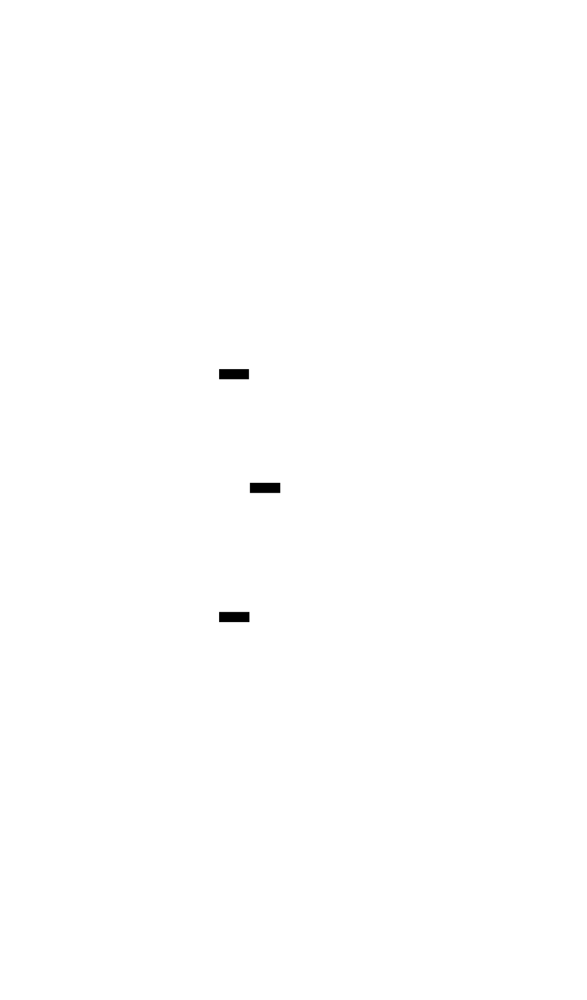
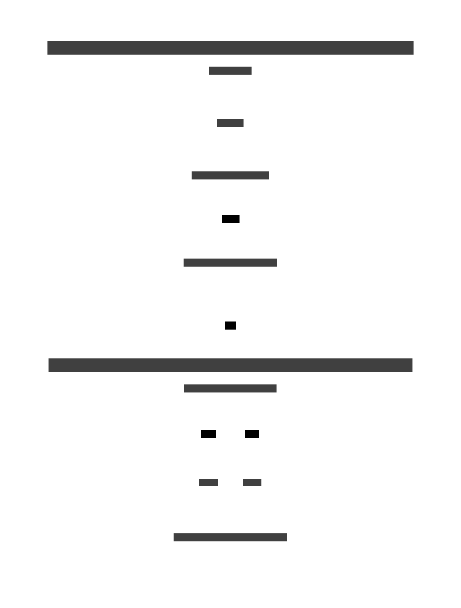

# 7. Algebraic Data Types

> Mathematical background: [Product & Coproduct](../ct/product-coproduct.md) — universal
> constructions for pairing and choice

An **algebraic data type** (ADT) is a type built by combining simpler types in two fundamental ways.
They are the primary tool for modelling data in functional programming.



## Product types

A **product type** holds **all** of its fields simultaneously — it is the logical AND of its parts.
The set of possible values is the _product_ (multiplication) of the sets of each field.

```text
Point = (x: Int, y: Int)    -- a pair: both x AND y must be present
-- if Int has N values: Point has N × N values
```

Called _product_ because `|Point| = |Int| × |Int|`.

In most languages this is a record, struct, or class with fields.

## Sum types

A **sum type** holds **one of** several alternatives — it is the logical OR of its variants. The set
of possible values is the _sum_ (addition) of the sets of each variant.

```text
Shape = Circle(radius: Float)
      | Rectangle(width: Float, height: Float)
      | Triangle(base: Float, height: Float)
-- a Shape value is exactly ONE of these three
```

Called _sum_ because `|Shape| = |Circle| + |Rectangle| + |Triangle|`.

Sum types are also called **tagged unions**, **discriminated unions**, or **variant types**.

## Why ADTs matter

| ADT            | Built from                                                 |
| -------------- | ---------------------------------------------------------- |
| `Maybe<a>`     | `Nothing \| Just a` — sum type (2 variants)                |
| `Either<e, a>` | `Left e \| Right a` — sum type (2 variants)                |
| `List<a>`      | `Nil \| Cons(head: a, tail: List<a>)` — recursive sum type |
| `Tree<a>`      | `Leaf \| Node(value: a, left: Tree<a>, right: Tree<a>)`    |

All the types used by [Functor](./12-functor.md), [Applicative](./13-applicative.md), and
[Monad](./17-monad.md) are ADTs.

## Pattern matching

Sum types are consumed by **pattern matching**, which exhaustively handles every variant:

```text
area : Shape -> Float
area (Circle r)        = π × r × r
area (Rectangle w h)   = w × h
area (Triangle b h)    = 0.5 × b × h
-- Compiler error if a variant is missing — no silent partial function.
```

## Motivation

Without sum types, optional or error-prone values are represented by `null` or sentinel values that
the type system cannot enforce. Any code path can forget to check, leading to null-pointer
exceptions or silent wrong results.

```text
-- Without ADT: null represents absence; compiler cannot enforce checking
function safeDivide(a, b):
    if b == 0: return null   -- caller may forget to check
    return a / b

result = safeDivide(10, 0)
print(result + 1)            -- runtime crash: null + 1
```

```text
-- With ADT: absence is part of the type; caller is forced to handle it
safeDivide :: Int -> Int -> Maybe Int
safeDivide _ 0 = Nothing
safeDivide a b = Just (a / b)

case safeDivide 10 0 of
    Nothing -> "division by zero"
    Just x  -> show (x + 1)   -- x is only in scope inside Just branch
```



## Examples

### C\#

```csharp
// Product type: record (all fields present)
record Point(double X, double Y);

// Sum type: discriminated union via sealed class hierarchy
abstract record Shape;
record Circle(double Radius) : Shape;
record Rectangle(double Width, double Height) : Shape;
record Triangle(double Base, double Height) : Shape;

// Pattern matching
double Area(Shape shape) => shape switch
{
    Circle c      => Math.PI * c.Radius * c.Radius,
    Rectangle r   => r.Width * r.Height,
    Triangle t    => 0.5 * t.Base * t.Height,
    _             => throw new ArgumentOutOfRangeException()
};

// Built-in Maybe-like: Nullable<T> / T?
int? safeDivide(int a, int b) => b == 0 ? null : a / b;
```

### F\#

```fsharp
// Product type: record
type Point = { X: float; Y: float }

// Sum type: discriminated union
type Shape =
    | Circle    of radius: float
    | Rectangle of width: float * height: float
    | Triangle  of base': float * height: float

// Pattern matching — exhaustive; compiler warns on missing cases
let area shape =
    match shape with
    | Circle r         -> System.Math.PI * r * r
    | Rectangle (w, h) -> w * h
    | Triangle (b, h)  -> 0.5 * b * h

// Built-in Maybe: Option<'T>
let safeDivide a b = if b = 0 then None else Some(a / b)
```

### Ruby

```ruby
# Ruby has no native sum types; the pattern is encoded with classes.

# Product type: Struct (all fields present)
Point = Struct.new(:x, :y)

# Sum type: tagged class hierarchy
class Shape; end
Circle    = Struct.new(:radius)    { def tag = :circle    }
Rectangle = Struct.new(:width, :height) { def tag = :rectangle }
Triangle  = Struct.new(:base, :height)  { def tag = :triangle  }

# Pattern matching (Ruby 3+)
def area(shape)
  case shape
  in Circle[radius:]          then Math::PI * radius ** 2
  in Rectangle[width:, height:] then width * height
  in Triangle[base:, height:] then 0.5 * base * height
  end
end

# Maybe-like: nil represents Nothing
def safe_divide(a, b) = b.zero? ? nil : a / b
```

### C++

```cpp
#include <cmath>
#include <optional>
#include <variant>

// Product type: struct
struct Point { double x, y; };

// Sum type: std::variant (C++17)
struct Circle    { double radius; };
struct Rectangle { double width, height; };
struct Triangle  { double base, height; };

using Shape = std::variant<Circle, Rectangle, Triangle>;

// Pattern matching via std::visit
double area(const Shape& s) {
    return std::visit([](auto&& sh) -> double {
        using T = std::decay_t<decltype(sh)>;
        if constexpr (std::is_same_v<T, Circle>)
            return M_PI * sh.radius * sh.radius;
        else if constexpr (std::is_same_v<T, Rectangle>)
            return sh.width * sh.height;
        else
            return 0.5 * sh.base * sh.height;
    }, s);
}

// Maybe-like: std::optional<T>
std::optional<int> safeDivide(int a, int b) {
    if (b == 0) return std::nullopt;
    return a / b;
}
```

### JavaScript

```js
// Product type: plain object or class
const point = (x, y) => ({ x, y });

// Sum type: tagged union (convention)
const Circle = (radius) => ({ tag: "Circle", radius });
const Rectangle = (width, height) => ({ tag: "Rectangle", width, height });
const Triangle = (base, height) => ({ tag: "Triangle", base, height });

// Pattern matching via switch on tag
function area(shape) {
  switch (shape.tag) {
    case "Circle":
      return Math.PI * shape.radius ** 2;
    case "Rectangle":
      return shape.width * shape.height;
    case "Triangle":
      return 0.5 * shape.base * shape.height;
    default:
      throw new Error("Unknown shape");
  }
}

// Maybe-like: null / undefined (no type enforcement)
const safeDivide = (a, b) => (b === 0 ? null : a / b);
```

### Python

```py
from __future__ import annotations
import math
from dataclasses import dataclass

# Product type: dataclass (all fields present)
@dataclass
class Point:
    x: float
    y: float


# Sum type: sealed class hierarchy (convention; Python 3.10+ match)
@dataclass
class Circle:
    radius: float


@dataclass
class Rectangle:
    width: float
    height: float


@dataclass
class Triangle:
    base: float
    height: float


Shape = Circle | Rectangle | Triangle


# Pattern matching (Python 3.10+)
def area(shape: Shape) -> float:
    match shape:
        case Circle(radius=r):
            return math.pi * r * r
        case Rectangle(width=w, height=h):
            return w * h
        case Triangle(base=b, height=h):
            return 0.5 * b * h


# Maybe-like: T | None
def safe_divide(a: int, b: int) -> int | None:
    return None if b == 0 else a // b
```

### Haskell

```hs
-- Product type: record
data Point = Point { x :: Double, y :: Double }

-- Sum type: algebraic data type with multiple constructors
data Shape
    = Circle    { radius :: Double }
    | Rectangle { width :: Double, height :: Double }
    | Triangle  { base :: Double, height :: Double }

-- Pattern matching — exhaustive; GHC warns on missing constructors
area :: Shape -> Double
area (Circle r)        = pi * r * r
area (Rectangle w h)   = w * h
area (Triangle b h)    = 0.5 * b * h

-- Built-in Maybe: Nothing | Just a
safeDivide :: Int -> Int -> Maybe Int
safeDivide _ 0 = Nothing
safeDivide a b = Just (a `div` b)

-- Built-in Either: Left e | Right a
safeDivide' :: Int -> Int -> Either String Int
safeDivide' _ 0 = Left "division by zero"
safeDivide' a b = Right (a `div` b)
```

### Rust

```rust
// Product type: struct (all fields present)
struct Point { x: f64, y: f64 }

// Sum type: enum with named variants — Rust's native ADT
enum Shape {
    Circle    { radius: f64 },
    Rectangle { width: f64, height: f64 },
    Triangle  { base: f64, height: f64 },
}

// Pattern matching — exhaustive; compiler errors on missing variants
fn area(shape: &Shape) -> f64 {
    match shape {
        Shape::Circle    { radius }           => std::f64::consts::PI * radius * radius,
        Shape::Rectangle { width, height }    => width * height,
        Shape::Triangle  { base, height }     => 0.5 * base * height,
    }
}

// Built-in Option<T> (= Maybe) and Result<T, E> (= Either)
fn safe_divide(a: i32, b: i32) -> Option<i32> {
    if b == 0 { None } else { Some(a / b) }
}

fn safe_divide_err(a: i32, b: i32) -> Result<i32, String> {
    if b == 0 { Err("division by zero".to_string()) } else { Ok(a / b) }
}
```

### Go

```go
import (
	"errors"
	"fmt"
	"math"
)

// Product type: struct
type Point struct{ X, Y float64 }

// Sum type: interface + concrete structs (no native tagged union)
type Shape interface{ Area() float64 }

type Circle    struct{ Radius float64 }
type Rectangle struct{ Width, Height float64 }
type Triangle  struct{ Base, Height float64 }

func (c Circle)    Area() float64 { return math.Pi * c.Radius * c.Radius }
func (r Rectangle) Area() float64 { return r.Width * r.Height }
func (t Triangle)  Area() float64 { return 0.5 * t.Base * t.Height }

// Type switch — not exhaustively checked by compiler
func describe(s Shape) string {
	switch v := s.(type) {
	case Circle:    return fmt.Sprintf("circle r=%.2f", v.Radius)
	case Rectangle: return fmt.Sprintf("rect %.2f×%.2f", v.Width, v.Height)
	case Triangle:  return fmt.Sprintf("triangle b=%.2f h=%.2f", v.Base, v.Height)
	default:        return "unknown"
	}
}

// Maybe-like: (value, bool) or (value, error) — no type-level enforcement
func safeDivide(a, b int) (int, error) {
	if b == 0 { return 0, errors.New("division by zero") }
	return a / b, nil
}
```
