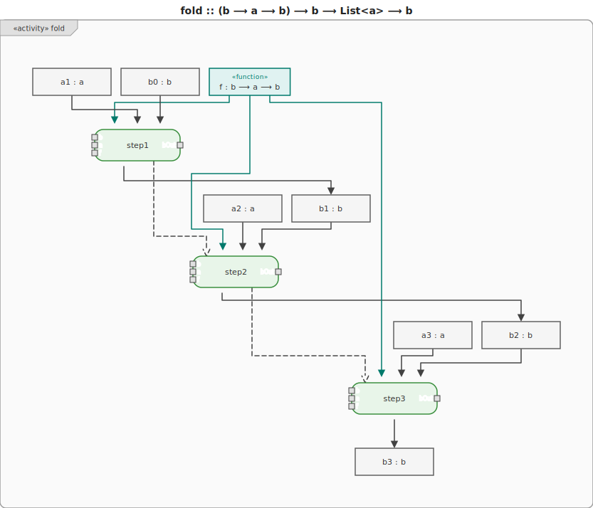
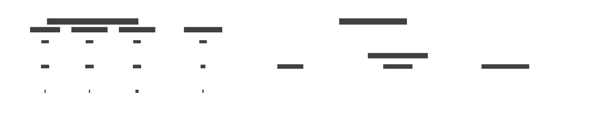

# 7. Fold

**Fold** (also called _reduce_) is the fundamental higher-order function that collapses a collection
into a single value by repeatedly applying a combining function `f :: b ⟶ a ⟶ b` with an initial
accumulator.

`fold :: (b ⟶ a ⟶ b) ⟶ b ⟶ List<a> ⟶ b`



`map`, `filter`, `sum`, `product`, `length` and many other operations can all be expressed as a
fold.

| Operation | Combining function                            | Init |
| --------- | --------------------------------------------- | ---- |
| sum       | `(acc, x) ⟶ acc + x`                          | `0`  |
| product   | `(acc, x) ⟶ acc × x`                          | `1`  |
| length    | `(acc, _) ⟶ acc + 1`                          | `0`  |
| map g     | `(acc, x) ⟶ acc ++ [g(x)]`                    | `[]` |
| filter p  | `(acc, x) ⟶ if p(x) then acc ++ [x] else acc` | `[]` |

## Motivation

Without fold, every aggregation over a list is a separate recursive function that duplicates the
same traversal skeleton. The only thing that differs between them is the combining step, yet each
must be written in full.

```text
-- Without fold: every aggregation is a hand-written recursive loop
function sum(xs):
    acc = 0
    for x in xs: acc = acc + x
    return acc

function product(xs):
    acc = 1
    for x in xs: acc = acc * x
    return acc

function length(xs):
    acc = 0
    for x in xs: acc = acc + 1
    return acc
-- Three functions; identical structure; three places to fix if the loop changes.
```

```text
-- With fold: the traversal is written once; only the combining step changes
sum     xs = fold (+) 0    xs
product xs = fold (*) 1    xs
length  xs = fold (\acc _ -> acc + 1) 0 xs
-- New aggregation = one line.  The loop is never rewritten.
```



## Examples

### C\#

```csharp
// sum
new[] { 1, 2, 3 }.Aggregate(0, (acc, x) => acc + x); // 6
```

### F\#

```fsharp
// sum
List.fold (fun acc x -> acc + x) 0 [1; 2; 3]  // 6

// or with the built-in operator section
List.fold (+) 0 [1; 2; 3]  // 6
```

### Ruby

```ruby
# sum
[1, 2, 3].reduce(0) { |acc, x| acc + x } # 6
```

### C++

```c++
#include <numeric>
// sum
std::accumulate(v.begin(), v.end(), 0, [](int acc, int x){ return acc + x; }); // 6
```

### JavaScript

```js
// sum
[1, 2, 3].reduce((acc, x) => acc + x, 0); // 6
```

### Python

```py
from functools import reduce
# sum
reduce(lambda acc, x: acc + x, [1, 2, 3], 0)  # 6
```

### Haskell

```hs
-- sum
foldl (+) 0 [1, 2, 3]  -- 6
```
