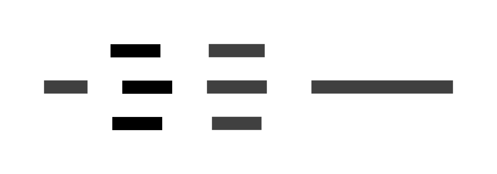

# 8. Newtype / Wrapper Types

A **newtype** is a single-field, single-constructor wrapper that creates a type _distinct_ from its
underlying type while sharing exactly the same runtime representation.


The distinction matters at compile time: `Age` and `Year` are different types even when both wrap an
`Int`. Passing a `Year` where an `Age` is expected is a type error. At runtime, the wrapper
disappears entirely — no boxing, no indirection, no overhead.



## Why wrap a type?

**Type safety / units of measure** — prevent mixing `Age`, `Year`, `Kg`, `Cm` even though all are
integers. The compiler enforces domain rules for free.

**Alternative type-class instances** — a type can only have one instance per class. Wrapping in a
newtype provides a second (or third) instance. Classic Haskell examples: `Sum Int` provides additive
`Monoid`; `Product Int` provides multiplicative `Monoid`; `All` and `Any` for `Bool`.

**Phantom types** — the type parameter is only used at the type level; it carries information the
compiler can check without affecting the value (e.g. `Validated e a` or `Tagged tag value`).

**Abstraction boundaries** — expose a `UserId` instead of a raw `String` so internal representation
can change without breaking callers.

**Zero-cost abstraction** — unlike a full wrapper class, a well-supported newtype leaves no trace in
the compiled binary.

## Laws

A newtype wrapping type `A` with constructor `W` must satisfy:

```text
unwrap (W x) == x          -- unwrap is the left inverse of the constructor
W (unwrap w) == w          -- constructor is the left inverse of unwrap
```

This means `W` and `unwrap` form an **isomorphism**: the newtype is isomorphic to its underlying
type. The two types are interchangeable in a controlled, explicit way.

> Mathematical background: [Product & Coproduct](../ct/product-coproduct.md) — a single-field
> product type; [Adjunction](../ct/adjunction.md) — `coerce` as an isomorphism between
> representationally equal types

## Code examples

### C\#

```csharp
// Record struct: zero-overhead value wrapper
readonly record struct Age(int Value);
readonly record struct Year(int Value);

// Usage
Age age = new Age(30);
Year year = new Year(1994);
// Age a2 = year; // compile error — different types
int raw = age.Value; // explicit unwrap
```

### F\#

```fsharp
// Single-case discriminated union — idiomatic F# newtype
type Age = Age of int
type Year = Year of int

let age = Age 30
let year = Year 1994

// Unwrap via pattern matching
let Age rawAge = age
let incrementAge (Age n) = Age (n + 1)
```

### Ruby

```ruby
# Ruby has no zero-cost newtype; use a Value Object with a delegator
require "delegate"

class Age < SimpleDelegator
  def initialize(value) = super(Integer(value))
  def to_s = "Age(#{__getobj__})"
end

class Year < SimpleDelegator
  def initialize(value) = super(Integer(value))
end

age  = Age.new(30)
year = Year.new(1994)
# Age and Year are separate classes; accidental mixing is caught at method level
```

### C\+\+

```cpp
// Strong typedef via single-field struct — common C++ newtype pattern
struct Age {
    int value;
    explicit Age(int v) : value(v) {}
};
struct Year {
    int value;
    explicit Year(int v) : value(v) {}
};

Age age{30};
Year year{1994};
// Age a2 = year;  // error: no implicit conversion
int raw = age.value;
```

### JavaScript

```javascript
// JavaScript has no compile-time types; use a class for a runtime wrapper
// For true static safety, combine with TypeScript (see below)
class Age {
  #value;
  constructor(value) {
    this.#value = value | 0;
  }
  valueOf() {
    return this.#value;
  }
  toString() {
    return `Age(${this.#value})`;
  }
}

// TypeScript: brand pattern for zero-overhead newtype
// type Age  = number & { readonly __brand: "Age"  };
// type Year = number & { readonly __brand: "Year" };
// const toAge  = (n: number): Age  => n as Age;
// const toYear = (n: number): Year => n as Year;

const age = new Age(30);
```

### Python

```python
from typing import NewType

# NewType creates a distinct type for static checkers (mypy, pyright)
# — no runtime overhead, no wrapping at all
Age  = NewType("Age",  int)
Year = NewType("Year", int)

age:  Age  = Age(30)
year: Year = Year(1994)
# mypy will reject: age = year  (incompatible types)

# For a runtime-enforced wrapper, use a dataclass:
from dataclasses import dataclass

@dataclass(frozen=True)
class Kg:
    value: int
    def __post_init__(self):
        if self.value < 0:
            raise ValueError("Kg must be non-negative")

weight = Kg(70)
```

### Haskell

```haskell
-- newtype keyword: guaranteed zero-cost; one constructor, one field
newtype Age  = Age  { getAge  :: Int } deriving (Show, Eq, Ord)
newtype Year = Year { getYear :: Int } deriving (Show, Eq, Ord)

-- Alternative Monoid instances via newtypes
import Data.Monoid (Sum(..), Product(..))

sumOf     = getSum     $ foldMap Sum     [1..5]  -- 15
productOf = getProduct $ foldMap Product [1..5]  -- 120

-- Coerce: safe zero-cost conversion between representationally equal types
import Data.Coerce (coerce)

ages :: [Age]
ages = coerce ([10, 20, 30] :: [Int])
```

### Rust

```rust
// Tuple struct with one field — idiomatic Rust newtype
#[derive(Debug, Clone, Copy, PartialEq, Eq, PartialOrd, Ord)]
struct Age(i32);

#[derive(Debug, Clone, Copy, PartialEq, Eq)]
struct Year(i32);

fn main() {
    let age  = Age(30);
    let year = Year(1994);
    // let a2: Age = year;  // compile error — type mismatch

    let raw: i32 = age.0; // zero-cost unwrap via field access
}

// Newtype enables implementing external traits on foreign types
use std::fmt;
struct Wrapper(Vec<String>);
impl fmt::Display for Wrapper {
    fn fmt(&self, f: &mut fmt::Formatter) -> fmt::Result {
        write!(f, "[{}]", self.0.join(", "))
    }
}
```

### Go

```go
// type alias with new name — Go's newtype pattern
type Age int
type Year int

func main() {
    var age  Age  = 30
    var year Year = 1994
    // age = year  // compile error: cannot use Year as Age

    raw := int(age) // explicit conversion to unwrap
    _ = raw
}

// Methods on the newtype
func (a Age) String() string {
    return fmt.Sprintf("Age(%d)", int(a))
}
```

## Language comparison

| Language   | Mechanism                         | Zero-cost             | Compile-time safety | Alternative instances  |
| ---------- | --------------------------------- | --------------------- | ------------------- | ---------------------- |
| C#         | `readonly record struct`          | ✓                     | ✓                   | via explicit impl      |
| F#         | Single-case DU                    | ✓                     | ✓                   | via module / CE        |
| Ruby       | `SimpleDelegator` / class         | ✗ (heap)              | ✗ (runtime)         | via override           |
| C++        | Single-field `struct`             | ✓                     | ✓                   | via overloading        |
| JavaScript | Class (TS brand)                  | ✗ (class) / ✓ (brand) | TS only             | via separate class     |
| Python     | `NewType` (static) / `@dataclass` | ✓ / ✗                 | mypy only / runtime | via subclass           |
| Haskell    | `newtype` keyword                 | ✓                     | ✓                   | ✓ (natural)            |
| Rust       | Tuple struct                      | ✓                     | ✓                   | ✓ (orphan rules apply) |
| Go         | `type Alias Underlying`           | ✓                     | ✓                   | via methods            |

Haskell's `newtype` is the purest realisation: the compiler _guarantees_ erasure (the `newtype`
wrapper is a compile-time fiction) and the `Coercible` type class enables safe, zero-cost
conversions between representationally equal types.

## See also

- [7. Algebraic Data Types](./07-adt.md) — newtype is a degenerate product type (one field)
- [9. Type Classes](./09-type-classes.md) — newtypes unlock multiple instances per underlying type
- [10. Semigroup & Monoid](./10-semigroup-monoid.md) — `Sum` and `Product` are the canonical newtype
  example
