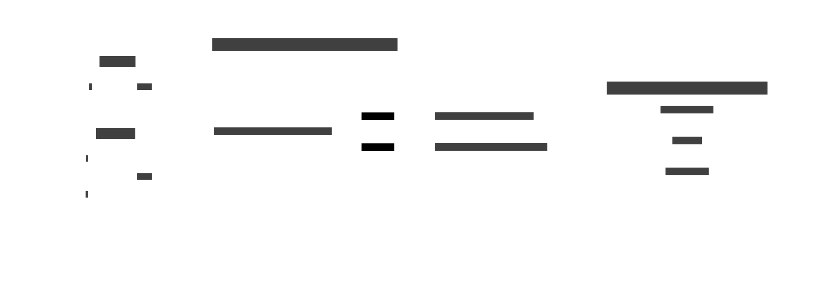

# 12. Composing Effects

A single monad models one effect cleanly. Real programs need several effects simultaneously — a
computation that can fail, reads configuration, accumulates a log, and performs I/O. Combining two
monads is **not automatic**: given monads `M` and `N`, the type `M(N(a))` is not generally a monad,
so every combination must be addressed explicitly.

This chapter describes the problem and three approaches to solving it.



## The problem

Each monad from [10. Monad](./10-monad.md) models exactly one effect.
[11. Monad Transformers](./11-transformer.md) explores the primary solution in depth; this chapter
compares all three approaches.

| Monad          | Effect modelled              |
| -------------- | ---------------------------- |
| `Maybe<a>`     | optional value / early exit  |
| `Either<e, a>` | failure with an error value  |
| `Reader<r, a>` | read-only shared environment |
| `State<s, a>`  | mutable state                |
| `Writer<w, a>` | accumulated log              |
| `IO a`         | arbitrary I/O side effects   |

A realistic application function frequently needs several simultaneously. Composing them naively
produces a deeply nested type that is painful to work with:

```text
-- Three effects: error + state + log; naive nesting
type App a = IO (Either AppError (State AppState (Writer Log a)))

-- Every operation requires manual wrapping/unwrapping at the right layer:
result <- liftIO someIO           -- lift into IO
case result of
    Left err  -> return (Left err)
    Right val -> do
        s <- get                  -- access state
        let (a, s') = runState (compute val) s
        put s'
        return (Right a)
-- Adding a fourth effect means touching every function in the codebase.
```

Why is this hard? Because `bind` on `M(N(a))` needs to know how `M` and `N` interact — and that
interaction is not derivable from their individual definitions. Two arrangements of the same monads
can have different semantics: `StateT (ExceptT M)` discards state on failure, while
`ExceptT (StateT M)` preserves it.

## Approaches at a glance


|                           | Monad Transformers                       | Free Monad                                | Algebraic Effects                        |
| ------------------------- | ---------------------------------------- | ----------------------------------------- | ---------------------------------------- |
| **Core idea**             | Stack transformer wrappers `T M a`       | Effects as data (AST); interpret later    | Effects as a row of labels; handlers run |
| **Effect order**          | Fixed; stack order matters for semantics | Composable algebras; coproduct of effects | Unordered row; semantics set by handler  |
| **Adding an effect**      | Wrap in one more transformer layer       | Add a new algebra variant                 | Add one label to the row                 |
| **Calling inner effects** | Explicit `lift` at each layer boundary   | Explicit injection into coproduct         | Automatic (compiler-inferred)            |
| **Testing**               | Swap the outermost base monad            | Swap the interpreter function             | Swap the handler at the call site        |
| **Performance**           | Overhead per layer (dictionary passing)  | Heap allocation per operation; slow       | Near-zero (continuation-based dispatch)  |
| **Boilerplate**           | High — `newtype`, `lift`, `liftIO`       | High — algebra + interpreter per effect   | Low                                      |
| **Language support**      | Haskell (mature), F# (CEs), Scala        | Haskell, F#, Scala                        | Koka, OCaml 5, Haskell libs              |
| **Maturity**              | Very mature                              | Mature                                    | Emerging                                 |
| **Best for**              | Known fixed set of effects               | Programs as data, multiple interpreters   | Modular, extensible, ergonomic stacks    |

## Monad Transformers

A **monad transformer** `T` turns any monad `M` into a new monad `T M` that adds one extra effect.
Transformers are layered into a **stack**; the type signature encodes which effects are available
and in what order they run.

```text
-- Stack: error on top of state on top of log
type App a = ExceptT AppError (StateT AppState (Writer Log)) a
--           ^error layer      ^state layer      ^log base

-- Running the stack peels off one layer at a time (inside-out order)
runApp m = runWriter (runStateT (runExceptT m) initialState)
```

To reach an inner layer, use `lift`. Each `lift` crosses one layer boundary:

```text
logMsg :: String -> App ()
logMsg msg = lift (lift (tell [msg]))   -- lift twice to reach Writer
```

`liftIO` is a shortcut for lifting any `IO` action past all transformer layers.

### Haskell

```hs
import Control.Monad.Trans.Except (ExceptT, throwE, runExceptT)
import Control.Monad.Trans.State  (StateT, get, put, runStateT)
import Control.Monad.Trans.Writer (Writer, tell, runWriter)
import Control.Monad.Trans.Class  (lift)

data AppState = AppState { counter :: Int } deriving Show
type AppError = String
type Log      = [String]

-- Three-layer transformer stack
type App a = ExceptT AppError (StateT AppState (Writer Log)) a

runApp :: App a -> (Either AppError a, AppState, Log)
runApp m =
    let ((result, st), logs) = runWriter (runStateT (runExceptT m) (AppState 0))
    in  (result, st, logs)

-- Helpers that lift into the right layer
logMsg :: String -> App ()
logMsg msg = lift (lift (tell [msg]))

incr :: App ()
incr = lift $ do { s <- get; put s { counter = counter s + 1 } }

failWith :: String -> App a
failWith = throwE

-- Example program
program :: App Int
program = do
    logMsg "starting"
    incr >> incr
    s <- lift get
    if counter s > 5
        then failWith "counter too high"
        else logMsg "done" >> return (counter s)

-- runApp program => (Right 2, AppState {counter = 2}, ["starting","done"])
```

### F\#

F# does not have transformer classes, but the same layering is achieved by **nesting computation
expressions**: the outer CE drives the error layer; the inner CE drives state.

```fsharp
// Manual three-layer stack: error + state + log
// Each "layer" is threaded explicitly through function arguments.

type AppError = string
type AppState = { Counter: int }
type Log      = string list

// Result type for the stack: (Ok/Error, updated state, accumulated log)
type App<'a> = AppState -> Log -> Result<'a * AppState * Log, AppError>

let bind (m: App<'a>) (f: 'a -> App<'b>) : App<'b> =
    fun s log ->
        match m s log with
        | Error e              -> Error e
        | Ok(a, s', log')      -> f a s' log'

let ret x : App<'a> = fun s log -> Ok(x, s, log)

type AppBuilder() =
    member _.Bind(m, f) = bind m f
    member _.Return x   = ret x
    member _.ReturnFrom m = m

let app = AppBuilder()

// Effect helpers
let logMsg msg : App<unit> = fun s log -> Ok((), s, log @ [msg])
let incr : App<unit>       = fun s log -> Ok((), { s with Counter = s.Counter + 1 }, log)
let getCount : App<int>    = fun s log -> Ok(s.Counter, s, log)
let failWith e : App<'a>   = fun _s _log -> Error e

let program = app {
    do!  logMsg "starting"
    do!  incr
    do!  incr
    let! n = getCount
    if n > 5 then return! failWith "counter too high"
    else
        do! logMsg "done"
        return n
}

let run m = m { Counter = 0 } []
// run program => Ok(2, {Counter=2}, ["starting"; "done"])
```

### Drawbacks of Monad Transformers

- **Order-dependence**: `StateT (ExceptT M)` and `ExceptT (StateT M)` behave differently on failure
  (state is kept or discarded). Choosing the wrong order is a silent semantic bug.
- **Lift proliferation**: each function must `lift` the correct number of times to reach the right
  layer. Adding an effect to the middle of an existing stack shifts all existing lift counts.
- **Refactoring cost**: changing a function's effect set changes its type and every call site.
- **Readability**: stacks deeper than three layers become difficult to read and reason about.

## Free Monad

A **free monad** treats a program as a **data structure** — an abstract syntax tree of effect
requests. The tree is built from pure constructors; a separate **interpreter** walks it and decides
what each operation means. Swapping the interpreter changes behaviour without touching the program.

```text
-- 1. Define the effect vocabulary as a functor (the "algebra")
data ConsoleF next
    = ReadLine  (String -> next)   -- read a line; continue with the result
    | PrintLine String next        -- print a line; then continue

-- 2. Build a program — pure data, no I/O yet
program :: Free ConsoleF ()
program = do
    line <- liftF (ReadLine id)
    liftF (PrintLine ("Echo: " ++ line) ())

-- 3. Run it with different interpreters
runIO   :: Free ConsoleF a -> IO a           -- production
runTest :: Free ConsoleF a -> [String] -> a  -- inject canned input
```

The key property: **the program is first-class data**. It can be inspected, serialised, optimised,
and run against any interpreter — including a test interpreter that never touches real I/O.

### Haskell

```hs
import Control.Monad.Free (Free, liftF)

-- Effect algebra
data ConsoleF next
    = ReadLine  (String -> next)
    | PrintLine String next
    deriving Functor

type Console = Free ConsoleF

-- Smart constructors
readLine    :: Console String
readLine    = liftF (ReadLine id)

printLine   :: String -> Console ()
printLine s = liftF (PrintLine s ())

-- Program: pure data, no IO
program :: Console ()
program = do
    line <- readLine
    printLine ("Echo: " ++ line)
    printLine "Done."

-- Production interpreter
runIO :: Console a -> IO a
runIO (Pure a)                    = return a
runIO (Free (ReadLine k))         = getLine >>= runIO . k
runIO (Free (PrintLine msg next)) = putStrLn msg >> runIO next

-- Test interpreter: feeds canned inputs, collects printed output
runTest :: Console a -> [String] -> (a, [String])
runTest (Pure a)                    _inputs       = (a, [])
runTest (Free (ReadLine k))         (i:inputs)    = runTest (k i) inputs
runTest (Free (ReadLine k))         []            = runTest (k "") []
runTest (Free (PrintLine msg next)) inputs        =
    let (a, out) = runTest next inputs in (a, msg : out)
```

### F\#

```fsharp
// Free monad in F# — encoded as an explicit recursive union

type Console<'a> =
    | CPure      of 'a
    | CReadLine  of (string -> Console<'a>)
    | CPrintLine of string * Console<'a>

// Monadic bind via structural recursion
let rec bind (m: Console<'a>) (f: 'a -> Console<'b>) : Console<'b> =
    match m with
    | CPure a              -> f a
    | CReadLine k          -> CReadLine(fun s -> bind (k s) f)
    | CPrintLine(msg, m')  -> CPrintLine(msg, bind m' f)

type ConsoleBuilder() =
    member _.Bind(m, f) = bind m f
    member _.Return x   = CPure x

let console = ConsoleBuilder()

// Smart constructors
let readLine      = CReadLine CPure
let printLine msg = CPrintLine(msg, CPure())

// Program: pure data
let program = console {
    let! line = readLine
    do!  printLine ("Echo: " + line)
    do!  printLine "Done."
}

// Production interpreter
let rec runIO (m: Console<'a>) : Async<'a> = async {
    match m with
    | CPure a              -> return a
    | CReadLine k          -> let line = System.Console.ReadLine()
                               return! runIO (k line)
    | CPrintLine(msg, m')  -> printfn "%s" msg
                               return! runIO m'
}

// Test interpreter
let rec runTest (m: Console<'a>) (inputs: string list) : 'a * string list =
    match m with
    | CPure a              -> a, []
    | CReadLine k          -> let i = List.tryHead inputs |> Option.defaultValue ""
                               runTest (k i) (List.tail inputs)
    | CPrintLine(msg, m')  -> let a, out = runTest m' inputs in a, msg :: out
```

### Drawbacks of Free Monad

- **Performance**: every monadic step allocates a heap node. Deep programs can be slow without the
  codensity transformation (which adds complexity).
- **Boilerplate**: each effect group needs its own functor, smart constructors, and interpreter.
  Combining two effect algebras requires the _data types à la carte_ pattern (coproducts).
- **Indirection**: the separation between program structure and interpreter can be hard to follow,
  and error messages through the abstraction are often cryptic.

## Algebraic Effects

**Algebraic effects** model side effects as a labelled **row** of named operations. A function's
type lists which effects it uses; a **handler** at the call site decides what each operation does.
Unlike transformer stacks, the row is unordered and the compiler infers effect usage automatically.

```text
-- Declare two effects (names only — no implementations)
effect State<s>:
    get : ()  -> s
    put : s   -> ()

effect Log:
    log : String -> ()

-- A function uses both effects — no stack declaration, no lift
function counter() : <State<Int>, Log> Int
    put(get() + 1)
    log("incremented")
    get()

-- Handle both at the call site — in any order
counter()
    |> handle State<Int>(initial = 0)
    |> handle Log(sink   = printLine)
```

The key differences from transformers:

- **No `lift`**: the compiler resolves which effect row a call belongs to.
- **Order does not matter**: handlers are applied independently; there is no semantic difference
  between applying the state handler first or the log handler first (for independent effects).
- **Resumable handlers**: a handler can resume the program after handling an operation, enabling
  effects like non-determinism or coroutines without special monad support.

### Koka

[Koka](https://koka-lang.github.io) has native algebraic effects built into the type system.

```koka
effect state<s>
  fun get()     : s
  fun put(x: s) : ()

effect log
  fun logMsg(msg: string) : ()

fun counter() : <state<int>, log> int
  put(get() + 1)
  logMsg("incremented")
  get()

fun main() : console ()
  // Handlers are provided at the call site
  with handler
    var st = 0
    fun get()    st
    fun put(x)   st := x
  with handler
    fun logMsg(msg) println(msg)
  val result = counter()
  println("result: " ++ show(result))
```

### Haskell (`effectful`)

The [`effectful`](https://hackage.haskell.org/package/effectful) library provides algebraic effects
with near-zero overhead using continuation-based dispatch. The effect row is part of the constraint
set, not the type constructor.

```hs
{-# LANGUAGE DataKinds, TypeFamilies, GADTs #-}
import Effectful
import Effectful.State.Static.Local (State, get, put, evalState)
import Effectful.Writer.Static.Local (Writer, tell, execWriter)
import Effectful.Error.Static        (Error, throwError, runError)

type AppError = String
type AppState = Int

-- Constraints declare the exact effects used — no explicit stack, no lift
program
    :: (State AppState :> es, Writer [String] :> es, Error AppError :> es)
    => Eff es Int
program = do
    n <- get
    tell ["current: " <> show n]
    put (n + 1)
    n' <- get
    if n' > 10
        then throwError "too high"
        else return n'

-- Handlers applied in any order at the call site
runProgram :: IO (Either AppError Int, [String])
runProgram = runEff
    . execWriter @[String]
    . evalState @AppState 0
    . runError @AppError
    $ program
```

The `polysemy` and `fused-effects` libraries offer similar APIs with different trade-offs in
ergonomics and performance.

### Drawbacks of Algebraic Effects

- **Runtime requirement**: efficient algebraic effects require delimited continuations in the
  runtime. Most languages do not have this yet; libraries emulate it with varying overhead.
- **Evolving ecosystem**: Haskell has several competing effect libraries (`effectful`, `polysemy`,
  `fused-effects`, `mtl`). Best practices and inter-library compatibility are still unsettled.
- **Semantics subtleties**: resumable handlers enable powerful features (non-determinism,
  coroutines) but introduce new reasoning challenges that monadic code avoids.

## Summary

| When to reach for...                               | Use                       |
| -------------------------------------------------- | ------------------------- |
| Small, fixed set of known effects                  | **Monad Transformers**    |
| Need multiple test/prod interpretations            | **Free Monad**            |
| Large or unknown set of effects; ergonomics matter | **Algebraic Effects**     |
| Working in Haskell today                           | `effectful` or `mtl`      |
| Working in F#                                      | Nested CEs or `FsToolkit` |
| Exploring effects research                         | Koka or OCaml 5           |
