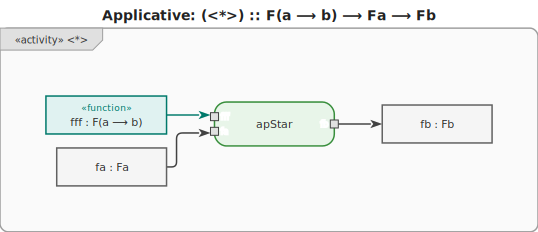

# 13. Applicative

An **applicative functor** `F` extends [Functor](./12-functor.md) with two operations that allow
applying **wrapped functions** to **wrapped values**.



A plain functor can only lift an unwrapped function: `fmap :: (a ⟶ b) ⟶ Fa ⟶ Fb`. But what if the
function itself is wrapped inside `F`? Applicative adds:

- **`pure :: a ⟶ Fa`** — lift any value into the applicative context.
- **`<*> :: F(a ⟶ b) ⟶ Fa ⟶ Fb`** — apply a wrapped function to a wrapped value.

Every monad is an applicative; every applicative is a functor.

## Laws

| Law          | Expression                                     |
| ------------ | ---------------------------------------------- |
| Identity     | `pure id <*> v = v`                            |
| Homomorphism | `pure f <*> pure x = pure (f x)`               |
| Interchange  | `u <*> pure y = pure ($ y) <*> u`              |
| Composition  | `pure (∘) <*> u <*> v <*> w = u <*> (v <*> w)` |

## Key distinction from Monad

With **Applicative** the effects are **independent**: both `F(a ⟶ b)` and `Fa` are evaluated
regardless of each other's result. With **Monad**, each step can depend on the result of the
previous step — `bind :: Ma ⟶ (a ⟶ Mb) ⟶ Mb` threads the unwrapped value into the next action.

```text
-- Applicative: validate two fields independently; collect all errors
pure form <*> validate email <*> validate password
-- Both are checked; errors from both sides can be accumulated.

-- Monad: the second action can depend on the first result
do
  user  <- lookupUser email
  token <- generateToken user   -- uses user from previous step
  return token
```

## Motivation

`fmap` handles the case where a plain function is applied to a single wrapped value. When a function
takes multiple arguments and each argument is wrapped independently, chaining `fmap` alone leaves a
wrapped function after the first application — which cannot be applied further without `<*>`.

```text
-- Without applicative: parse two independent values; manual unwrap required
parsed_x = parse input_x   -- Maybe Int
parsed_y = parse input_y   -- Maybe Int

result = case parsed_x of
    Nothing -> Nothing
    Just x  -> case parsed_y of
        Nothing -> Nothing
        Just y  -> Just (x + y)
-- Scales badly: three fields = three nested cases.
```

```text
-- With applicative: lift the function over both independently
result = pure (+) <*> parse input_x <*> parse input_y
-- Nothing short-circuits; Just values are combined.
-- n fields = n uses of <*>, no nesting.
```


## Examples

### C\#

```csharp
// C# does not have a built-in Applicative typeclass.
// The pattern is expressed manually for each container.

// Applicative for Nullable<T> (Maybe-like)
static int? Apply(Func<int, int>? f, int? x) =>
    f.HasValue && x.HasValue ? f.Value(x.Value) : null;

Func<int, int>? wrappedDouble = x => x * 2;
int? value = 5;
int? result = Apply(wrappedDouble, value); // 10

// Combining two independent nullables
static int? LiftA2(Func<int, int, int> f, int? x, int? y) =>
    x.HasValue && y.HasValue ? f(x.Value, y.Value) : null;

int? sum = LiftA2((a, b) => a + b, 3, 4); // 7
int? none = LiftA2((a, b) => a + b, 3, null); // null
```

### F\#

```fsharp
// F# Option as applicative — apply a wrapped function
let applyOption f x =
    match f, x with
    | Some f', Some x' -> Some(f' x')
    | _ -> None

let wrappedDouble = Some(fun x -> x * 2)
let value = Some 5
let result = applyOption wrappedDouble value // Some 10

// Lifting a two-argument function over two independent Options
let liftA2 f x y = applyOption (Option.map f x) y

let sum = liftA2 (+) (Some 3) (Some 4) // Some 7
let none = liftA2 (+) (Some 3) None // None

// Result<'a,'e> accumulates errors with CE or custom apply
```

### Ruby

```ruby
# Ruby has no built-in Applicative, but the pattern can be encoded.

# Applicative for a simple Maybe wrapper
class Maybe
  attr_reader :value

  def initialize(value) = @value = value
  def self.pure(x) = new(x)
  def nothing? = @value.nil?

  def apply(other)
    return Maybe.new(nil) if nothing? || other.nothing?

    Maybe.pure(@value.call(other.value))
  end
end

double = Maybe.pure(->(x) { x * 2 })
value  = Maybe.pure(5)
result = double.apply(value)   # Maybe(10)

none   = Maybe.new(nil)
result2 = double.apply(none)   # Maybe(nil)
```

### C++

```cpp
#include <functional>
#include <optional>

// Applicative for std::optional
template <typename A, typename B>
std::optional<B> apply(std::optional<std::function<B(A)>> f,
                       std::optional<A> x) {
    if (f && x) return (*f)(*x);
    return std::nullopt;
}

// Lift a two-argument function over two independents optionals
template <typename A, typename B, typename C>
std::optional<C> liftA2(std::function<C(A, B)> f,
                        std::optional<A> x,
                        std::optional<B> y) {
    if (x && y) return f(*x, *y);
    return std::nullopt;
}

auto sum = liftA2<int, int, int>([](int a, int b) { return a + b; },
                                 std::optional{3}, std::optional{4}); // 7
auto none = liftA2<int, int, int>([](int a, int b) { return a + b; },
                                  std::optional{3}, std::nullopt); // nullopt
```

### JavaScript

```js
// JavaScript has no built-in Applicative.
// Encode it for an Option-like wrapper.

const Some = (x) => ({ tag: "Some", value: x });
const None = { tag: "None" };
const isNone = (m) => m.tag === "None";

const apOption = (f, x) => (isNone(f) || isNone(x) ? None : Some(f.value(x.value)));

const liftA2 = (f, x, y) =>
  apOption(Some((a) => (b) => f(a, b)).value ? Some((a) => (b) => f(a, b)) : None, x)
  |> (g) => apOption(g, y); // illustrative; pipe operator is stage-2

// Simpler direct form:
const add = (a) => (b) => a + b;
const result = apOption(Some(add(3)), Some(4)); // Some(7)
const none = apOption(Some(add(3)), None); // None
```

### Python

```py
from __future__ import annotations
from dataclasses import dataclass
from typing import Callable, Generic, TypeVar

A = TypeVar("A")
B = TypeVar("B")


@dataclass
class Maybe(Generic[A]):
    value: A | None

    @staticmethod
    def pure(x: A) -> "Maybe[A]":
        return Maybe(x)

    def apply(self, other: "Maybe[A]") -> "Maybe[B]":
        if self.value is None or other.value is None:
            return Maybe(None)
        return Maybe.pure(self.value(other.value))  # type: ignore[arg-type]


wrapped_double = Maybe.pure(lambda x: x * 2)
value = Maybe.pure(5)
result = wrapped_double.apply(value)  # Maybe(value=10)

none: Maybe[int] = Maybe(None)
result2 = wrapped_double.apply(none)  # Maybe(value=None)
```

### Haskell

```hs
-- Haskell: Applicative is a built-in typeclass (in Control.Applicative)
-- Every Monad is also an Applicative.

-- pure and <*> for Maybe
-- pure  :: a -> Maybe a
-- (<*>) :: Maybe (a -> b) -> Maybe a -> Maybe b

wrappedDouble :: Maybe (Int -> Int)
wrappedDouble = pure (* 2)   -- Just (* 2)

result :: Maybe Int
result = wrappedDouble <*> Just 5   -- Just 10

noneResult :: Maybe Int
noneResult = wrappedDouble <*> Nothing   -- Nothing

-- liftA2 lifts a two-argument function over two independents effects
import Control.Applicative (liftA2)

sumResult :: Maybe Int
sumResult = liftA2 (+) (Just 3) (Just 4)   -- Just 7

noSum :: Maybe Int
noSum = liftA2 (+) (Just 3) Nothing   -- Nothing

-- Works identically for lists (non-determinism), Either, IO, etc.
listResult :: [Int]
listResult = liftA2 (+) [1, 2] [10, 20]   -- [11, 21, 12, 22]
```

### Rust

```rust
// Rust has no Applicative typeclass; encode it per container.

fn apply_option<A, B, F: Fn(A) -> B>(f: Option<F>, x: Option<A>) -> Option<B> {
    match (f, x) {
        (Some(f), Some(x)) => Some(f(x)),
        _ => None,
    }
}

fn lift_a2<A, B, C, F: Fn(A, B) -> C>(f: F, x: Option<A>, y: Option<B>) -> Option<C> {
    match (x, y) {
        (Some(a), Some(b)) => Some(f(a, b)),
        _ => None,
    }
}

let wrapped_double: Option<fn(i32) -> i32> = Some(|x| x * 2);
let result = apply_option(wrapped_double, Some(5)); // Some(10)

let sum   = lift_a2(|a, b| a + b, Some(3), Some(4));       // Some(7)
let none  = lift_a2(|a, b| a + b, Some(3), None::<i32>);   // None
```

### Go

```go
// Go 1.18+: applicative pattern with a generic Option type.

type Option[T any] struct {
	Value T
	Valid bool
}

func Pure[T any](x T) Option[T] { return Option[T]{Value: x, Valid: true} }

func Apply[A, B any](f Option[func(A) B], x Option[A]) Option[B] {
	if !f.Valid || !x.Valid {
		return Option[B]{}
	}
	return Pure(f.Value(x.Value))
}

func LiftA2[A, B, C any](f func(A, B) C, x Option[A], y Option[B]) Option[C] {
	if !x.Valid || !y.Valid {
		return Option[C]{}
	}
	return Pure(f(x.Value, y.Value))
}

sum  := LiftA2(func(a, b int) int { return a + b }, Pure(3), Pure(4))    // {7, true}
none := LiftA2(func(a, b int) int { return a + b }, Pure(3), Option[int]{}) // {0, false}
```
