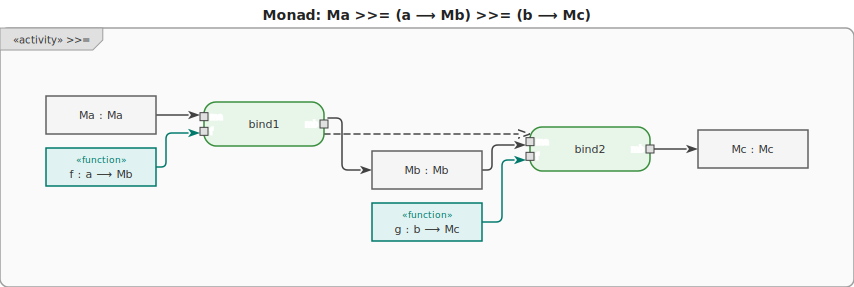
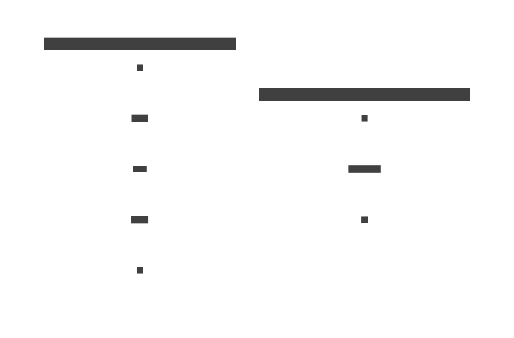

# 15. Monad

> Mathematical background: [Monad](../ct/monad.md) — monoid in the category of endofunctors; Kleisli
> triple

A **monad** is a functor extended with two operations that allow **sequencing of effectful
computations**.

`fmap` (from [Functor](./11-functor.md)) handles `f :: a ⟶ b`. But when `f :: a ⟶ Mb` (the function
itself produces a wrapped value), `fmap` yields `M(Mb)` — an unwanted nested wrapper. Monads solve
this.



## Operations

- **`pure :: a ⟶ Ma`** — lift a plain value into the monad (inherited from
  [Applicative](./12-applicative.md)). Also called `return`.
- **`bind :: Ma ⟶ (a ⟶ Mb) ⟶ Mb`** — unwrap `a` from `Ma`, apply `f`, and flatten `M(Mb)` to `Mb`.
  Also called `flatMap` or `>>=`.

Chaining multiple binds produces a pipeline of effectful steps where each step can see the result of
the previous one.

## Common monads

Each monad below has its own detailed page with diagram and code examples.

| Monad          | Effect modelled                                | Detail                        |
| -------------- | ---------------------------------------------- | ----------------------------- |
| `Maybe<a>`     | optional value / failure without error message | [maybe.md](monads/maybe.md)   |
| `Either<e, a>` | failure with an error value                    | [either.md](monads/either.md) |
| `List<a>`      | non-determinism / multiple results             | [list.md](monads/list.md)     |
| `IO a`         | input/output side effects                      | [io.md](monads/io.md)         |
| `State s a`    | stateful computation                           | [state.md](monads/state.md)   |
| `Reader r a`   | read-only shared environment / config          | [reader.md](monads/reader.md) |
| `Writer w a`   | accumulated log / output alongside a result    | [writer.md](monads/writer.md) |
| `Parser a`     | consuming input; parsing as sequenced effects  | [parser.md](monads/parser.md) |
| `Cont r a`     | first-class continuations; `callCC`            | [cont.md](monads/cont.md)     |
| `STM a`        | atomic transactions over shared mutable state  | [stm.md](monads/stm.md)       |
| `Prob a`       | discrete probability distributions             | [prob.md](monads/prob.md)     |

For combining multiple monads in one computation, see [16. Monad Transformers](./16-transformer.md).

## Motivation

`fmap` (from Functor) works when the mapping function is pure: `f :: a ⟶ b`. But when `f` itself
produces a wrapped value (`f :: a ⟶ Mb`), `fmap` yields a doubly-nested `M(Mb)` — which is unusable
without manual unwrapping at every step.

```text
-- Without monad: fmap produces M(Mb), requiring manual case analysis at every step
result1 = fmap safeDivide (Just 10)
-- yields: Just (Just 5)   ← nested wrapper, not chainable

result2 = case result1 of
    Nothing        -> Nothing
    Just Nothing   -> Nothing
    Just (Just x)  -> fmap safeDivide (Just x)  -- and so on...
-- Each step requires the same unwrap/re-wrap ceremony.
```

```text
-- With monad: bind = fmap + flatten, chains cleanly
result = Just 10
    >>= safeDivide   -- Just 5
    >>= safeDivide   -- Just 2
    >>= safeDivide   -- Just 0
-- Flat result at every step; Nothing short-circuits the rest.
```



## Examples

### C\#

```csharp
// Maybe monad pattern (using nullable)
int? SafeDivide(int a, int b) => b == 0 ? null : a / b;

int? result = SafeDivide(10, 2)           // Just 5
    .SelectMany(x => SafeDivide(x, 0))   // Nothing (propagates)
    .SelectMany(x => SafeDivide(x, 1));  // never reached
```

### F\#

F# `option` is a built-in Maybe monad. Computation expressions provide `do`-notation style
sequencing.

```fsharp
let safeDivide a b = if b = 0 then None else Some (a / b)

// Using Option.bind explicitly
let result =
    safeDivide 10 2
    |> Option.bind (fun x -> safeDivide x 0)
    |> Option.bind (fun x -> safeDivide x 1)
// None
```

### Ruby

```ruby
# Ruby's && short-circuits on nil, acting as Maybe bind
def safe_divide(a, b)
  b.zero? ? nil : a / b
end

x = safe_divide(10, 2)      # 5
y = x && safe_divide(x, 0)  # nil (short-circuits)
z = y && safe_divide(y, 1)  # nil (never reached)
# z = nil
```

### C++

```cpp
#include <optional>

auto safe_divide = [](int a, int b) -> std::optional<int> {
    return b == 0 ? std::nullopt : std::optional{a / b};
};

// C++23: and_then is bind for optional
auto result = safe_divide(10, 2)
    .and_then([&](int x) { return safe_divide(x, 0); })  // nullopt
    .and_then([&](int x) { return safe_divide(x, 1); }); // never reached
// std::nullopt
```

### JavaScript

```js
// List monad — bind is flatMap
const result = [1, 2, 3].flatMap((x) => [x, -x]); // [1,-1, 2,-2, 3,-3]
```

### Python

```py
def safe_div(a, b):
    return None if b == 0 else a / b

def bind(ma, f):
    return None if ma is None else f(ma)

result = bind(bind(10, lambda x: safe_div(x, 2)), lambda x: safe_div(x, 0))  # None
```

### Haskell

All monads support `do`-notation as syntactic sugar for `>>=`.

```hs
safeDivide :: Int -> Int -> Maybe Int
safeDivide _ 0 = Nothing
safeDivide a b = Just (a `div` b)

result :: Maybe Int
result = do
    x <- safeDivide 10 2   -- Just 5
    y <- safeDivide x 0    -- Nothing (short-circuits)
    safeDivide y 1         -- never reached
```

### Rust

```rust
// Rust: Option::and_then is bind (>>=); Result::and_then is bind for errors.

fn safe_divide(a: i32, b: i32) -> Option<i32> {
    if b == 0 { None } else { Some(a / b) }
}

// Chaining: each and_then passes the unwrapped value to the next step;
// None short-circuits the rest.
let result = Some(100)
    .and_then(|x| safe_divide(x, 2))  // Some(50)
    .and_then(|x| safe_divide(x, 5))  // Some(10)
    .and_then(|x| safe_divide(x, 0)); // None

// Result<T, E> — and_then threads Ok values; Err short-circuits
fn parse_int(s: &str) -> Result<i32, String> {
    s.parse().map_err(|e: std::num::ParseIntError| e.to_string())
}

let chain = parse_int("42")
    .and_then(|n| if n > 0 { Ok(n * 2) } else { Err("non-positive".to_string()) });
// Ok(84)
```

### Go

```go
// Go has no monad typeclass; the bind pattern is encoded with explicit checks.

type Option[T any] struct {
	Value T
	Valid bool
}

func Pure[T any](x T) Option[T] { return Option[T]{Value: x, Valid: true} }

func AndThen[A, B any](m Option[A], f func(A) Option[B]) Option[B] {
	if !m.Valid {
		return Option[B]{}
	}
	return f(m.Value)
}

safeDivide := func(a, b int) Option[int] {
	if b == 0 {
		return Option[int]{}
	}
	return Pure(a / b)
}

result := AndThen(
	AndThen(Pure(100), func(x int) Option[int] { return safeDivide(x, 2) }),
	func(x int) Option[int] { return safeDivide(x, 0) },
) // {0, false}

// Idiomatic Go: (value, error) pairs are the conventional monad-like pattern.
func safeDivideErr(a, b int) (int, error) {
	if b == 0 {
		return 0, fmt.Errorf("divide by zero")
	}
	return a / b, nil
}
```
