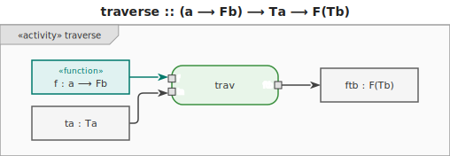
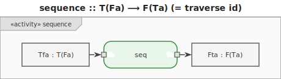
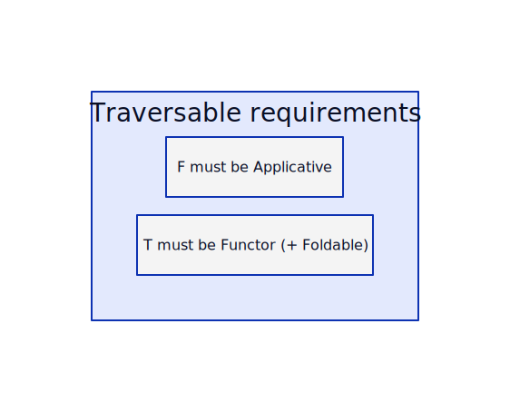
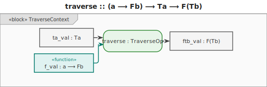
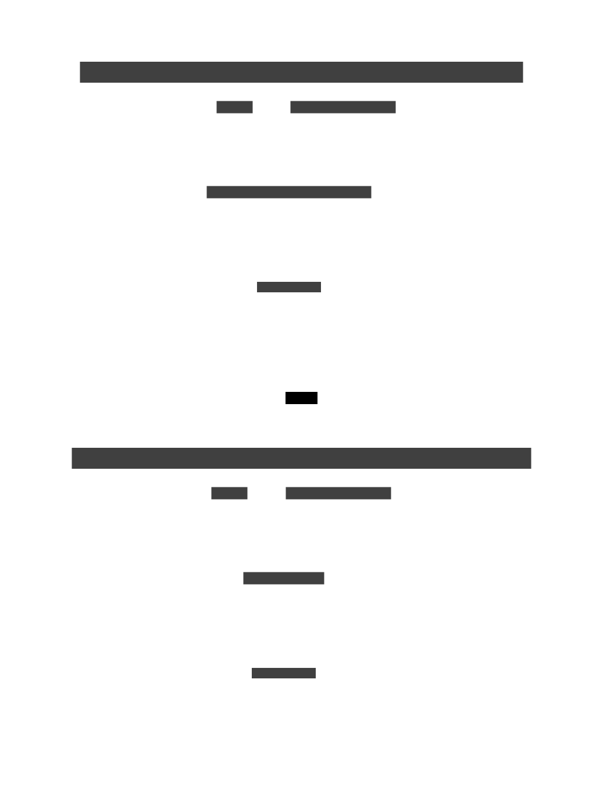

# 17. Traversable

> **In plain terms:** Traversable is "`map` + `Promise.all`": it applies an effectful function to
> every element and collects all results back into the same container shape — turning a list of
> futures into a future of a list.

A **traversable** container `T` generalises the idea of **visiting every element with an effectful
function** and collecting the results — while preserving the container's shape.









Two core operations:

- **`traverse :: (a ⟶ Fb) ⟶ Ta ⟶ F(Tb)`** — apply an effectful function to every element; collect
  all effects into a single outer `F`.
- **`sequence :: T(Fa) ⟶ F(Ta)`** — swap the container and the effect; `sequence = traverse id`.

`F` must be an [Applicative](./15-applicative.md) so that independent effects can be combined. `T`
must be a [Functor](./13-functor.md) so that its shape can be mapped over. Many traversable types
are also [Foldable](./16-fold.md).

## Laws

| Law         | Expression                                                                   |
| ----------- | ---------------------------------------------------------------------------- |
| Naturality  | `t ∘ traverse f = traverse (t ∘ f)`                                          |
| Identity    | `traverse Identity = Identity`                                               |
| Composition | `traverse (Compose ∘ fmap g ∘ f) = Compose ∘ fmap (traverse g) ∘ traverse f` |

## Motivation

When you have a collection of values and want to apply a function that might fail (or produce some
effect) to each one, you face a structural problem: a single failure anywhere should invalidate the
whole result, but `fmap` alone leaves you with a container of `Maybe` values — you still have to
collapse them manually.

```text
-- Without traverse: manually collapse a list of Maybe results
function validate_all(xs):
    results = []
    for x in xs:
        r = validate(x)
        if r == Nothing:
            return Nothing   -- abort on first failure
        results.append(r.value)
    return Just(results)
-- The traversal skeleton is written by hand every time.
-- Different container or effect = rewrite the whole function.
```

```text
-- With traverse: one call handles traversal and effect combination
result = traverse validate xs   -- Maybe [validatedValues]
-- Nothing if any element fails; Just [all values] if all succeed.
-- Works the same for Either (collect first error), IO (sequence actions),
-- List (all combinations), etc.  Container or effect changes = zero rewrite.
```



## Examples

### C\#

```csharp
// C# has no built-in Traverse; implement it for IEnumerable + Nullable.

static int[]? TraverseNullable(IEnumerable<int> xs, Func<int, int?> f)
{
    var results = new List<int>();
    foreach (var x in xs)
    {
        var r = f(x);
        if (!r.HasValue) return null;   // short-circuit on first null
        results.Add(r.Value);
    }
    return results.ToArray();
}

int? SafeSqrt(int x) => x >= 0 ? (int)Math.Sqrt(x) : null;

var ok   = TraverseNullable([4, 9, 16], SafeSqrt);   // [2, 3, 4]
var fail = TraverseNullable([4, -1, 16], SafeSqrt);   // null
```

### F\#

```fsharp
// F# does not have a Traversable typeclass, but the pattern is idiomatic
// via Result.traverse, Option.traverse etc. in the FsToolkit library,
// or written by hand.

let traverseOption (f: 'a -> 'b option) (xs: 'a list) : 'b list option =
    List.foldBack
        (fun x acc ->
            match f x, acc with
            | Some y, Some ys -> Some(y :: ys)
            | _ -> None)
        xs
        (Some [])

let safeSqrt x = if x >= 0 then Some(sqrt (float x)) else None

let ok   = traverseOption safeSqrt [ 4; 9; 16 ]   // Some [2.0; 3.0; 4.0]
let fail = traverseOption safeSqrt [ 4; -1; 16 ]   // None
```

### Ruby

```ruby
# Ruby: implement traverse for Array + a Maybe-like wrapper.

class Maybe
  attr_reader :value

  def initialize(value) = @value = value
  def self.pure(x) = new(x)
  def nothing? = @value.nil?
end

def traverse_maybe(xs, &f)
  xs.reduce(Maybe.pure([])) do |acc, x|
    result = f.call(x)
    return Maybe.new(nil) if acc.nothing? || result.nothing?

    Maybe.pure(acc.value + [result.value])
  end
end

safe_sqrt = ->(x) { x >= 0 ? Maybe.pure(Math.sqrt(x)) : Maybe.new(nil) }

ok   = traverse_maybe([4, 9, 16], &safe_sqrt)   # Maybe([2.0, 3.0, 4.0])
fail = traverse_maybe([4, -1, 16], &safe_sqrt)  # Maybe(nil)
```

### C++

```cpp
#include <cmath>
#include <optional>
#include <vector>

// traverse for vector + optional: abort on first nullopt
template <typename A, typename B>
std::optional<std::vector<B>>
traverse(const std::vector<A>& xs,
         std::function<std::optional<B>(A)> f) {
    std::vector<B> results;
    results.reserve(xs.size());
    for (const auto& x : xs) {
        auto r = f(x);
        if (!r) return std::nullopt;
        results.push_back(*r);
    }
    return results;
}

auto safeSqrt = [](int x) -> std::optional<double> {
    if (x < 0) return std::nullopt;
    return std::sqrt(static_cast<double>(x));
};

auto ok   = traverse<int, double>({4, 9, 16}, safeSqrt);   // {2.0, 3.0, 4.0}
auto fail = traverse<int, double>({4, -1, 16}, safeSqrt);  // nullopt
```

### JavaScript

```js
// JavaScript: traverse over an array with an Option-returning function.

const Some = (x) => ({ tag: "Some", value: x });
const None = { tag: "None" };
const isNone = (m) => m.tag === "None";

function traverseOption(xs, f) {
  const results = [];
  for (const x of xs) {
    const r = f(x);
    if (isNone(r)) return None;
    results.push(r.value);
  }
  return Some(results);
}

const safeSqrt = (x) => (x >= 0 ? Some(Math.sqrt(x)) : None);

const ok = traverseOption([4, 9, 16], safeSqrt); // Some([2, 3, 4])
const fail = traverseOption([4, -1, 16], safeSqrt); // None
```

### Python

```py
from __future__ import annotations
from dataclasses import dataclass
from typing import Callable, Generic, TypeVar

A = TypeVar("A")
B = TypeVar("B")


@dataclass
class Maybe(Generic[A]):
    value: A | None

    @staticmethod
    def pure(x: A) -> "Maybe[A]":
        return Maybe(x)

    @property
    def is_nothing(self) -> bool:
        return self.value is None


def traverse_maybe(xs: list[A], f: Callable[[A], Maybe[B]]) -> Maybe[list[B]]:
    results: list[B] = []
    for x in xs:
        r = f(x)
        if r.is_nothing:
            return Maybe(None)
        results.append(r.value)  # type: ignore[arg-type]
    return Maybe.pure(results)


import math


def safe_sqrt(x: int) -> Maybe[float]:
    return Maybe.pure(math.sqrt(x)) if x >= 0 else Maybe(None)


ok = traverse_maybe([4, 9, 16], safe_sqrt)    # Maybe(value=[2.0, 3.0, 4.0])
fail = traverse_maybe([4, -1, 16], safe_sqrt) # Maybe(value=None)
```

### Haskell

```hs
-- Haskell: Traversable is a built-in typeclass.
-- traverse and sequence work on any Traversable with any Applicative.
import Data.Maybe (mapMaybe)

safeSqrt :: Int -> Maybe Double
safeSqrt x
    | x >= 0    = Just (sqrt (fromIntegral x))
    | otherwise = Nothing

-- traverse: apply safeSqrt to each element; Nothing if any fails
ok :: Maybe [Double]
ok = traverse safeSqrt [4, 9, 16]     -- Just [2.0, 3.0, 4.0]

failResult :: Maybe [Double]
failResult = traverse safeSqrt [4, -1, 16]  -- Nothing

-- sequence: flip a list of Maybe into a Maybe of list
maybes :: [Maybe Int]
maybes = [Just 1, Just 2, Just 3]

seqResult :: Maybe [Int]
seqResult = sequence maybes    -- Just [1, 2, 3]

seqFail :: Maybe [Int]
seqFail = sequence [Just 1, Nothing, Just 3]   -- Nothing

-- Also works for IO: sequence a list of IO actions
ioActions :: [IO String]
ioActions = [getLine, getLine]

allLines :: IO [String]
allLines = sequence ioActions   -- reads two lines; returns IO [String]
```

### Rust

```rust
fn safe_sqrt(x: i32) -> Option<f64> {
    if x >= 0 { Some((x as f64).sqrt()) } else { None }
}

// traverse: Iterator::map + collect into Option<Vec<_>>
// collect() short-circuits on the first None
let ok: Option<Vec<f64>> = vec![4, 9, 16]
    .into_iter()
    .map(safe_sqrt)
    .collect(); // Some([2.0, 3.0, 4.0])

let fail: Option<Vec<f64>> = vec![4, -1, 16]
    .into_iter()
    .map(safe_sqrt)
    .collect(); // None

// sequence: Vec<Option<T>> -> Option<Vec<T>>
let maybes: Vec<Option<i32>> = vec![Some(1), Some(2), Some(3)];
let seq: Option<Vec<i32>> = maybes.into_iter().collect(); // Some([1, 2, 3])

let with_none = vec![Some(1), None, Some(3)];
let seq_fail: Option<Vec<i32>> = with_none.into_iter().collect(); // None
```

### Go

```go
import "math"

type Option[T any] struct {
	Value T
	Valid bool
}

func safeSqrt(x int) Option[float64] {
	if x < 0 {
		return Option[float64]{}
	}
	return Option[float64]{Value: math.Sqrt(float64(x)), Valid: true}
}

func Traverse[A, B any](xs []A, f func(A) Option[B]) Option[[]B] {
	results := make([]B, 0, len(xs))
	for _, x := range xs {
		r := f(x)
		if !r.Valid {
			return Option[[]B]{}
		}
		results = append(results, r.Value)
	}
	return Option[[]B]{Value: results, Valid: true}
}

ok   := Traverse([]int{4, 9, 16}, safeSqrt)  // {[2 3 4], true}
fail := Traverse([]int{4, -1, 16}, safeSqrt) // {nil, false}
```
