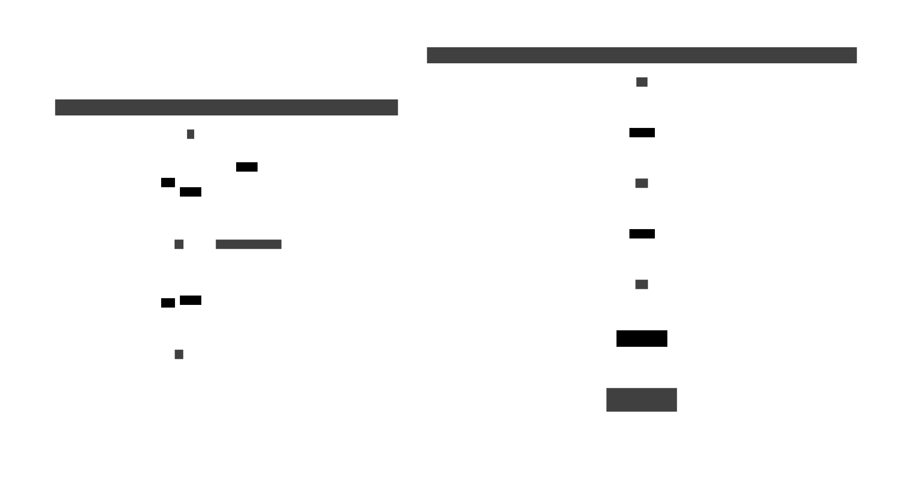

# 18. Continuation Passing Style

> **In plain terms:** CPS is like rewriting every function to accept a callback for its result —
> similar to Node.js-style callbacks — but applied systematically so the entire control flow becomes
> explicit and first-class.

**Continuation Passing Style (CPS)** is a program transformation where every function receives an
extra argument — the **continuation** `k` — that represents _what to do next with the result_.
Instead of returning a value, a CPS function calls `k` with it.



CPS makes control flow explicit and first-class. Early exits, coroutines, generators, exceptions,
and the `Cont` monad all reduce to the single mechanism of passing and calling continuations.


## Direct style vs CPS

```text
-- Direct style
double :: Int -> Int
double x = x * 2

add :: Int -> Int -> Int
add x y = x + y

result = add (double 3) 1   -- 7
```

```text
-- CPS
doubleCPS :: Int -> (Int -> r) -> r
doubleCPS x k = k (x * 2)

addCPS :: Int -> Int -> (Int -> r) -> r
addCPS x y k = k (x + y)

-- Composed: doubleCPS 3, then addCPS _ 1, then print
doubleCPS 3 (\d -> addCPS d 1 print)   -- prints 7
```

The CPS transform is **mechanical**: every function gets a continuation parameter; every call
becomes a tail call; the `return` statement disappears.

## callCC — capturing the current continuation

`callCC` ("call with current continuation") exposes the continuation as a first-class value,
enabling **non-local exit**:

```text
-- Abort early from deep inside a computation
callCC (\exit -> do
  x <- step1
  when (x < 0) (exit "negative!")
  y <- step2 x
  return y)
```

`exit` is the captured continuation. Calling it anywhere short-circuits the entire computation and
jumps directly to the outer result — a type-safe, functional goto.

## CPS and the Cont monad

The `Cont r a` type is exactly CPS packaged as a monad:

```text
newtype Cont r a = Cont { runCont :: (a -> r) -> r }
```

`>>=` sequences continuations automatically, so `do`-notation in `Cont` reads like direct style
while running in CPS under the hood. See the [Cont monad catalogue page](../monads/cont.md) for
type, bind semantics, and full examples.

## Laws

CPS is a **program transformation**, not a type class, so its laws are preservation properties:

- **Semantic equivalence**: a CPS-transformed function produces the same observable result as its
  direct-style original when applied to the identity continuation `id`.
- **Tail-call property**: every call in a CPS program is a tail call; no frame is left on the call
  stack after the call — enabling **tail-call optimisation (TCO)**.
- **Monad laws**: `Cont` satisfies the standard monad laws (`return`/`>>=` associativity and
  identity).

## Code examples

### C\#

```csharp
// CPS manually
int DoubleCps(int x, Func<int, int> k) => k(x * 2);
int AddCps(int x, int y, Func<int, int> k) => k(x + y);

// Compose: double 3, then add 1
int result = DoubleCps(3, d => AddCps(d, 1, r => r)); // 7

// callCC pattern: early exit via exception or callback
int FindFirst(IEnumerable<int> xs, Func<int, bool> pred, Func<int, int> found, Func<int> notFound)
{
    foreach (var x in xs)
        if (pred(x)) return found(x);
    return notFound();
}
```

### F\#

```fsharp
// CPS transform
let doubleCps x k = k (x * 2)
let addCps x y k = k (x + y)

// Composed
let result = doubleCps 3 (fun d -> addCps d 1 id)  // 7

// callCC with continuation monad (via computation expression)
// F# does not have a built-in Cont CE, but one can be defined:
type ContBuilder() =
    member _.Return(x) = fun k -> k x
    member _.Bind(m, f) = fun k -> m (fun a -> f a k)

let cont = ContBuilder()

let program = cont {
    let! d = fun k -> k (3 * 2)
    let! r = fun k -> k (d + 1)
    return r
}

let answer = program id  // 7
```

### Ruby

```ruby
# Manual CPS
def double_cps(x, &k) = k.call(x * 2)
def add_cps(x, y, &k) = k.call(x + y)

# Composed
result = double_cps(3) { |d| add_cps(d, 1) { |r| r } }  # 7

# Early exit via throw/catch (Ruby's built-in continuation-like mechanism)
answer = catch(:done) do
  [1, -2, 3].each do |n|
    throw :done, "negative: #{n}" if n < 0
  end
  "all positive"
end
# => "negative: -2"
```

### C\+\+

```cpp
#include <functional>

// CPS functions using std::function
template<typename R>
auto double_cps(int x, std::function<R(int)> k) { return k(x * 2); }

template<typename R>
auto add_cps(int x, int y, std::function<R(int)> k) { return k(x + y); }

// Composed
int result = double_cps<int>(3, [](int d) {
    return add_cps<int>(d, 1, [](int r) { return r; });
}); // 7

// Early exit via setjmp/longjmp or std::optional return in callbacks
```

### JavaScript

```javascript
// Manual CPS
const doubleCps = (x, k) => k(x * 2);
const addCps = (x, y, k) => k(x + y);

// Composed
const result = doubleCps(3, (d) => addCps(d, 1, (r) => r)); // 7

// Node.js async callbacks are CPS — error-first convention:
fs.readFile("data.txt", "utf8", (err, data) => {
  if (err) return handleError(err); // error continuation
  process(data); // success continuation
});

// Modern Promise/async-await is CPS with nicer syntax:
const data = await fs.promises.readFile("data.txt", "utf8");
```

### Python

```python
from typing import Callable, TypeVar

A = TypeVar("A")
R = TypeVar("R")

# CPS functions
def double_cps(x: int, k: Callable[[int], int]) -> int:
    return k(x * 2)

def add_cps(x: int, y: int, k: Callable[[int], int]) -> int:
    return k(x + y)

# Composed
result = double_cps(3, lambda d: add_cps(d, 1, lambda r: r))  # 7

# Python lacks TCO; deep CPS chains can overflow the call stack.
# Use trampolining for iterative execution of CPS programs.

def trampoline(f):
    while callable(f):
        f = f()
    return f
```

### Haskell

```haskell
import Control.Monad.Cont

-- Manual CPS
doubleCps :: Int -> (Int -> r) -> r
doubleCps x k = k (x * 2)

addCps :: Int -> Int -> (Int -> r) -> r
addCps x y k = k (x + y)

-- Composed (manual)
result :: Int
result = doubleCps 3 (\d -> addCps d 1 id)  -- 7

-- Using the Cont monad
program :: Cont r Int
program = do
    d <- cont (doubleCps 3)
    r <- cont (addCps d 1)
    return r

answer :: Int
answer = runCont program id  -- 7

-- callCC: early exit
safeDiv :: Int -> Int -> Cont r (Either String Int)
safeDiv _ 0 = return (Left "division by zero")
safeDiv x y = return (Right (x `div` y))

withEarlyExit :: Int -> Int -> Int
withEarlyExit x y = runCont (callCC $ \exit -> do
    when (y == 0) (exit 0)
    return (x `div` y)) id
```

### Rust

```rust
// CPS with closures
fn double_cps<R, K: FnOnce(i32) -> R>(x: i32, k: K) -> R {
    k(x * 2)
}

fn add_cps<R, K: FnOnce(i32) -> R>(x: i32, y: i32, k: K) -> R {
    k(x + y)
}

fn main() {
    // Composed
    let result = double_cps(3, |d| add_cps(d, 1, |r| r)); // 7
    println!("{result}");

    // Rust's async/.await desugars to a state machine that is
    // semantically equivalent to CPS — each await point is a
    // continuation boundary.
}

// Early exit in synchronous code uses the ? operator or
// block-with-return-value, which are specialised continuations.
```

### Go

```go
package main

import "fmt"

// CPS with function callbacks
func doubleCps(x int, k func(int) int) int { return k(x * 2) }
func addCps(x, y int, k func(int) int) int  { return k(x + y) }

func main() {
    // Composed
    result := doubleCps(3, func(d int) int {
        return addCps(d, 1, func(r int) int { return r })
    }) // 7
    fmt.Println(result)

    // Go goroutines + channels are a form of CPS:
    // a goroutine sends its result to a channel (its continuation).
    ch := make(chan int, 1)
    go func() { ch <- 3 * 2 }()
    val := <-ch
    fmt.Println(val) // 6
}
```

## Key points

| Concept          | Meaning                                                              |
| ---------------- | -------------------------------------------------------------------- |
| Continuation `k` | "What to do next" — a first-class function                           |
| CPS transform    | Every function becomes tail-calling; every call passes `k`           |
| `callCC`         | Capture current continuation as an escape function                   |
| Cont monad       | CPS + do-notation; `>>=` = continuation composition                  |
| TCO              | CPS is tail-call-only; languages with TCO run it in O(1) stack space |
| Async/await      | Syntactic sugar for CPS over a scheduler                             |

## See also

- [17. Traversable](./17-traversable.md) — effectful mapping; Cont is the "universal effect"
- [19. Monad](./19-monad.md) — Cont is a monad; CPS is the bridge from functions to monads
- [Cont monad](../monads/cont.md) — type, bind mechanics, `callCC`, `reset`/`shift` with examples
