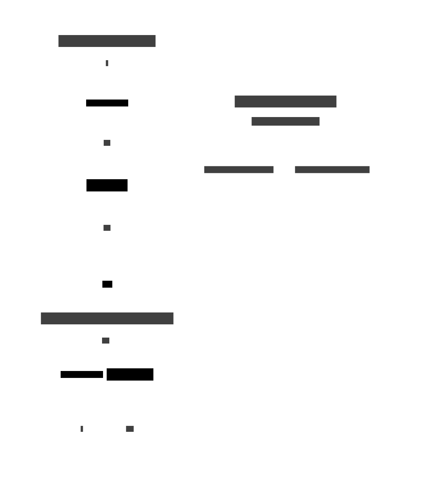

# 20. Comonad

A **comonad** is the categorical dual of a monad. Where a monad injects a value into a context and
chains computations that _produce_ context, a comonad _extracts_ a focused value from a context and
chains computations that _consume_ context.


```text
class Comonad w where
    extract   :: w a → a           -- dual of pure/return (inject → extract)
    extend    :: (w a → b) → w a → w b  -- dual of bind  (produce → consume)
    duplicate :: w a → w (w a)     -- dual of join   (collapse → expand)
```

The three operations are interdefinable: `extend f = fmap f . duplicate`.

## Laws

```text
extend extract       = id               -- left identity
extract . extend f   = f                -- right identity
extend f . extend g  = extend (f . extend g)  -- associativity
```

## Motivation: context-dependent computation

A monad says "given a value, what context do you need next?"  
A comonad says "given a context, what value can you compute from your current focus?"

Classic examples:

| Comonad      | Context               | `extract`          | `extend f`                           |
| ------------ | --------------------- | ------------------ | ------------------------------------ |
| `Stream a`   | Infinite sequence     | Current head       | Apply `f` to every suffix            |
| `Store s a`  | A store with index    | `get currentIndex` | Recompute `a` at every index via `f` |
| `Env e a`    | Read-only environment | The `a` value      | Run `f` with the same `e`            |
| `Traced m a` | Monoid-indexed log    | `a` at `mempty`    | Shift the focus along the monoid     |

The **Store comonad** is the foundation of Lens (every `Lens s a` is a `Store a s → s`), which is
why comonads and optics are closely related.



## Examples

### C\#

```csharp
// Env comonad — a value paired with a read-only environment
// (W a = (E, a); extract = snd; extend f (e, a) = (e, f(e, a)))
public record Env<E, A>(E Environment, A Value)
{
    // extract: focus the value
    public A Extract() => Value;

    // extend: recompute value using the whole context
    public Env<E, B> Extend<B>(Func<Env<E, A>, B> f) =>
        new Env<E, B>(Environment, f(this));
}

// Example: compute derived values that depend on configuration
var ctx = new Env<string, int>("USD", 42);

// extend recomputes without losing the environment
var result = ctx.Extend(c => $"{c.Value} {c.Environment}");
Console.WriteLine(result.Extract()); // "42 USD"
```

### F\#

```fsharp
// Stream comonad — infinite list focused at the head
type Stream<'a> = { Head: 'a; Tail: unit -> Stream<'a> }

let extract (s: Stream<'a>) = s.Head

let rec duplicate (s: Stream<'a>) : Stream<Stream<'a>> =
    { Head = s; Tail = fun () -> duplicate (s.Tail()) }

let extend (f: Stream<'a> -> 'b) (s: Stream<'a>) : Stream<'b> =
    duplicate s |> fun d ->
        let rec go (ss: Stream<Stream<'a>>) =
            { Head = f ss.Head; Tail = fun () -> go (ss.Tail()) }
        go d

// Example: moving average over a stream
let movingAvg2 (s: Stream<float>) =
    (s.Head + s.Tail().Head) / 2.0

// extend movingAvg2 creates a stream of local averages
```

### Ruby

```ruby
# Env comonad in Ruby
class Env
  attr_reader :env, :value

  def initialize(env, value)
    @env   = env
    @value = value
  end

  # extract: unwrap the focused value
  def extract
    @value
  end

  # extend: recompute value from full context
  def extend
    Env.new(@env, yield(self))
  end
end

ctx = Env.new("config", 42)
result = ctx.extend { |c| "#{c.value} (#{c.env})" }
puts result.extract  # "42 (config)"
```

### C++

```cpp
#include <functional>
#include <memory>
#include <string>

// Store comonad: W a = (s -> a, s)
// A getter and a current index/position
template <typename S, typename A>
struct Store {
    std::function<A(S)> getter;
    S pos;

    // extract: evaluate at current position
    A extract() const { return getter(pos); }

    // extend: produce a new Store that recomputes using the whole context
    template <typename B>
    Store<S, B> extend(std::function<B(Store<S, A>)> f) const {
        auto g = getter;
        auto p = pos;
        return Store<S, B>{
            [g, f, p](S s) -> B {
                Store<S, A> sub{g, s};
                return f(sub);
            },
            p
        };
    }
};

// Example: array-indexing Store (foundation of Lens)
Store<int, std::string> s{
    [](int i) { return std::to_string(i * i); },
    3
};

auto squared = s.extract();   // "9"
```

### JavaScript

```javascript
// Env (Context) comonad
class Env {
  constructor(env, value) {
    this.env = env;
    this.value = value;
  }

  // extract: the focused value
  extract() {
    return this.value;
  }

  // extend: recompute using the full context
  extend(f) {
    return new Env(this.env, f(this));
  }

  // duplicate: wrap context in itself
  duplicate() {
    return new Env(this.env, this);
  }
}

const ctx = new Env({ currency: "EUR" }, 100);
const result = ctx
  .extend((c) => c.value * 1.1) // apply 10 % markup
  .extend((c) => `${c.value.toFixed(2)} ${c.env.currency}`);

console.log(result.extract()); // "110.00 EUR"
```

### Python

```python
from __future__ import annotations
from dataclasses import dataclass
from typing import TypeVar, Generic, Callable

E = TypeVar("E")
A = TypeVar("A")
B = TypeVar("B")

@dataclass
class Env(Generic[E, A]):
    """Env comonad: a value paired with a read-only environment."""
    environment: E
    value: A

    def extract(self) -> A:
        return self.value

    def extend(self, f: Callable["Env[E, A]", B]) -> "Env[E, B]":
        return Env(self.environment, f(self))

    def duplicate(self) -> "Env[E, Env[E, A]]":
        return Env(self.environment, self)

# Example: configuration-aware computation
ctx: Env[str, int] = Env("production", 42)

formatted = (
    ctx
    .extend(lambda c: c.value * 2)
    .extend(lambda c: f"{c.value} [{c.environment}]")
)
print(formatted.extract())  # "84 [production]"
```

### Haskell

```haskell
-- Comonad is in the `comonad` package on Hackage
-- cabal install comonad

import Control.Comonad

-- Stream comonad: an infinite list focused at the head
data Stream a = Stream a (Stream a)

instance Functor Stream where
    fmap f (Stream x xs) = Stream (f x) (fmap f xs)

instance Comonad Stream where
    extract   (Stream x _)  = x
    duplicate s@(Stream _ xs) = Stream s (duplicate xs)
    extend f  s             = fmap f (duplicate s)

-- Moving average: a context-dependent transformation
movingAvg :: Stream Double -> Double
movingAvg (Stream a (Stream b _)) = (a + b) / 2

-- Game of Life as a comonad:
-- The universe is a Store comonad; each cell reads its neighbours via extract
import Control.Comonad.Store

type Grid a = Store (Int, Int) a

neighbours :: Grid Bool -> [Bool]
neighbours g = [extract (seek pos g) | pos <- neighbourPositions (pos g)]
  where
    neighbourPositions (x, y) = [(x+dx, y+dy) | dx <- [-1,0,1], dy <- [-1,0,1],
                                                  (dx, dy) /= (0, 0)]

step :: Grid Bool -> Bool
step g =
    let alive = extract g
        liveNeighbours = length (filter id (neighbours g))
    in  liveNeighbours == 3 || (alive && liveNeighbours == 2)

evolve :: Grid Bool -> Grid Bool
evolve = extend step
```

### Rust

```rust
// Env comonad in Rust
#[derive(Clone, Debug)]
pub struct Env<E, A> {
    pub env:   E,
    pub value: A,
}

impl<E: Clone, A: Clone> Env<E, A> {
    pub fn new(env: E, value: A) -> Self {
        Env { env, value }
    }

    /// extract: unwrap the focused value
    pub fn extract(&self) -> &A {
        &self.value
    }

    /// extend: recompute using the full context
    pub fn extend<B, F: Fn(&Env<E, A>) -> B>(&self, f: F) -> Env<E, B> {
        Env {
            env:   self.env.clone(),
            value: f(self),
        }
    }

    /// duplicate: wrap the context in itself
    pub fn duplicate(&self) -> Env<E, Env<E, A>> {
        Env {
            env:   self.env.clone(),
            value: self.clone(),
        }
    }
}

fn main() {
    let ctx = Env::new("prod", 42i32);

    let result = ctx
        .extend(|c| c.value * 2)
        .extend(|c| format!("{} [{}]", c.value, c.env));

    println!("{}", result.extract()); // "84 [prod]"
}
```

### Go

```go
package main

import "fmt"

// Env comonad: (E, A)
type Env[E any, A any] struct {
    Env   E
    Value A
}

// Extract returns the focused value
func (e Env[E, A]) Extract() A {
    return e.Value
}

// Extend recomputes the value using the full context
func Extend[E any, A any, B any](e Env[E, A], f func(Env[E, A]) B) Env[E, B] {
    return Env[E, B]{Env: e.Env, Value: f(e)}
}

// Duplicate wraps the context in itself
func Duplicate[E any, A any](e Env[E, A]) Env[E, Env[E, A]] {
    return Env[E, Env[E, A]]{Env: e.Env, Value: e}
}

func main() {
    ctx := Env[string, int]{Env: "prod", Value: 42}

    doubled  := Extend(ctx, func(c Env[string, int]) int { return c.Value * 2 })
    labelled := Extend(doubled, func(c Env[string, int]) string {
        return fmt.Sprintf("%d [%s]", c.Value, c.Env)
    })

    fmt.Println(labelled.Extract()) // "84 [prod]"
}
```

## Key points

| Concept        | Description                                                               |
| -------------- | ------------------------------------------------------------------------- |
| `extract`      | Dual of `pure` — focus the current value from a context                   |
| `extend`       | Dual of `bind` — compute a new value from the whole context               |
| `duplicate`    | Dual of `join` — expand context into nested contexts                      |
| Store comonad  | `Store s a = (s → a, s)`; foundation of the Lens optic                    |
| Stream comonad | Infinite sequence; `extend` applies a sliding window across all positions |

## See also

- [19. Monad](./19-monad.md) — the categorical dual; comparing the two clarifies both
- [23. Lens / Optics](./23-optics.md) — Store comonad is the denotational basis of Lens
- [../ct/monad.md](../ct/monad.md) — categorical formulation; dualising gives comonad laws
