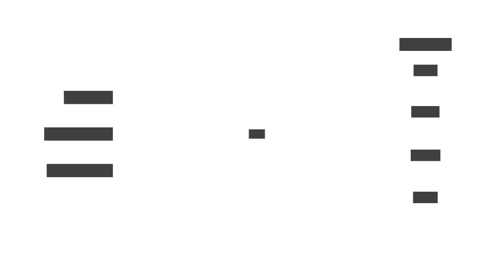
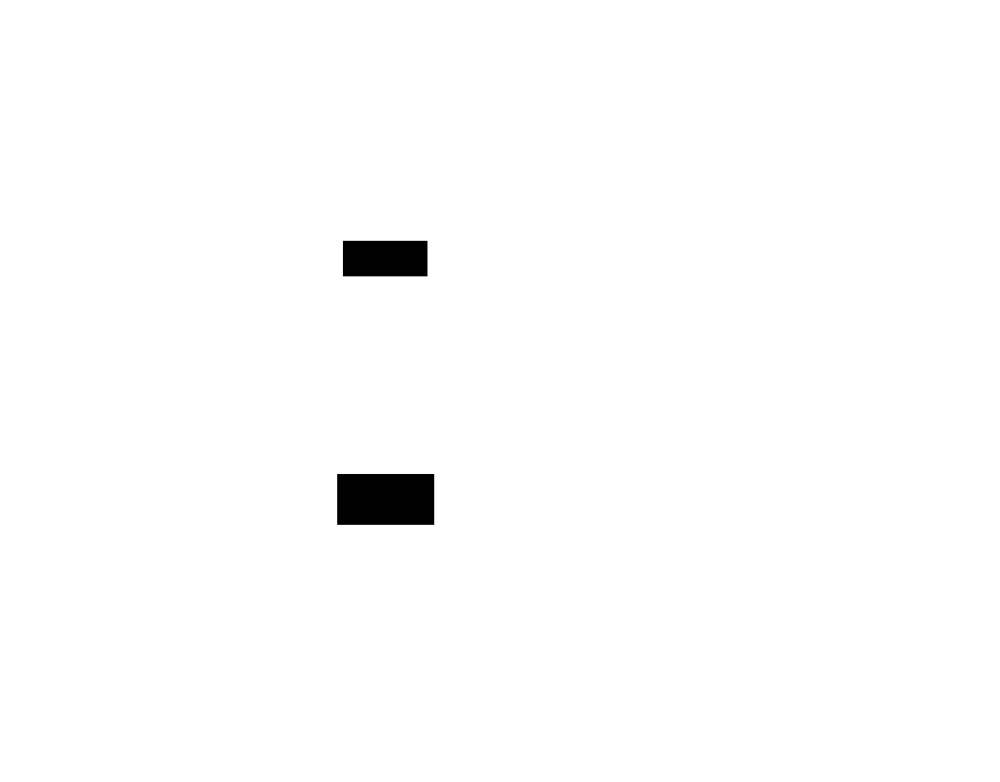

# 26. Arrows

> Mathematical background: [Kleisli Categories](../ct/kleisli.md) — Kleisli arrows formalise monadic
> functions; every `Arrow` whose `arr` is faithful is a Kleisli category for some monad

An **arrow** `A b c` is an abstraction of a computation from `b` to `c` that may carry **extra
structure** — state, side effects, or parallelism — without requiring the full power of a monad.
Where a monad sequences computations that _produce_ context (`a → M b`), an arrow is a first-class
computation _from_ `b` _to_ `c` (`A b c`).

```text
class Arrow arr where
    arr   :: (b → c) → arr b c          -- embed a pure function
    (>>>) :: arr b c → arr c d → arr b d -- sequential composition
    first :: arr b c → arr (b, d) (c, d) -- pass extra input through unchanged
```

The plain function arrow `(→)` is the simplest instance: `arr = id`, `>>>` is `(.)`,
`first f (b, d) = (f b, d)`.



## Laws

```text
arr id >>> f                = f                          -- left identity
f >>> arr id                = f                          -- right identity
(f >>> g) >>> h             = f >>> (g >>> h)            -- associativity
arr (g . f)                 = arr f >>> arr g            -- arr distributes over .
first (arr f)               = arr (first f)              -- first/arr coherence
first (f >>> g)             = first f >>> first g        -- first distributes
first f >>> arr fst         = arr fst >>> f              -- fst coherence
first f >>> arr (id *** g)  = arr (id *** g) >>> first f -- independence
first (first f) >>> arr assoc = arr assoc >>> first f   -- associativity of first
```

## Arrow vs Monad vs Profunctor

| Feature                       | Monad `M a`    | Arrow `A b c`           | Profunctor `P b c` |
| ----------------------------- | -------------- | ----------------------- | ------------------ |
| Input type is                 | Fixed (unit)   | Explicit                | Explicit           |
| Output type is                | `a`            | `c`                     | `c`                |
| Sequential composition        | `>>=`          | `>>>`                   | –                  |
| Can branch on input value?    | Yes (via bind) | Only with `ArrowChoice` | No                 |
| Can read current input shape? | No             | Yes (`first`, `***`)    | Yes (`dimap`)      |
| Every Monad is an Arrow?      | —              | Yes                     | —                  |
| Every Arrow is a Profunctor?  | —              | Yes (via `Strong`)      | —                  |

## ArrowChoice and ArrowLoop

```text
class Arrow arr => ArrowChoice arr where
    left :: arr b c → arr (Either b d) (Either c d)

class Arrow arr => ArrowLoop arr where
    loop :: arr (b, d) (c, d) → arr b c   -- feedback / recursion
```

`ArrowChoice` adds branching (analogous to `Choice` for profunctors → Prism). `ArrowLoop` adds
feedback loops, enabling stream processors and automata.

## Motivation



Monads model effectful computations where each step can choose the next step based on the _value_
produced. But sometimes you want to analyse or transform the **shape** of a computation statically —
before running it. Arrows make the input and output types explicit in the computation itself, which
enables:

- **Stream processors**: a component that transforms a stream `B` into a stream `C`, composable with
  `>>>`.
- **Parser combinators**: an `arr` that consumes input and may fail; `ArrowChoice` gives `<|>`.
- **FRP signal functions**: `SF a b` — a time-varying function from signal `a` to signal `b`; Yampa
  uses exactly this.
- **Circuit simulation**: a component with typed inputs and outputs, wired with `>>>` and `***`.

## Examples

### C\#

```csharp
// Arrow encoded as a delegate wrapper with composition operators
// C# lacks HKTs so we use concrete Arrow<B,C> = Func<B,C> enriched

public sealed class Arrow<B, C>
{
    private readonly Func<B, C> _run;
    public Arrow(Func<B, C> f) => _run = f;
    public C Run(B b) => _run(b);

    // arr: embed pure function
    public static Arrow<B, C> Arr(Func<B, C> f) => new(f);

    // >>>: sequential composition
    public Arrow<B, D> Then<D>(Arrow<C, D> next) =>
        new(b => next.Run(Run(b)));

    // first: pass extra input through
    public Arrow<(B, D), (C, D)> First<D>() =>
        new(bd => (Run(bd.Item1), bd.Item2));

    // ***: run two arrows in parallel on a pair
    public Arrow<(B, D), (C, E)> Fanout<D, E>(Arrow<D, E> other) =>
        new(bd => (Run(bd.Item1), other.Run(bd.Item2)));
}

// Usage: pipeline with first-class composition
var parseInt  = Arrow<string, int>.Arr(int.Parse);
var doubleIt  = Arrow<int, int>.Arr(x => x * 2);
var showIt    = Arrow<int, string>.Arr(x => $"Result: {x}");

var pipeline = parseInt.Then(doubleIt).Then(showIt);
Console.WriteLine(pipeline.Run("21")); // "Result: 42"

// first: enrich a pair's first component
var withTag = parseInt.First<string>();
Console.WriteLine(withTag.Run(("21", "tag")).Item1); // 42
```

### F\#

```fsharp
// F# has built-in arrow notation via kleisli composition and function types
// For a full Arrow, we define a record

type Arrow<'B, 'C> = { Run: 'B -> 'C }

let arr f = { Run = f }

let (>>>) (a: Arrow<'B,'C>) (b: Arrow<'C,'D>) : Arrow<'B,'D> =
    { Run = fun x -> b.Run (a.Run x) }

let first (a: Arrow<'B,'C>) : Arrow<'B * 'D, 'C * 'D> =
    { Run = fun (b, d) -> (a.Run b, d) }

let ( *** ) (f: Arrow<'B,'C>) (g: Arrow<'D,'E>) : Arrow<'B*'D,'C*'E> =
    first f >>> arr (fun (c, d) -> (c, d)) |> fun _ ->
    { Run = fun (b, d) -> (f.Run b, g.Run d) }

// Usage
let parseInt  = arr int
let doubleIt  = arr ((*) 2)
let showIt    = arr (sprintf "Result: %d")

let pipeline = parseInt >>> doubleIt >>> showIt
printfn "%s" (pipeline.Run "21")   // "Result: 42"

// F# also has the Kleisli arrow for monads: a -> M b
let kleisli (f: 'a -> 'b option) (g: 'b -> 'c option) : 'a -> 'c option =
    fun a -> f a |> Option.bind g
```

### Ruby

```ruby
# Arrow in Ruby — a callable with composition operators
class Arrow
  def initialize(&f) = (@f = f)
  def run(x)         = @f.call(x)

  # arr: embed pure proc
  def self.arr(&f) = new(&f)

  # >>>: sequential composition
  def >>(other)
    Arrow.new { |x| other.run(run(x)) }
  end

  # first: pass second element of pair through unchanged
  def first
    Arrow.new { |(b, d)| [run(b), d] }
  end

  # ***: parallel composition on pairs
  def ***(other)
    Arrow.new { |(b, d)| [run(b), other.run(d)] }
  end
end

parse_int = Arrow.arr { |s| Integer(s) }
double_it = Arrow.arr { |n| n * 2 }
show_it   = Arrow.arr { |n| "Result: #{n}" }

pipeline = parse_int >> double_it >> show_it
puts pipeline.run("21")               # "Result: 42"

# first: enrich the first element of a pair
with_tag = parse_int.first
puts with_tag.run(["21", "tag"]).inspect  # [42, "tag"]
```

### C++

```cpp
#include <functional>
#include <string>
#include <utility>
#include <iostream>

// Arrow<B,C> — wraps a std::function with composition operators
template <typename B, typename C>
struct Arrow {
    std::function<C(B)> run;

    // arr: embed a function
    static Arrow arr(std::function<C(B)> f) { return Arrow{f}; }

    // >>>: sequential composition  Arrow<B,C> >>> Arrow<C,D> = Arrow<B,D>
    template <typename D>
    Arrow<B, D> then(Arrow<C, D> next) const {
        auto r = run;
        return { [r, next](B b) { return next.run(r(b)); } };
    }

    // first: pass second element through
    template <typename D>
    Arrow<std::pair<B,D>, std::pair<C,D>> first() const {
        auto r = run;
        return { [r](std::pair<B,D> bd) -> std::pair<C,D> {
            return { r(bd.first), bd.second };
        }};
    }
};

int main() {
    Arrow<std::string, int>    parse_int{ [](std::string s) { return std::stoi(s); } };
    Arrow<int, int>            double_it{ [](int n) { return n * 2; } };
    Arrow<int, std::string>    show_it  { [](int n) { return "Result: " + std::to_string(n); } };

    auto pipeline = parse_int.then(double_it).then(show_it);
    std::cout << pipeline.run("21") << '\n';  // "Result: 42"

    auto with_tag = parse_int.first<std::string>();
    auto [n, tag] = with_tag.run({"21", "label"});
    std::cout << n << " " << tag << '\n';     // 42 label
}
```

### JavaScript

```javascript
// Arrow in JavaScript — a class with >>> and first
class Arrow {
  constructor(f) {
    this._f = f;
  }

  run(x) {
    return this._f(x);
  }

  // arr: embed pure function
  static arr(f) {
    return new Arrow(f);
  }

  // >>>: sequential composition
  then(next) {
    const f = this._f;
    return new Arrow((x) => next.run(f(x)));
  }

  // first: pass second element of pair through
  first() {
    const f = this._f;
    return new Arrow(([b, d]) => [f(b), d]);
  }

  // ***: run two arrows in parallel on a pair
  fanout(other) {
    const f = this._f;
    return new Arrow(([b, d]) => [f(b), other.run(d)]);
  }

  // &&&: fork a single input through two arrows
  fork(other) {
    const f = this._f;
    return new Arrow((b) => [f(b), other.run(b)]);
  }
}

const parseInt_ = Arrow.arr((s) => Number.parseInt(s, 10));
const doubleIt = Arrow.arr((n) => n * 2);
const showIt = Arrow.arr((n) => `Result: ${n}`);

const pipeline = parseInt_.then(doubleIt).then(showIt);
console.log(pipeline.run("21")); // "Result: 42"

// fan-out: split input through two arrows simultaneously
const both = parseInt_.fork(Arrow.arr((s) => s.toUpperCase()));
console.log(both.run("21")); // [21, "21"]
```

### Python

```python
from __future__ import annotations
from typing import TypeVar, Generic, Callable, Tuple
from dataclasses import dataclass

B  = TypeVar("B")
C  = TypeVar("C")
D  = TypeVar("D")
E  = TypeVar("E")

@dataclass(frozen=True)
class Arrow(Generic[B, C]):
    """Arrow abstraction — a computation from B to C."""
    _run: Callable[[B], C]

    def run(self, x: B) -> C:
        return self._run(x)

    @staticmethod
    def arr(f: Callable[[B], C]) -> "Arrow[B, C]":
        """Embed a pure function as an Arrow."""
        return Arrow(f)

    def then(self, next_: "Arrow[C, D]") -> "Arrow[B, D]":
        """>>> : sequential composition."""
        f = self._run
        return Arrow(lambda x: next_.run(f(x)))

    def first(self) -> "Arrow[tuple[B, D], tuple[C, D]]":
        """Pass the second element of a pair through unchanged."""
        f = self._run
        return Arrow(lambda bd: (f(bd[0]), bd[1]))

    def fanout(self, other: "Arrow[D, E]") -> "Arrow[tuple[B, D], tuple[C, E]]":
        """*** : run two arrows in parallel on a pair."""
        f = self._run
        return Arrow(lambda bd: (f(bd[0]), other.run(bd[1])))

    def fork(self, other: "Arrow[B, D]") -> "Arrow[B, tuple[C, D]]":
        """&&& : split one input through two arrows."""
        f = self._run
        return Arrow(lambda b: (f(b), other.run(b)))


parse_int = Arrow.arr(int)
double_it = Arrow.arr(lambda n: n * 2)
show_it   = Arrow.arr(lambda n: f"Result: {n}")

pipeline = parse_int.then(double_it).then(show_it)
print(pipeline.run("21"))                    # "Result: 42"

# Fork: run the same input through two arrows
both = parse_int.fork(Arrow.arr(str.upper))
print(both.run("21"))                        # (21, '21')
```

### Haskell

```haskell
-- Arrows live in Control.Arrow (base library — no extra package needed)
import Control.Arrow

-- The function arrow (->) is the simplest Arrow instance
-- arr f = f,  (>>>) = flip (.),  first f (b, d) = (f b, d)

-- Pipeline with arrow notation (GHC extension ArrowNotation)
{-# LANGUAGE Arrows #-}
import Control.Arrow (Arrow, arr, (>>>), first, (&&&), (***))

-- Plain function arrow
pipeline :: String -> String
pipeline = arr read >>> arr (* 2) >>> arr (("Result: " ++) . show)
-- pipeline "21" = "Result: 42"

-- Kleisli arrow: wraps a -> Maybe b as an Arrow
import Control.Arrow (Kleisli(..))

safeDiv :: Kleisli Maybe (Int, Int) Int
safeDiv = Kleisli $ \(a, b) -> if b == 0 then Nothing else Just (a `div` b)

safeSqrt :: Kleisli Maybe Int Int
safeSqrt = Kleisli $ \n -> if n < 0 then Nothing else Just (floor (sqrt (fromIntegral n)))

-- Compose Kleisli arrows with >>>
safeDivSqrt :: Kleisli Maybe (Int, Int) Int
safeDivSqrt = safeDiv >>> safeSqrt

-- Arrow proc notation (like do-notation for arrows)
addAndDouble :: Arrow arr => arr (Int, Int) Int
addAndDouble = proc (x, y) -> do
    s <- arr (uncurry (+)) -< (x, y)
    arr (* 2) -< s

-- Yampa-style stream function (simplified)
newtype SF a b = SF { runSF :: [a] -> [b] }

instance Arrow SF where
    arr f   = SF (map f)
    first f = SF $ \abs_ ->
        let (as_, bs_) = unzip abs_
        in  zip (runSF f as_) bs_
    (SF f) >>> (SF g) = SF (g . f)
```

### Rust

```rust
// Arrow in Rust via a trait and a concrete wrapper type
// Rust's ownership model requires some care with closures (Box<dyn Fn>)

trait ArrowTrait<B, C>: Sized {
    fn run(&self, b: B) -> C;

    fn then<D, Next: ArrowTrait<C, D>>(self, next: Next) -> Seq<Self, Next> {
        Seq(self, next)
    }
}

// Concrete arrow wrapping a boxed closure
struct Arr<B, C>(Box<dyn Fn(B) -> C>);

impl<B, C> Arr<B, C> {
    fn new(f: impl Fn(B) -> C + 'static) -> Self {
        Arr(Box::new(f))
    }
}

impl<B, C> ArrowTrait<B, C> for Arr<B, C> {
    fn run(&self, b: B) -> C { (self.0)(b) }
}

// Sequential composition
struct Seq<F, G>(F, G);

impl<B, C, D, F: ArrowTrait<B, C>, G: ArrowTrait<C, D>> ArrowTrait<B, D> for Seq<F, G> {
    fn run(&self, b: B) -> D { self.1.run(self.0.run(b)) }
}

// first: pass the second element through
struct First<F>(F);

impl<B: Clone, C, D, F: ArrowTrait<B, C>> ArrowTrait<(B, D), (C, D)> for First<F> {
    fn run(&self, (b, d): (B, D)) -> (C, D) { (self.0.run(b), d) }
}

fn main() {
    let parse_int = Arr::new(|s: &str| s.parse::<i32>().unwrap());
    let double_it = Arr::new(|n: i32| n * 2);
    let show_it   = Arr::new(|n: i32| format!("Result: {n}"));

    let pipeline  = parse_int.then(double_it).then(show_it);
    println!("{}", pipeline.run("21")); // "Result: 42"
}
```

### Go

```go
// Arrow in Go via generics (Go 1.18+)
package main

import "fmt"

// Arrow[B, C] wraps a function B → C
type Arrow[B, C any] struct {
    f func(B) C
}

func Arr[B, C any](f func(B) C) Arrow[B, C] { return Arrow[B, C]{f} }
func (a Arrow[B, C]) Run(b B) C             { return a.f(b) }

// Then: sequential composition Arrow[B,C] >>> Arrow[C,D] = Arrow[B,D]
func Then[B, C, D any](a Arrow[B, C], b Arrow[C, D]) Arrow[B, D] {
    return Arr(func(x B) D { return b.Run(a.Run(x)) })
}

// First: pass second element of a pair through
func First[B, C, D any](a Arrow[B, C]) Arrow[[2]any, [2]any] {
    return Arr(func(bd [2]any) [2]any {
        return [2]any{a.Run(bd[0].(B)), bd[1]}
    })
}

// Fork: &&& — split a single input through two arrows
func Fork[B, C, D any](a Arrow[B, C], b Arrow[B, D]) Arrow[B, [2]any] {
    return Arr(func(x B) [2]any { return [2]any{a.Run(x), b.Run(x)} })
}

func main() {
    parseInt_ := Arr(func(s string) int {
        n := 0
        fmt.Sscan(s, &n)
        return n
    })
    doubleIt := Arr(func(n int) int    { return n * 2 })
    showIt   := Arr(func(n int) string { return fmt.Sprintf("Result: %d", n) })

    pipeline := Then(Then(parseInt_, doubleIt), showIt)
    fmt.Println(pipeline.Run("21")) // "Result: 42"

    // Fork: collect both the number and its doubled form
    both := Fork(parseInt_, Then(parseInt_, doubleIt))
    fmt.Println(both.Run("21")) // [21 42]
}
```

## Key points

| Concept       | Description                                                                         |
| ------------- | ----------------------------------------------------------------------------------- |
| `arr`         | Embed a pure function — every function is an arrow                                  |
| `>>>`         | Sequential composition — output of first feeds input of second                      |
| `first`       | Thread extra input through unchanged — foundation of all pair-handling operations   |
| `***`         | Parallel composition — run two arrows on a pair simultaneously                      |
| `&&&`         | Fan-out — split one input through two arrows and collect both outputs               |
| `Kleisli`     | `a → M b` as an Arrow — every monad gives rise to a Kleisli arrow                   |
| `ArrowChoice` | Adds `left`/`right` for branching on `Either` — `ArrowChoice` ≅ `Choice` profunctor |
| `ArrowLoop`   | Adds `loop` for feedback — enables automata and stream processors                   |

## See also

- [25. Profunctor](./25-profunctor.md) — every Arrow is a Strong profunctor; `first` = `first'`
- [19. Monad](./19-monad.md) — every Monad gives a Kleisli Arrow; `>>=` corresponds to `>>>`
- [27. Lens / Optics](./27-optics.md) — `ArrowChoice` maps directly to the `Choice` typeclass
  underlying Prism
