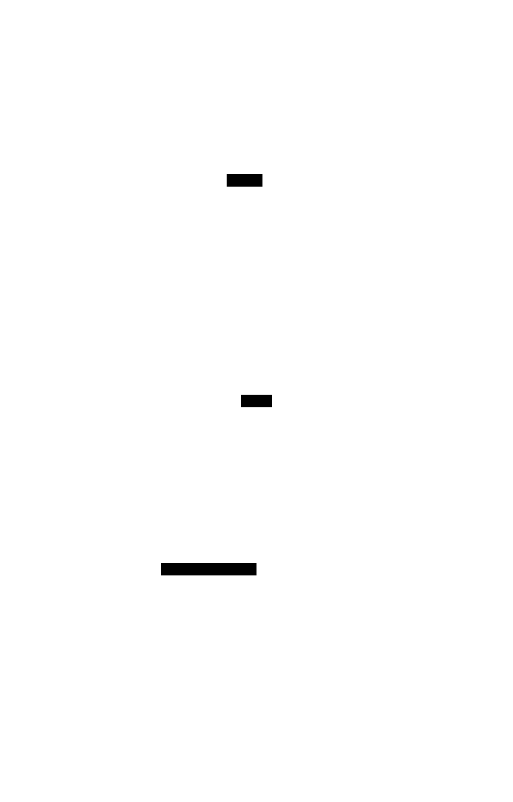

# 29. Codata and Coinduction

> Mathematical background: [F-Algebra](../ct/f-algebra.md) — initial algebras (data) and terminal
> coalgebras (codata) as the two fixed points of an endofunctor
>
> **In plain terms:** Codata is the dual of data: where a `data` type is defined by how you _build_
> it (constructors), a codata type is defined by how you _observe_ it — enabling infinite or
> lazily-produced sequences without running out of memory.

Algebraic Data Types are **defined by their constructors** — how values are _built_. Codata is the
exact dual: defined by **destructors/observations** — how values are _taken apart_. This duality
explains why infinite structures such as streams, infinite trees, and comonads are mathematically
principled, not just a pragmatic trick.


## The core duality

|                       | Data (inductive)                 | Codata (coinductive)                                |
| --------------------- | -------------------------------- | --------------------------------------------------- |
| Defined by            | Constructors (how to build)      | Destructors (how to observe)                        |
| Introduction          | `Nil`, `Cons`, `Leaf`            | Corecursion (unfold / `ana`)                        |
| Elimination           | Pattern matching                 | Calling destructors                                 |
| Termination guarantee | Structural recursion terminates  | **Productivity**: each step produces a finite piece |
| Fixed point           | `Fix F` — least fixpoint         | `Cofix F` / `Nu F` — greatest fixpoint              |
| Examples              | Finite lists, trees, expressions | Streams, infinite trees, comonads                   |

The same functor `F` has **two** fixed points: the least (`Fix F`, reached by induction) and the
greatest (`Cofix F`, reached by coinduction). Every inductive type has a coinductive dual.

## Productivity, not termination

Recursive definitions over codata do not need to **terminate** — they need to be **productive**:
every observation (calling a destructor) must reduce in a finite number of steps.

```text
-- NOT a trick — this is productive corecursion (Haskell)
nats :: Stream Int          -- infinite stream of naturals
nats = 0 :> fmap (+1) nats  -- each step: yield the head, then unfold the tail

-- The type system (in Coq/Agda/Idris) can check productivity statically
-- In Haskell, laziness provides the runtime machinery; guardedness is the principle
```

## Anamorphisms: the coinductive unfold

Where a **catamorphism** (`cata`) tears down a recursive structure, an **anamorphism** (`ana`)
builds a potentially-infinite corecursive structure from a seed:

```text
-- Haskell: Stream a = a :> Stream a
data StreamF a r = a :> r       -- base functor
newtype Stream a = Stream { unStream :: StreamF a (Stream a) }

-- ana :: (s -> StreamF a s) -> s -> Stream a
natsFrom :: Int -> Stream Int
natsFrom = ana (\n -> n :> (n + 1))   -- seed: n; step: yield n, new seed n+1

-- A hylomorphism builds and immediately tears down (cf. 28. Recursion Schemes)
```

See [28. Recursion Schemes](./28-recursion-schemes.md) for `cata`, `ana`, and `hylo` in full detail.



## Why comonads are codata

A **comonad** `W a` has two destructors:

- `extract :: W a -> a` — observe the focused value
- `extend :: (W a -> b) -> W a -> W b` — shift focus and re-observe

These match exactly the codata interface: defined by what you can _do to_ them, not by how they are
built. The `Store` comonad is literally the greatest fixpoint of the lens functor — which is why
`Store s a` is the denotational basis of `Lens`. See [20. Comonad](./20-comonad.md).

## Streams as the canonical example

A `Stream a` is the coinductive dual of `List a`:

|              | `List a`                 | `Stream a`                                              |
| ------------ | ------------------------ | ------------------------------------------------------- |
| Constructors | `Nil`, `Cons a (List a)` | — (no base case)                                        |
| Destructors  | `head`, `tail`, `null`   | `head :: Stream a -> a`, `tail :: Stream a -> Stream a` |
| Finite?      | Yes                      | No (by definition)                                      |
| Intro        | pattern matched          | produced by corecursion                                 |

## Examples

### C\#

```csharp
// C# does not have native codata syntax, but IEnumerable<T> / yield return
// is the idiomatic lazy infinite sequence (backed by a state machine = anamorphism)

using System.Collections.Generic;

// Infinite stream of naturals — productive: each MoveNext() yields one value
static IEnumerable<int> NatsFrom(int start)
{
    while (true) yield return start++;
}

// Anamorphism: unfold a seed into an IEnumerable<T>
static IEnumerable<B> Ana<S, B>(Func<S, (B head, S tail)> step, S seed)
{
    while (true)
    {
        var (head, next) = step(seed);
        yield return head;
        seed = next;
    }
}

// Usage: Fibonacci stream
IEnumerable<long> Fibs = Ana(((long a, long b) s) => (s.a, (s.b, s.a + s.b)), (0L, 1L));
// Take first 10: Fibs.Take(10) → 0 1 1 2 3 5 8 13 21 34

// Destructors (observations): First(), Skip(n).First(), Take(n)
```

### F\#

```fsharp
// F# sequences (seq<'T>) are lazy enumerables — coinductive streams
// seq { ... } introduces codata; yield is the step

let rec natsFrom n : seq<int> = seq {
    yield n
    yield! natsFrom (n + 1)    // productive: one step before recursive call
}

// Explicit anamorphism
let rec ana (step: 'S -> 'A * 'S) (seed: 'S) : seq<'A> = seq {
    let (head, next) = step seed
    yield head
    yield! ana step next
}

let fibs : seq<int64> =
    ana (fun (a, b) -> (a, (b, a + b))) (0L, 1L)

// Observations (destructors)
let first = Seq.head fibs                  // 0
let tenth = Seq.item 9 fibs               // 34
let first10 = Seq.take 10 fibs |> Seq.toList
```

### Ruby

```ruby
# Ruby: Enumerator is the coinductive stream
# Enumerator::new takes a "yielder" — the corecursive step

# Infinite stream of naturals
nats = Enumerator.new do |y|
  n = 0
  loop { y << n; n += 1 }   # productive: each iteration yields one value
end

# Anamorphism: unfold a seed
def ana(seed, &step)
  Enumerator.new do |y|
    s = seed
    loop do
      head, s = step.call(s)
      y << head
    end
  end
end

fibs = ana([0, 1]) { |(a, b)| [a, [b, a + b]] }

# Destructors (observations)
puts nats.first(5).inspect  # [0, 1, 2, 3, 4]
puts fibs.first(8).inspect  # [0, 1, 1, 2, 3, 5, 8, 13]
```

### C++

```cpp
// C++20 coroutines / generator<T> (P2168 / std::generator) are coinductive streams
// Each co_yield is one productive step

#include <generator>  // C++23 std::generator
#include <cstdint>
#include <ranges>

// Infinite stream of naturals
std::generator<int> nats_from(int start = 0) {
    while (true) co_yield start++;  // productive: one value per step
}

// Anamorphism templated on seed type S and output type A
template<typename S, typename A>
std::generator<A> ana(auto step, S seed) {
    while (true) {
        auto [head, next] = step(seed);
        co_yield head;
        seed = next;
    }
}

// Fibonacci stream
auto fibs = ana(
    [](std::pair<int64_t,int64_t> s) {
        return std::pair{s.first, std::pair{s.second, s.first + s.second}};
    },
    std::pair<int64_t,int64_t>{0, 1}
);

// Destructors: take first 10
auto first10 = fibs | std::views::take(10);
```

### JavaScript

```javascript
// JavaScript generators are coinductive streams
// function* + yield = anamorphism; [Symbol.iterator] = destructor protocol

// Infinite stream of naturals — productive (each next() call is one step)
function* natsFrom(start = 0) {
  while (true) yield start++;
}

// Explicit anamorphism: unfold a seed s into an infinite iterator
function* ana(step, seed) {
  let s = seed;
  while (true) {
    const [head, next] = step(s);
    yield head;
    s = next;
  }
}

// Fibonacci stream
const fibs = ana(([a, b]) => [a, [b, a + b]], [0n, 1n]);

// Destructors: take first n values
function take(n, iter) {
  const out = [];
  for (const v of iter) {
    out.push(v);
    if (out.length === n) break;
  }
  return out;
}

console.log(take(8, fibs)); // [0n, 1n, 1n, 2n, 3n, 5n, 8n, 13n]
console.log(take(5, natsFrom())); // [0, 1, 2, 3, 4]
```

### Python

```python
from typing import Generator, Callable, TypeVar
from itertools import islice

S = TypeVar("S")
A = TypeVar("A")

# Python generators are coinductive streams
# yield is the productive step; next() is the destructor

def nats_from(start: int = 0) -> Generator[int, None, None]:
    """Infinite stream of naturals — each next() call yields one value."""
    n = start
    while True:
        yield n
        n += 1

# Anamorphism: unfold a seed
def ana(step: Callable[[S], tuple[A, S]], seed: S) -> Generator[A, None, None]:
    s = seed
    while True:
        head, s = step(s)
        yield head

# Fibonacci stream
def fib_step(state: tuple[int, int]) -> tuple[int, tuple[int, int]]:
    a, b = state
    return a, (b, a + b)

fibs = ana(fib_step, (0, 1))

# Destructors: observations
print(list(islice(fibs, 10)))        # [0, 1, 1, 2, 3, 5, 8, 13, 21, 34]
print(list(islice(nats_from(), 5)))  # [0, 1, 2, 3, 4]
```

### Haskell

```haskell
-- Haskell has the most direct representation of codata:
-- laziness makes every type coinductive by default.
-- Libraries like 'comonad' and 'recursion-schemes' expose the structure explicitly.

import Data.List (unfoldr)
import Control.Comonad (Comonad(..))

-- Coinductive stream — defined by its two destructors
data Stream a = a :> Stream a     -- no Nil: guaranteed infinite

headS :: Stream a -> a
headS (x :> _) = x

tailS :: Stream a -> Stream a
tailS (_ :> xs) = xs

-- Anamorphism: unfold a seed into a Stream
-- This is productive: each step yields exactly one element before recursing
ana :: (s -> (a, s)) -> s -> Stream a
ana step seed = let (h, s') = step seed
                in  h :> ana step s'

-- Infinite stream of naturals
nats :: Stream Int
nats = ana (\n -> (n, n + 1)) 0

-- Fibonacci
fibs :: Stream Integer
fibs = ana (\(a, b) -> (a, (b, a + b))) (0, 1)

-- takeS: destructor that observes n elements
takeS :: Int -> Stream a -> [a]
takeS 0 _        = []
takeS n (x :> xs) = x : takeS (n - 1) xs

-- Hylomorphism: build (ana) and immediately fold (cata)
-- hylo alg step = cata alg . ana step     -- avoids building the intermediate structure
import Data.Functor.Foldable (hylo)
```

### Rust

```rust
// Rust iterators are coinductive — defined by next() :: Self -> Option<(A, Self)>
// The Iterator trait IS the destructor interface

use std::iter;

// Infinite stream of naturals via the standard iterator combinator
let nats = 0u64..;  // RangeFrom implements Iterator (productive, lazy)

// Explicit anamorphism: unfold a seed
// std::iter::successors is the stdlib anamorphism
let fibs = iter::successors(Some((0u64, 1u64)), |&(a, b)| Some((b, a + b)))
    .map(|(a, _)| a);  // project to the output

let first10: Vec<u64> = fibs.take(10).collect();
println!("{:?}", first10); // [0, 1, 1, 2, 3, 5, 8, 13, 21, 34]

// Custom infinite iterator struct (codata record)
struct NatsFrom(u64);

impl Iterator for NatsFrom {
    type Item = u64;
    fn next(&mut self) -> Option<u64> {   // destructor; never returns None
        let n = self.0;
        self.0 += 1;
        Some(n)
    }
}

// Comonad: defined by extract/extend — destructors, not constructors
// 'extend-rs' or manual impl:
struct Env<E, A> { env: E, val: A }  // Env comonad = Reader dual

impl<E: Clone, A> Env<E, A> {
    fn extract(&self) -> &A { &self.val }
    fn extend<B>(&self, f: impl Fn(&Self) -> B) -> Env<E, B> {
        Env { env: self.env.clone(), val: f(self) }
    }
}
```

### Go

```go
// Go: channels as coinductive streams; goroutines produce values lazily

package main

import "fmt"

// Infinite stream of naturals — goroutine + channel is the Go anamorphism
// Productive: each send is one step; the consumer controls observation speed
func natsFrom(start int) <-chan int {
    ch := make(chan int)
    go func() {
        for n := start; ; n++ {
            ch <- n
        }
    }()
    return ch
}

// Anamorphism: unfold a seed of type S, yield values of type A
// Returns a receive-only channel (the destructor interface)
func ana[S any, A any](step func(S) (A, S), seed S) <-chan A {
    ch := make(chan A)
    go func() {
        s := seed
        for {
            head, next := step(s)
            ch <- head
            s = next
        }
    }()
    return ch
}

// take: destructor that observes n values from a channel
func take[A any](n int, ch <-chan A) []A {
    out := make([]A, n)
    for i := range out {
        out[i] = <-ch
    }
    return out
}

func main() {
    nats := natsFrom(0)
    fmt.Println(take(5, nats)) // [0 1 2 3 4]

    type FibState struct{ a, b int }
    fibs := ana(func(s FibState) (int, FibState) {
        return s.a, FibState{s.b, s.a + s.b}
    }, FibState{0, 1})
    fmt.Println(take(8, fibs)) // [0 1 1 2 3 5 8 13]
}
```

## Key points

| Concept      | Description                                                                         |
| ------------ | ----------------------------------------------------------------------------------- |
| Codata       | Defined by its destructors (observers), not its constructors                        |
| Coinduction  | Proof/definition principle for codata; dual of induction                            |
| Productivity | The codata safety condition: each observation terminates; the whole may be infinite |
| `Cofix F`    | Greatest fixpoint of `F`; dual of `Fix F` (least fixpoint)                          |
| Anamorphism  | `ana :: (s → F s) → s → Cofix F`; the canonical coinductive unfold                  |
| Streams      | Canonical codata: `head`/`tail` are the two destructors                             |
| Comonad      | Defined by `extract`/`extend` destructors — it _is_ a codata type                   |
| Hylomorphism | `ana` then `cata` fused; builds and immediately consumes a virtual costructure      |

## See also

- [7. Algebraic Data Types](./07-adt.md) — the inductive dual: defined by constructors, finite trees
- [10. Lazy Evaluation](./10-lazy-evaluation.md) — how laziness implements codata at runtime
- [20. Comonad](./20-comonad.md) — codata in practice: `Store`, `Env`, `Traced`
- [28. Recursion Schemes](./28-recursion-schemes.md) — `cata`, `ana`, `hylo` as the canonical
  vocabulary
- [../ct/f-algebra.md](../ct/f-algebra.md) — initial algebras vs terminal coalgebras: the
  mathematical picture
