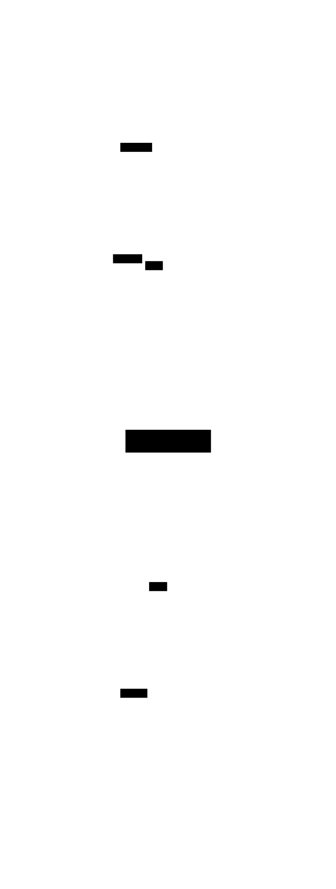

# 31. Computation Models and λ-Calculus

> Mathematical background: [Lambda Calculus](../ct/lambda-calculus.md) — β/η-reduction,
> Church-Turing thesis, SKI, System F

Every programming language embodies a **model of computation** — a precise description of what it
means to compute. Functional programming is grounded in the **λ-calculus** (Church, 1936), not the
Turing machine. That choice has consequences: computation is substitution, not mutation; equational
reasoning is the default; and types are sets of proofs.


## Three families of computation models



| Family         | Key models                                                           | FP connection                                               |
| -------------- | -------------------------------------------------------------------- | ----------------------------------------------------------- |
| **Sequential** | Turing machine, FSM, pushdown automaton, RAM                         | Imperative languages compile to a RAM model                 |
| **Functional** | λ-calculus, combinatory logic (SKI), μ-recursive functions, System F | Every FP language _is_ a typed λ-calculus variant           |
| **Concurrent** | Actor model, CSP/π-calculus, Petri nets, process algebras            | Effect systems and concurrency primitives sit _on top_ of λ |

All three families are **equally expressive** (Church-Turing thesis): anything computable in one can
be computed in any other. They differ in what is _primitive_: mutation vs substitution vs message
passing.

## β-reduction = computation = equational reasoning

In the λ-calculus, computation is a sequence of **β-reduction** steps:

$$(\lambda x.\, e_1)\; e_2 \;\longrightarrow_\beta\; e_1[e_2 / x]$$

"Evaluate a function call" _is_ "substitute the argument for the parameter". Because substitution
has no side effects, **every expression is equal to its fully-reduced form** — this is exactly what
[3. Equational Reasoning](./03-equational-reasoning.md) exploits.

**η-equivalence** says two functions are equal if they agree on all inputs:
$f \equiv_\eta g \iff \forall x,\; f\,x = g\,x$. This underlies the validity of point-free
definitions and is why **referential transparency** holds.

## Church numerals — numbers from pure functions

A natural number $n$ is encoded as a **higher-order function** that applies its argument $n$ times:

$$
\mathbf{0} = \lambda f.\lambda x.\, x \qquad
\mathbf{1} = \lambda f.\lambda x.\, f\,x \qquad
\mathbf{n} = \lambda f.\lambda x.\, \underbrace{f\,(f\,(\cdots f}_{n}\,x\cdots))
$$

Arithmetic follows from function composition:

$$
\mathrm{succ}\; n = \lambda f.\lambda x.\, f\,(n\,f\,x) \qquad
\mathrm{add}\; m\; n = \lambda f.\lambda x.\, m\,f\,(n\,f\,x) \qquad
\mathrm{mul}\; m\; n = \lambda f.\, m\,(n\,f)
$$

Church numerals show that **data can be encoded as behaviour** — a pattern that reappears in
[23. Tagless Final](./23-tagless-final.md) and [9. Type Classes](./09-type-classes.md).

## SKI combinators — point-free at the foundation

Every closed λ-term (no free variables) can be mechanically translated into three combinators:

$$I = \lambda x.\, x \qquad K = \lambda x.\lambda y.\, x \qquad S = \lambda x.\lambda y.\lambda z.\, x\,z\,(y\,z)$$

`SK` alone is Turing-complete; `I = SKK`. Combinatory logic is the formal basis of **point-free
style** — writing pipelines without naming intermediate arguments. In FP: `I` = `id`, `K` = `const`,
`S` ≈ the `Applicative` instance of functions (`(<*>) = \f g x -> f x (g x)`). See
[4. Composition](./04-composition.md).

## The Y and Z combinators — recursion from λ alone

The pure λ-calculus has no built-in `letrec`. Recursion emerges from the **fixed-point property**:

$$Y = \lambda f.\,(\lambda x.\, f\,(x\,x))\,(\lambda x.\, f\,(x\,x)) \qquad Y\,f =_\beta f\,(Y\,f)$$

`Y` works under **lazy evaluation**. For **strict** (call-by-value) languages, use the **Z
combinator** (η-expanded to delay evaluation):

$$Z = \lambda f.\,(\lambda x.\, f\,(\lambda v.\, x\,x\,v))\,(\lambda x.\, f\,(\lambda v.\, x\,x\,v))$$

`Z f n` evaluates `f` with a self-referencing thunk; each recursive call forces the thunk.

## Examples

### C\#

```csharp
// Church numerals as Func<Func<T,T>, Func<T,T>>
using System;

// Church numeral type alias: CN<T> = Func<Func<T,T>, Func<T,T>>
// zero f x = x
Func<Func<int,int>, Func<int,int>> zero = f => x => x;
Func<Func<int,int>, Func<int,int>> one  = f => x => f(x);
Func<Func<int,int>, Func<int,int>> two  = f => x => f(f(x));

// succ n f x = f (n f x)
Func<Func<Func<int,int>, Func<int,int>>,
     Func<Func<int,int>, Func<int,int>>> succ = n => f => x => f(n(f)(x));

// To int: apply (+1) starting from 0
int ToInt(Func<Func<int,int>, Func<int,int>> n) => n(x => x + 1)(0);
Console.WriteLine(ToInt(succ(succ(zero)))); // 2

// SKI
Func<T,T>                         I<T>(T x) => x;
Func<T, Func<U, T>>               K<T,U>(T x) => _ => x;
Func<T,U> S<T,U,V>(Func<T, Func<V,U>> x, Func<T,V> y, T z) => x(z)(y(z));

// Z combinator (strict fixed-point) for factorial
delegate Func<int,int> SelfApply(SelfApply self);
Func<int,int> Z(Func<Func<int,int>, Func<int,int>> f) {
    SelfApply loop = self => f(v => self(self)(v));
    return loop(loop);
}
var fact = Z(rec => n => n <= 1 ? 1 : n * rec(n - 1));
Console.WriteLine(fact(5)); // 120
```

### F\#

```fsharp
// Church numerals — curried functions
// type Church<'a> = ('a -> 'a) -> 'a -> 'a
let zero : ('a -> 'a) -> 'a -> 'a = fun _ x -> x
let one  : ('a -> 'a) -> 'a -> 'a = fun f x -> f x
let succ n = fun f x -> f (n f x)
let add  m n = fun f x -> m f (n f x)
let mul  m n = fun f -> m (n f)

let toInt n = n ((+) 1) 0
printfn "%d" (toInt (succ (succ (succ zero)))) // 3

// SKI as functions
let I x = x
let K x _ = x
let S x y z = x z (y z)

// Z combinator — strict fixed point
let Z f =
    let loop (self : 'a -> 'b) = f (fun v -> self self v)
    loop loop

let fact = Z (fun rec' n -> if n <= 1 then 1 else n * rec' (n - 1))
printfn "%d" (fact 5) // 120
```

### Ruby

```ruby
# Church numerals as lambdas
zero = ->(f) { ->(x) { x } }
one  = ->(f) { ->(x) { f.(x) } }
succ = ->(n) { ->(f) { ->(x) { f.(n.(f).(x)) } } }
add  = ->(m) { ->(n) { ->(f) { ->(x) { m.(f).(n.(f).(x)) } } } }
mul  = ->(m) { ->(n) { ->(f) { m.(n.(f)) } } }

to_i = ->(n) { n.(->(x) { x + 1 }).(0) }

two = succ.(succ.(zero))
puts to_i.(add.(two).(two))  # 4

# SKI
i = ->(x) { x }
k = ->(x) { ->(_) { x } }
s = ->(x) { ->(y) { ->(z) { x.(z).(y.(z)) } } }

# Z combinator (strict — works in Ruby since & is eager)
z = ->(f) {
  loop = ->(self) { f.(->(v) { self.(self).(v) }) }
  loop.(loop)
}

fact = z.(->(rec) { ->(n) { n <= 1 ? 1 : n * rec.(n - 1) } })
puts fact.(6)  # 720
```

### C++

```cpp
#include <functional>
#include <iostream>

// Church numerals — polymorphic via auto (C++20 generic lambdas)
// Church<int>: std::function<std::function<int(int)>(std::function<int(int)>)>
using F = std::function<int(int)>;
using Church = std::function<F(F)>;

Church zero = [](F) { return [](int x) { return x; }; };
Church one  = [](F f) { return [f](int x) { return f(x); }; };

auto succ(Church n) -> Church {
    return [n](F f) { return [n, f](int x) { return f(n(f)(x)); }; };
}
auto add(Church m, Church n) -> Church {
    return [m, n](F f) { return [m, n, f](int x) { return m(f)(n(f)(x)); }; };
}

int to_int(Church n) { return n([](int x) { return x + 1; })(0); }

// SKI
auto I = [](auto x) { return x; };
auto K = [](auto x) { return [x](auto) { return x; }; };
auto S = [](auto x) { return [x](auto y) { return [x,y](auto z) { return x(z)(y(z)); }; }; };

// Z combinator for factorial (strict)
using Rec = std::function<int(int)>;
using Step = std::function<Rec(Rec)>;

Rec Z(Step f) {
    std::function<Rec(std::function<Rec(std::function<Rec(Rec)>)>)> loop;
    loop = [&f](auto self) -> Rec {
        return f([self](int v) { return self(self)(v); });
    };
    return loop(loop);
}

int main() {
    auto three = succ(succ(succ(zero)));
    std::cout << to_int(add(three, three)) << "\n";  // 6

    Rec fact = Z([](Rec rec) -> Rec {
        return [rec](int n) { return n <= 1 ? 1 : n * rec(n - 1); };
    });
    std::cout << fact(5) << "\n";  // 120
}
```

### JavaScript

```javascript
// Church numerals
const zero = (f) => (x) => x;
const one = (f) => (x) => f(x);
const succ = (n) => (f) => (x) => f(n(f)(x));
const add = (m) => (n) => (f) => (x) => m(f)(n(f)(x));
const mul = (m) => (n) => (f) => m(n(f));

const toInt = (n) => n((x) => x + 1)(0);

const two = succ(succ(zero));
const four = add(two)(two);
console.log(toInt(four)); // 4
console.log(toInt(mul(two)(two))); // 4

// SKI combinators
const I = (x) => x;
const K = (x) => (_) => x;
const S = (x) => (y) => (z) => x(z)(y(z));

// verify I = S K K
const I2 = S(K)(K);
console.log(I2(42) === I(42)); // true

// Z combinator — strict (works in JS which is call-by-value)
const Z = (f) => ((x) => f((v) => x(x)(v)))((x) => f((v) => x(x)(v)));

const fact = Z((rec) => (n) => (n <= 1 ? 1 : n * rec(n - 1)));
console.log(fact(7)); // 5040
```

### Python

```python
from typing import TypeVar, Callable

A = TypeVar("A")

# Church numerals
zero = lambda f: lambda x: x
one  = lambda f: lambda x: f(x)
succ = lambda n: (lambda f: lambda x: f(n(f)(x)))
add  = lambda m: lambda n: (lambda f: lambda x: m(f)(n(f)(x)))
mul  = lambda m: lambda n: (lambda f: m(n(f)))

to_int = lambda n: n(lambda x: x + 1)(0)

two  = succ(succ(zero))
five = succ(succ(succ(two)))
print(to_int(add(two)(five)))  # 7
print(to_int(mul(two)(two)))   # 4

# SKI combinators
I = lambda x: x
K = lambda x: lambda _: x
S = lambda x: lambda y: lambda z: x(z)(y(z))

# Z combinator (strict fixed-point; works since Python is call-by-value)
Z = lambda f: (lambda x: f(lambda v: x(x)(v)))(lambda x: f(lambda v: x(x)(v)))

fact = Z(lambda rec: lambda n: 1 if n <= 1 else n * rec(n - 1))
print(fact(8))  # 40320
```

### Haskell

```haskell
-- Haskell is lazy, so the Y combinator works directly (no Z needed)
-- Church numerals require RankNTypes for the polymorphic type

{-# LANGUAGE RankNTypes #-}

-- Church numeral type: applying f exactly n times
newtype Church = Church { runChurch :: forall a. (a -> a) -> a -> a }

zero, one :: Church
zero = Church (\_ x -> x)
one  = Church (\f x -> f x)

succ' :: Church -> Church
succ' (Church n) = Church (\f x -> f (n f x))

add', mul' :: Church -> Church -> Church
add' (Church m) (Church n) = Church (\f x -> m f (n f x))
mul' (Church m) (Church n) = Church (\f   -> m (n f))

toInt :: Church -> Int
toInt (Church n) = n (+1) 0

-- SKI
i :: a -> a
i = id

k :: a -> b -> a
k = const

s :: (a -> b -> c) -> (a -> b) -> a -> c
s x y z = x z (y z)   -- same as (<*>) for ((->) a)

-- Y combinator — works in lazy Haskell
fix :: (a -> a) -> a
fix f = let x = f x in x   -- or: f (fix f)

fact :: Int -> Int
fact = fix (\rec n -> if n <= 1 then 1 else n * rec (n - 1))

-- In practice, use GHC's Data.Function.fix
-- import Data.Function (fix)
```

### Rust

```rust
// Rust is strict + has no GC, so Y combinator needs Box<dyn Fn>
// Church numerals require a trait object or concrete Church type

// Church numeral as a function that applies f n times to x
// We use a macro-free version with concrete i32 for simplicity
fn church_to_int<F>(n: impl Fn(F) -> F, zero_val: F) -> F
where F: Copy
{
    // Hmm — we need a different approach for arbitrary n
    // Instead, represent Church numerals as Fn(fn(i32)->i32) -> fn(i32)->i32
    todo!()  // see below
}

// Practical representation: Church<i32> = Box<dyn Fn(Box<dyn Fn(i32)->i32>) -> Box<dyn Fn(i32)->i32>>
type Step = Box<dyn Fn(i32) -> i32>;
type Church = Box<dyn Fn(Step) -> Step>;

fn zero() -> Church { Box::new(|_f| Box::new(|x| x)) }
fn succ(n: Church) -> Church {
    Box::new(move |f: Step| {
        let nf = n(Box::new(|x| f(x)));   // n f
        Box::new(move |x| f(nf(x)))        // f (n f x)  — simplified
    })
}
fn to_int(n: Church) -> i32 { n(Box::new(|x| x + 1))(0) }

// SKI as generic closures
fn i_comb<T>(x: T) -> T { x }
fn k_comb<T: Clone, U>(x: T) -> impl Fn(U) -> T { move |_| x.clone() }

// Z combinator (strict fixed-point) for factorial
// Uses Rc<dyn Fn> to allow the self-referential closure
use std::rc::Rc;
type RFn = Rc<dyn Fn(i32) -> i32>;

fn z_fact() -> RFn {
    fn z(f: Rc<dyn Fn(RFn) -> RFn>) -> RFn {
        let f2 = f.clone();
        Rc::new(move |v| f.clone()(Rc::new(move |w| z(f2.clone())(w)))(v))
    }
    z(Rc::new(|rec: RFn| {
        Rc::new(move |n: i32| if n <= 1 { 1 } else { n * rec(n - 1) })
    }))
}

fn main() {
    let fact = z_fact();
    println!("{}", fact(6)); // 720
}
```

### Go

```go
// Go: type-erased Church numerals using func(any) any
// (Go lacks the higher-kinded types needed for a typed Church numeral)

package main

import "fmt"

// Church numeral: a function that applies f n times to x
type Church func(f func(any) any) func(any) any

var zero Church = func(f func(any) any) func(any) any {
    return func(x any) any { return x }
}

func succ(n Church) Church {
    return func(f func(any) any) func(any) any {
        return func(x any) any { return f(n(f)(x)) }
    }
}

func add(m, n Church) Church {
    return func(f func(any) any) func(any) any {
        return func(x any) any { return m(f)(n(f)(x)) }
    }
}

func toInt(n Church) int {
    result := n(func(x any) any { return x.(int) + 1 })(0)
    return result.(int)
}

// SKI combinators
var I = func(x any) any { return x }
var K = func(x any) any { return func(_ any) any { return x } }
var S = func(x any) any {
    return func(y any) any {
        return func(z any) any {
            fx := x.(func(any) any)(z)
            yz := y.(func(any) any)(z)
            return fx.(func(any) any)(yz)
        }
    }
}

// Z combinator (strict fixed-point) for factorial
type SelfFn func(SelfFn) func(int) int

func Z(f func(func(int) int) func(int) int) func(int) int {
    loop := func(self SelfFn) func(int) int {
        return f(func(v int) int { return self(self)(v) })
    }
    return loop(loop)
}

func main() {
    two   := succ(succ(zero))
    three := succ(two)
    fmt.Println(toInt(add(two, three)))   // 5

    fact := Z(func(rec func(int) int) func(int) int {
        return func(n int) int {
            if n <= 1 { return 1 }
            return n * rec(n-1)
        }
    })
    fmt.Println(fact(5)) // 120
}
```

## Interaction nets — parallel graph rewriting

All the models above are **sequential at heart**: β-reduction picks one redex at a time. Interaction
nets (Yves Lafont, 1990) are a graph-rewriting model where every reduction is **inherently
parallel** — there are no dependencies between active pairs, so any or all can fire at once.

### The model

An **interaction net** is a graph of **agents** (nodes) connected by **ports** (edges). Every agent
has exactly one distinguished **principal port** and zero or more **auxiliary ports**. Reduction
fires on an **active pair**: two agents connected **principal-to-principal**:

```text
    a          b              result
   / \        / \            / ... \
  …  (*)----(*) …   →      (expanded local subgraph)
```

Each interaction rule:

- is **purely local** — only the two active agents and their wires are touched
- **destroys** the two agents after firing (no sharing, no global traversal)
- is **confluent** — the order of firing never affects the final result

Because no rule touches the same wire as any other, **all active pairs can be reduced in parallel**
without coordination.

### Interaction combinators (Lafont's universal system)

Three agents suffice to compute anything (a universal basis, analogous to SKI):

| Agent       | Symbol | Principal | Auxiliaries | Role                            |
| ----------- | ------ | --------- | ----------- | ------------------------------- |
| Eraser      | ε      | 1         | 0           | Discard a value                 |
| Duplicator  | δ      | 1         | 2           | Copy a value (fan-out)          |
| Constructor | γ      | 1         | 2           | Build a pair / apply a function |

The six pairwise interaction rules (ε–ε, δ–δ, γ–γ, ε–γ, ε–δ, γ–δ) define a complete, Turing-complete
rewriting system. The λ-calculus compiles into interaction combinators via the **Lamping
translation**, which implements **optimal β-reduction** (never duplicates a redex before it is
needed, and never reduces inside an unevaluated thunk).

### HVM and Bend — interaction nets at scale

**HVM** (Higher-order Virtual Machine, HigherOrderCO, 2022) is a runtime that executes interaction
nets on real hardware — CPUs and GPUs — achieving linear speedup with core count for many pure
functional programs. **Bend** is a high-level language that compiles to HVM. The key insight is that
HVM maps active pairs directly to independent GPU threads: the parallelism is structural, not
inferred by an optimiser.

This connects directly to [24. Concurrency and Parallelism](./24-concurrency.md): where that chapter
treats concurrency as an _effect_ to be managed, interaction nets make parallelism **the default**
by construction.

### Examples

The examples below simulate a minimal interaction net interpreter: an agent graph that erases,
duplicates, and constructs pairs, plus a reduction loop. A full Lamping translation is too large to
inline; these snippets show the data structures and one-step reduction.

#### C\#

```csharp
// Minimal interaction net: agents, ports, and one-step reduction
// Agents: Eraser (ε), Duplicator (δ), Constructor (γ)

enum AgentKind { Eraser, Duplicator, Constructor }

record Port(Agent Agent, int Index); // Index 0 = principal

class Agent(AgentKind kind, int arity) {
    public AgentKind Kind   = kind;
    public Port?[]   Ports  = new Port?[arity + 1]; // [0]=principal, [1..]=aux
}

// Active pair: two agents connected on their principal ports
record ActivePair(Agent A, Agent B);

// Interaction: ε–ε → nothing (both erased)
static void Interact(ActivePair pair, List<ActivePair> work) {
    var (a, b) = (pair.A, pair.B);
    if (a.Kind == AgentKind.Eraser && b.Kind == AgentKind.Eraser) {
        // both disappear, no new active pairs
        return;
    }
    // ε–γ: eraser erases both auxiliary ports of γ
    if (a.Kind == AgentKind.Eraser && b.Kind == AgentKind.Constructor) {
        var e1 = new Agent(AgentKind.Eraser, 0);
        var e2 = new Agent(AgentKind.Eraser, 0);
        // connect e1 to b.Ports[1], e2 to b.Ports[2] (omitted: wire bookkeeping)
        _ = e1; _ = e2;
        return;
    }
    // ... other rules elided for brevity
}
```

#### F\#

```fsharp
// Interaction net in F#: algebraic types for agents + reduction step

type AgentKind = Eraser | Duplicator | Constructor

type Agent =
    { Kind  : AgentKind
      Ports : Agent option array } // Ports.[0] = principal

let makeAgent kind arity =
    { Kind = kind; Ports = Array.create (arity + 1) None }

// One reduction step: ε–ε → nothing
let reduce (a: Agent) (b: Agent) : (Agent * Agent) list =
    match a.Kind, b.Kind with
    | Eraser, Eraser -> []                          // both erased
    | Eraser, Constructor ->                        // ε erases each aux port of γ
        let e1 = makeAgent Eraser 0
        let e2 = makeAgent Eraser 0
        // wire e1 → γ.aux1, e2 → γ.aux2 (bookkeeping omitted)
        [(e1, b); (e2, b)]                          // new active pairs to process
    | _ -> []                                       // other rules elided
```

#### Ruby

```ruby
# Interaction net: agents as plain structs, reduction as pattern dispatch

Agent = Struct.new(:kind, :ports) do
  # ports[0] = principal port (holds the connected Agent, or nil)
end

def make_agent(kind, arity) = Agent.new(kind, Array.new(arity + 1))

# One reduction step: returns list of new active pairs
def reduce(a, b)
  case [a.kind, b.kind]
  in [:eraser, :eraser]
    []                           # both disappear
  in [:eraser, :constructor]
    # ε erases each aux port of γ — create two new erasers
    e1 = make_agent(:eraser, 0)
    e2 = make_agent(:eraser, 0)
    # wire to b.ports[1] and b.ports[2] (bookkeeping omitted)
    [[e1, b.ports[1]], [e2, b.ports[2]]].compact
  else
    []                           # other rules elided
  end
end
```

#### C++

```cpp
// Interaction net: nodes as tagged structs, reduction dispatch

#include <memory>
#include <vector>
#include <variant>

enum class Kind { Eraser, Duplicator, Constructor };

struct Agent {
    Kind kind;
    std::vector<std::weak_ptr<Agent>> ports; // ports[0] = principal
    explicit Agent(Kind k, int arity) : kind(k), ports(arity + 1) {}
};

using Pair = std::pair<std::shared_ptr<Agent>, std::shared_ptr<Agent>>;

// One reduction step: ε × ε → {} ; ε × γ → two new erasers
std::vector<Pair> reduce(std::shared_ptr<Agent> a, std::shared_ptr<Agent> b) {
    if (a->kind == Kind::Eraser && b->kind == Kind::Eraser)
        return {};   // both vanish

    if (a->kind == Kind::Eraser && b->kind == Kind::Constructor) {
        auto e1 = std::make_shared<Agent>(Kind::Eraser, 0);
        auto e2 = std::make_shared<Agent>(Kind::Eraser, 0);
        // wire to b->ports[1] and b->ports[2] (bookkeeping omitted)
        return {};   // new pairs would be pushed here
    }
    return {};       // other rules elided
}
```

#### JavaScript

```js
// Interaction net in JavaScript: objects as agents, Map for wires

const makeAgent = (kind, arity) => ({
  kind,
  ports: Array(arity + 1).fill(null), // ports[0] = principal
});

// One reduction step: ε–ε → []; ε–γ → two new erasers
function reduce(a, b, work) {
  if (a.kind === "eraser" && b.kind === "eraser") return; // both vanish

  if (a.kind === "eraser" && b.kind === "constructor") {
    const e1 = makeAgent("eraser", 0);
    const e2 = makeAgent("eraser", 0);
    // wire e1 to b.ports[1], e2 to b.ports[2] (bookkeeping omitted)
    // push new active pairs onto work queue
    if (b.ports[1]) work.push([e1, b.ports[1]]);
    if (b.ports[2]) work.push([e2, b.ports[2]]);
  }
  // other rules elided
}

// Driver: reduce all active pairs (sequential simulation of parallel model)
function runNet(activePairs) {
  const work = [...activePairs];
  while (work.length > 0) {
    const [a, b] = work.pop();
    reduce(a, b, work);
  }
}
```

#### Python

```python
from dataclasses import dataclass, field
from enum import Enum, auto


class Kind(Enum):
    ERASER = auto()
    DUPLICATOR = auto()
    CONSTRUCTOR = auto()


@dataclass
class Agent:
    kind: Kind
    ports: list["Agent | None"] = field(default_factory=list)  # ports[0] = principal


def make_agent(kind: Kind, arity: int) -> Agent:
    return Agent(kind, [None] * (arity + 1))


# One reduction step; returns new active pairs
def reduce(a: Agent, b: Agent) -> list[tuple[Agent, Agent]]:
    match (a.kind, b.kind):
        case (Kind.ERASER, Kind.ERASER):
            return []  # both vanish
        case (Kind.ERASER, Kind.CONSTRUCTOR):
            e1 = make_agent(Kind.ERASER, 0)
            e2 = make_agent(Kind.ERASER, 0)
            # wire to b.ports[1] and b.ports[2] (bookkeeping omitted)
            pairs = []
            if b.ports[1]:
                pairs.append((e1, b.ports[1]))
            if b.ports[2]:
                pairs.append((e2, b.ports[2]))
            return pairs
        case _:
            return []  # other rules elided
```

#### Haskell

```hs
-- Interaction net in Haskell: IORef-based mutable graph
-- (A pure representation requires careful threading of the name supply)
import Data.IORef

data Kind = Eraser | Duplicator | Constructor deriving (Eq, Show)

data Agent = Agent
  { kind  :: Kind
  , ports :: IORef [IORef (Maybe Agent)]  -- ports !! 0 = principal
  }

makeAgent :: Kind -> Int -> IO Agent
makeAgent k arity = do
  ps <- mapM (\_ -> newIORef Nothing) [0..arity]
  ref <- newIORef ps
  pure $ Agent k ref

-- One step: ε–ε → nothing; ε–γ → two new erasers (auxiliary ports freed)
-- Returns new active pairs to schedule
step :: Agent -> Agent -> IO [(Agent, Agent)]
step a b = case (kind a, kind b) of
  (Eraser, Eraser)      -> pure []       -- both vanish
  (Eraser, Constructor) -> do
    e1 <- makeAgent Eraser 0
    e2 <- makeAgent Eraser 0
    -- wire e1 to b.aux1, e2 to b.aux2 (bookkeeping omitted)
    pure []   -- new pairs would be returned here
  _                     -> pure []

-- see: 'inet' package on Hackage for a full interaction net library
```

#### Rust

```rust
// Interaction net in Rust: arena-allocated agents, indices as pointers
// (avoids Rc<RefCell<_>> cyclic graph problems)

#[derive(Clone, Copy, Debug, PartialEq)]
enum Kind { Eraser, Duplicator, Constructor }

#[derive(Clone, Debug)]
struct Agent {
    kind:  Kind,
    ports: Vec<Option<usize>>,  // index into arena; ports[0] = principal
}

struct Net {
    agents: Vec<Agent>,
    active: Vec<(usize, usize)>,  // active pairs as index pairs
}

impl Net {
    fn new_agent(&mut self, kind: Kind, arity: usize) -> usize {
        let id = self.agents.len();
        self.agents.push(Agent { kind, ports: vec![None; arity + 1] });
        id
    }

    // One reduction step: ε–ε → nothing; ε–γ → two new erasers
    fn reduce_pair(&mut self, ai: usize, bi: usize) {
        match (self.agents[ai].kind, self.agents[bi].kind) {
            (Kind::Eraser, Kind::Eraser) => {}  // both vanish
            (Kind::Eraser, Kind::Constructor) => {
                let e1 = self.new_agent(Kind::Eraser, 0);
                let e2 = self.new_agent(Kind::Eraser, 0);
                // wire e1 → agents[bi].ports[1], e2 → agents[bi].ports[2]
                if let Some(p1) = self.agents[bi].ports[1] {
                    self.active.push((e1, p1));
                }
                if let Some(p2) = self.agents[bi].ports.get(2).copied().flatten() {
                    self.active.push((e2, p2));
                }
            }
            _ => {}  // other rules elided
        }
    }

    fn run(&mut self) {
        while let Some((a, b)) = self.active.pop() {
            self.reduce_pair(a, b);
        }
    }
}
// see: HVM2 source (github.com/HigherOrderCO/HVM) for production implementation
```

#### Go

```go
// Interaction net in Go: slice-of-structs arena, indices as references

package main

import "fmt"

type Kind int

const (
	Eraser Kind = iota
	Duplicator
	Constructor
)

type Agent struct {
	kind  Kind
	ports []int // index into agents slice; -1 = unconnected; ports[0] = principal
}

type Net struct {
	agents []Agent
	active [][2]int // active pairs: indices of the two agents
}

func (n *Net) newAgent(k Kind, arity int) int {
	id := len(n.agents)
	ports := make([]int, arity+1)
	for i := range ports {
		ports[i] = -1
	}
	n.agents = append(n.agents, Agent{kind: k, ports: ports})
	return id
}

// One reduction step: ε–ε → nothing; ε–γ → two new erasers
func (n *Net) reducePair(ai, bi int) {
	a, b := n.agents[ai], n.agents[bi]
	switch {
	case a.kind == Eraser && b.kind == Eraser:
		// both vanish
	case a.kind == Eraser && b.kind == Constructor:
		e1 := n.newAgent(Eraser, 0)
		e2 := n.newAgent(Eraser, 0)
		// wire e1 → b.ports[1], e2 → b.ports[2]
		if len(b.ports) > 1 && b.ports[1] >= 0 {
			n.active = append(n.active, [2]int{e1, b.ports[1]})
		}
		if len(b.ports) > 2 && b.ports[2] >= 0 {
			n.active = append(n.active, [2]int{e2, b.ports[2]})
		}
	}
}

func (n *Net) Run() {
	for len(n.active) > 0 {
		pair := n.active[len(n.active)-1]
		n.active = n.active[:len(n.active)-1]
		n.reducePair(pair[0], pair[1])
	}
}

func main() {
	net := &Net{}
	a := net.newAgent(Eraser, 0)
	b := net.newAgent(Eraser, 0)
	net.active = append(net.active, [2]int{a, b})
	net.Run()
	fmt.Println("reduced", len(net.agents), "agents") // 2 (both erased conceptually)
}
```

| β-reduction | $(\lambda x.\,e_1)\,e_2 \to e_1[e_2/x]$ — the fundamental computation step | |
η-equivalence | $f \equiv \lambda x.\,f\,x$ — extensional equality; basis of point-free style | |
Church-Turing thesis | λ-calculus, Turing machines, and μ-recursive functions compute the same class
of functions | | Church numerals | Natural numbers as iteration count:
$\mathbf{n} = \lambda f.\lambda x.\, f^n(x)$ | | SKI combinators | Turing-complete point-free basis;
`I=id`, `K=const`, `S≈(<*>)` | | Y combinator | $Y\,f = f\,(Y\,f)$ — fixed point; recursion without
naming; works under lazy evaluation | | Z combinator | Strict variant of Y; needed in call-by-value
languages | | System F | Polymorphic λ-calculus; formal basis of `forall` types and parametricity |
| Normal order | Outermost-first reduction = lazy evaluation | | Applicative order | Innermost-first
reduction = strict evaluation | | Interaction nets | Graph-rewriting model: agents connected by
ports; active pairs reduce locally and in parallel | | Interaction combinators | Universal basis: ε
(erase), δ (duplicate), γ (construct) — Turing-complete in 6 rules | | HVM / Bend | Runtime that
maps active pairs to GPU threads; structural parallelism without a scheduler |

## See also

- [24. Concurrency and Parallelism](./24-concurrency.md) — HVM/Bend: interaction nets as a massively
  parallel runtime; active pairs as independent GPU threads
- [ct/lambda-calculus.md](../ct/lambda-calculus.md) — formal definition, Church-Rosser theorem,
  System F, and the full SKI translation
- [3. Equational Reasoning](./03-equational-reasoning.md) — β-reduction makes every call site
  replaceable by its result
- [4. Composition](./04-composition.md) — `(.)` is the S combinator instantiated; point-free is SKI
- [5. Higher-Order Functions](./05-higher-order-functions.md) — higher-order functions _are_
  λ-abstractions
- [10. Lazy Evaluation](./10-lazy-evaluation.md) — call-by-need is normal-order reduction with
  memoisation
- [23. Tagless Final](./23-tagless-final.md) — Church encoding at the type-class level
- [29. Codata and Coinduction](./29-codata.md) — greatest fixed points; corecursion = coinductive
  analogue of Y
