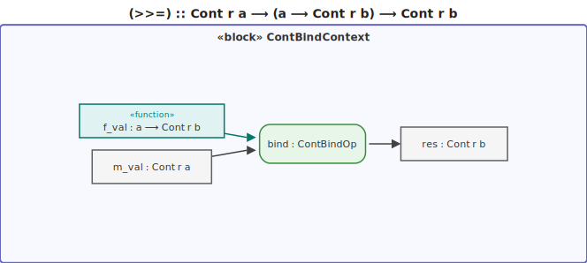
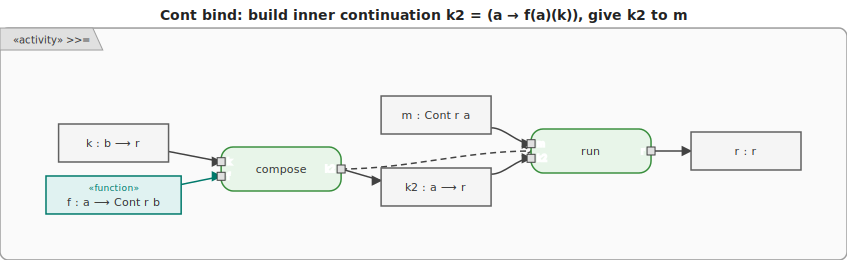

# Continuation Monad

The **Continuation monad** (`Cont`) models computations as **functions that take their own
continuation** — a callback that says "what to do with the result next". Making continuations
explicit gives first-class control over the flow of a program.






## Type

```text
Cont r a  =  (a -> r) -> r
```

- `a` is the value this step produces
- `r` is the **final result type** of the entire computation
- A `Cont` value is literally a function waiting for a continuation `k :: a -> r`

## How bind works

```text
pure x  = \k -> k x                    -- pass x directly to the continuation

bind m f = \k -> m (\a -> f a k)       -- let m produce a, then have f a consume k
```

Each `bind` composes continuations: `m` is given a continuation that first runs `f a`, which is then
given the original `k`. The current step is always "running last", which is why Cont can implement
early exit and other non-local control flows.

## Key operations

| Operation     | Type                                        | Description                                            |
| ------------- | ------------------------------------------- | ------------------------------------------------------ |
| `runCont m k` | `Cont r a -> (a -> r) -> r`                 | Execute the computation with a final continuation `k`  |
| `callCC f`    | `((a -> Cont r b) -> Cont r a) -> Cont r a` | Capture the current continuation as an escape function |
| `reset m`     | `Cont a a -> Cont r a`                      | Delimit the scope of the current continuation          |
| `shift f`     | `((a -> r) -> Cont r r) -> Cont r a`        | Capture the continuation up to the enclosing `reset`   |

## Key use cases

- **Early exit** — `callCC` acts as a `return` or `break` that jumps out of deeply nested code
- **Exceptions** — implement `throw`/`catch` as pure values
- **Coroutines** — cooperative multitasking without OS threads
- **Backtracking** — enumerate alternatives by calling a continuation multiple times
- **CPS transformation** — the basis for many compiler optimisations

Cont is known as the **"mother of all monads"**: every monad `M` can be embedded into `Cont (M r)`.

## Motivation

In deep nested code, returning early means threading a flag or special value back through every
layer. `callCC` lets you escape directly to the call site — the continuation captures exactly "what
would have happened next".

```text
-- Without callCC: early exit requires returning a sentinel and checking it at each level
function pipeline(x):
    r1 = step1(x)
    if r1 == ABORT: return ABORT
    r2 = step2(r1)
    if r2 == ABORT: return ABORT
    r3 = step3(r2)
    if r3 == ABORT: return ABORT
    return r3
```

```text
-- With callCC: the escape function jumps straight to the runCont call site
pipeline = callCC $ \exit -> do
    r1 <- step1 x; when (shouldAbort r1) (exit ABORT)
    r2 <- step2 r1; when (shouldAbort r2) (exit ABORT)
    r3 <- step3 r2
    return r3
```


## Examples

### C\#

```csharp
// Cont<R,A>: (A -> R) -> R
// Modelled as a delegate for clarity.

delegate R Cont<R, A>(Func<A, R> k);

static Cont<R, A> Pure<R, A>(A value) => k => k(value);

static Cont<R, B> Bind<R, A, B>(Cont<R, A> m, Func<A, Cont<R, B>> f) =>
    k => m(a => f(a)(k));

static A RunCont<A>(Cont<A, A> m) => m(x => x);

// callCC: the escape function ignores the rest of the computation
static Cont<R, A> CallCC<R, A, B>(Func<Func<A, Cont<R, B>>, Cont<R, A>> f) =>
    k => f(a => _ => k(a))(k);

// Early exit: result = 10 (the large branch is taken immediately)
var result = RunCont(
    CallCC<int, int, int>(exit =>
        Bind(Pure<int, int>(10), x =>
            x > 5
                ? exit(x)          // escape: k(10) is returned directly
                : Pure<int, int>(x * 2))));
// result = 10

// CPS without the Cont wrapper — idiomatic for simple cases
int AddCps(int x, Func<int, int> k) => k(x + 1);
int DoubleCps(int x, Func<int, int> k) => k(x * 2);

// Add 5 then double: 12
int r = AddCps(5, a => DoubleCps(a, b => b));
```

### F\#

F# computation expressions give `do`-notation over `Cont` without a library.

```fsharp
type Cont<'r, 'a> = Cont of (('a -> 'r) -> 'r)

let runCont (Cont m) k = m k
let pure x             = Cont (fun k -> k x)
let bind (Cont m) f    = Cont (fun k -> m (fun a -> runCont (f a) k))
let callCC f           = Cont (fun k -> runCont (f (fun a -> Cont (fun _ -> k a))) k)

type ContBuilder<'r>() =
    member _.Return x        = pure x
    member _.Bind(m, f)      = bind m f
    member _.ReturnFrom m    = m

let cont<'r> = ContBuilder<'r>()

// Early exit: result = 10
let result =
    runCont (cont {
        let! x = pure 10
        let! y = callCC (fun exit -> cont {
                if x > 5 then return! exit x   // jumps out
                return x * 2
            })
        return y
    }) id
// result = 10

// CPS pipeline
let addCps x k  = k (x + 1)
let doubleCps x k = k (x * 2)
let r = addCps 5 (fun a -> doubleCps a id)  // 12
```

### Ruby

```ruby
# Cont<R,A> as a lambda: (A -> R) -> R

def pure(value)
  ->(k) { k.call(value) }
end

def bind(m, &f)
  ->(k) { m.call(->(a) { f.call(a).call(k) }) }
end

def run_cont(m)
  m.call(->(x) { x })
end

def call_cc(&f)
  ->(k) {
    escape = ->(a) { ->(_ignored) { k.call(a) } }
    f.call(escape).call(k)
  }
end

# Early exit: result = 10
result = run_cont(
  call_cc do |exit|
    bind(pure(10)) do |x|
      x > 5 ? exit.call(x) : pure(x * 2)
    end
  end
)
# result = 10

# CPS pipeline (idiomatic Ruby equivalent)
add_cps    = ->(x, k) { k.call(x + 1) }
double_cps = ->(x, k) { k.call(x * 2) }
r = add_cps.call(5, ->(a) { double_cps.call(a, ->(b) { b }) })  # 12
```

### C++

```cpp
#include <functional>

template <typename R, typename A>
using Cont = std::function<R(std::function<R(A)>)>;

template <typename R, typename A>
Cont<R, A> pure(A value) {
    return [value](auto k) { return k(value); };
}

template <typename R, typename A, typename B>
Cont<R, B> bind(Cont<R, A> m, std::function<Cont<R, B>(A)> f) {
    return [m, f](auto k) { return m([f, k](A a) { return f(a)(k); }); };
}

template <typename R, typename A>
R runCont(Cont<R, A> m) { return m([](A a) -> R { return a; }); }

// CPS pipeline — cleaner than the full Cont wrapper for simple cases
int addCps(int x, std::function<int(int)> k)    { return k(x + 1); }
int doubleCps(int x, std::function<int(int)> k) { return k(x * 2); }

// Add 5 then double: 12
int r = addCps(5, [](int a) { return doubleCps(a, [](int b) { return b; }); });

// Early exit via full Cont + callCC
template <typename R, typename A>
Cont<R, A> callCC(std::function<Cont<R, A>(std::function<Cont<R, A>(A)>)> f) {
    return [f](std::function<R(A)> k) -> R {
        return f([k](A a) -> Cont<R, A> {
            return [k, a](auto) -> R { return k(a); };
        })(k);
    };
}

auto result = runCont<int, int>(
    callCC<int, int>([](auto exit) {
        return bind<int, int, int>(pure<int, int>(10), [exit](int x) -> Cont<int, int> {
            if (x > 5) return exit(x);
            return pure<int, int>(x * 2);
        });
    }));
// result = 10
```

### JavaScript

```js
// Cont<R,A>: (A -> R) -> R

const pure = (value) => (k) => k(value);
const bind = (m, f) => (k) => m((a) => f(a)(k));
const runCont = (m) => m((x) => x);
const callCC = (f) => (k) => f((a) => (_) => k(a))(k);

// Early exit: result = 10
const result = runCont(
  callCC((exit) =>
    bind(
      pure(10),
      (x) =>
        x > 5
          ? exit(x) // escape: k(10) returned immediately
          : pure(x * 2), // never reached
    ),
  ),
);
// result = 10

// CPS pipeline (idiomatic JS equivalent)
const addCps = (x, k) => k(x + 1);
const doubleCps = (x, k) => k(x * 2);
const r = addCps(5, (a) => doubleCps(a, (b) => b)); // 12
```

### Python

```py
# Cont<R,A>: (A -> R) -> R

def pure(value):
    return lambda k: k(value)

def bind(m, f):
    return lambda k: m(lambda a: f(a)(k))

def run_cont(m):
    return m(lambda x: x)

def call_cc(f):
    return lambda k: f(lambda a: (lambda _: k(a)))(k)

# Early exit: result = 10
result = run_cont(
    call_cc(lambda exit:
        bind(pure(10), lambda x:
            exit(x) if x > 5 else pure(x * 2)
        )
    )
)
# result = 10

# CPS pipeline (idiomatic Python equivalent)
add_cps    = lambda x, k: k(x + 1)
double_cps = lambda x, k: k(x * 2)
r = add_cps(5, lambda a: double_cps(a, lambda b: b))  # 12
```

### Haskell

```hs
import Control.Monad.Cont

-- runCont :: Cont r a -> (a -> r) -> r
-- callCC  :: ((a -> Cont r b) -> Cont r a) -> Cont r a

-- Early exit: jump out of a computation when a condition holds
earlyExit :: Int
earlyExit = runCont computation id
  where
    computation :: Cont Int Int
    computation = callCC $ \exit -> do
        x <- return 10
        when (x > 5) $ exit x   -- jumps here; rest is discarded
        return (x * 2)
-- earlyExit = 10

-- Simulate exceptions
safeDivide :: Int -> Int -> Cont r (Either String Int)
safeDivide _ 0 = return (Left "division by zero")
safeDivide a b = return (Right (a `div` b))

-- Coroutine: add 10, then add 10 again (via continuation)
addTen :: Int -> Cont r Int
addTen x = return (x + 10)

chainedResult :: Int
chainedResult = runCont (addTen 5 >>= addTen) id  -- 25
```

### Rust

```rust
// The Cont monad is awkward in Rust due to ownership and lack of HKT.
// Continuation-passing style (CPS) is the idiomatic Rust equivalent.

// CPS: each function takes a continuation closure
fn add_cps<R>(x: i32, k: impl FnOnce(i32) -> R) -> R {
    k(x + 1)
}

fn double_cps<R>(x: i32, k: impl FnOnce(i32) -> R) -> R {
    k(x * 2)
}

// Add 5 then double: 12
let r = add_cps(5, |a| double_cps(a, |b| b));
assert_eq!(r, 12);

// Early exit — idiomatic Rust uses a labelled block or a closure
fn pipeline(x: i32) -> i32 {
    // "callCC exit" is a labelled block break in Rust
    let result = 'early: {
        if x > 5 {
            break 'early x;   // escape immediately
        }
        x * 2
    };
    result
}
assert_eq!(pipeline(10), 10);
assert_eq!(pipeline(3), 6);

// For asynchronous coroutines, Rust uses async/await (Future monad).
```

### Go

```go
// Go does not have a Cont monad or CPS as a standard pattern.
// CPS is expressible with closures; early exit uses labelled breaks or returns.

// CPS pipeline: each step calls a continuation function
func addCps(x int, k func(int) int) int    { return k(x + 1) }
func doubleCps(x int, k func(int) int) int { return k(x * 2) }

// Add 5 then double: 12
r := addCps(5, func(a int) int { return doubleCps(a, func(b int) int { return b }) })
// r = 12

// Early exit — idiomatic Go uses an explicit return
func pipeline(x int) int {
	if x > 5 {
		return x // "callCC exit" equivalent
	}
	return x * 2
}
// pipeline(10) == 10, pipeline(3) == 6

// For sequential async code, Go uses goroutines + channels,
// which model a form of cooperative continuation passing.
```
