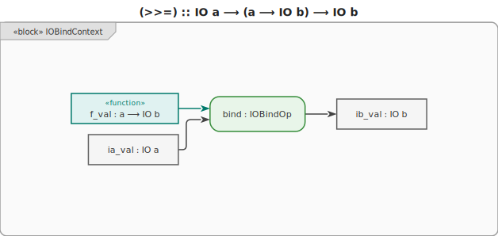
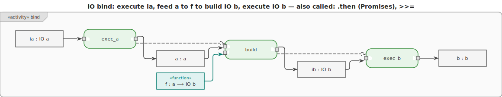

# IO Monad

The **IO monad** models **side-effectful computations** — reading input, writing output, accessing
files, clocks, or any interaction with the outside world.






## Type

```text
IO a  -- a description of an effectful computation that, when executed, produces a value of type a
```

An `IO a` value is a **recipe**, not a result. Nothing actually runs until the runtime executes it
(in Haskell, this happens at `main`). This keeps pure functions truly pure — all effects are
explicit in the type.

## How bind works

`bind` **sequences** two IO actions:

1. Execute the first action to obtain a value `a`.
2. Pass `a` to `f` to get the next IO action.
3. Execute that action.

The order of `bind` calls determines the order in which side effects happen.

## Key use cases

- Console I/O (read/write)
- File I/O
- Network requests
- Clock / random number generation
- Any real-world interaction

## Motivation

Without an IO monad, functions can silently perform side effects despite having a pure-looking type
signature. The caller cannot tell from the type whether a function reads a file, writes to a
database, or launches a rocket. Testing requires global mocks; effect order is implicit and fragile.

```text
-- Without IO monad: side effects hidden behind a pure-looking type
function compute(x: Int) -> Int:
    factor = read_file("config.txt")  -- surprise! reads a file
    log("computing...")               -- surprise! writes to a log
    return x * factor
-- Nothing in the signature warns callers about the side effects.
-- Unit-testing means mocking the file system globally.
-- Reordering lines may silently change observable behaviour.
```

```text
-- With IO monad: effects are explicit in the return type
compute :: Int -> IO Int
compute x = do
    factor <- readFile "config.txt"  -- IO effect declared
    log "computing..."               -- IO effect declared
    pure (x * factor)
-- IO Int tells every caller: this computation has side effects.
-- Pure functions remain IO-free and trivially testable.
-- The runtime executes effects in the exact order bind specifies.
```


## Examples

### C\# (Task as an IO-like monad)

```csharp
// Task<T> sequences async IO operations the same way
async Task<string> GreetUser()
{
    string name = await Console.In.ReadLineAsync();      // IO String
    await Console.Out.WriteLineAsync($"Hello, {name}!"); // IO ()
    return name;
}
```

### F\# (async computation expression)

F# `async { }` is a computation expression that sequences IO actions just like `do`-notation, with
`let!` as bind.

```fsharp
let greetUser () = async {
    let! name = Console.In.ReadLineAsync() |> Async.AwaitTask  // IO String
    do! Console.Out.WriteLineAsync($"Hello, {name}!") |> Async.AwaitTask  // IO ()
    do! Console.Out.WriteLineAsync("Have a nice day!") |> Async.AwaitTask
    return name
}

// Execute
let name = greetUser () |> Async.RunSynchronously
```

### Ruby

```ruby
# Ruby IO is sequential by nature — plain method calls in order
def greet_user
  name = gets.chomp        # IO: read from stdin
  puts "Hello, #{name}!"  # IO: write to stdout
  puts "Have a nice day!"
  name
end

name = greet_user
```

### C++

```cpp
#include <iostream>
#include <string>

// C++ IO is sequential by nature — no IO monad needed
std::string greet_user() {
    std::string name;
    std::getline(std::cin, name);              // IO: read
    std::cout << "Hello, " << name << "!\n"; // IO: write
    std::cout << "Have a nice day!\n";
    return name;
}
```

### JavaScript (Promise as an IO-like monad)

```js
// Promise.then is bind for async IO
const greetUser = () =>
  readLine()
    .then((name) => writeLine(`Hello, ${name}!`).then(() => name))
    .then((name) => writeLine("Have a nice day!"));
```

### Python (generator-based sequencing)

```py
import sys

def greet_user():
    name = input()             # IO: read from stdin
    print(f"Hello, {name}!")   # IO: write to stdout
    print("Have a nice day!")  # IO: write to stdout
    return name
```

### Haskell

In Haskell, `IO` is the _only_ way to perform side effects. `do`-notation is syntactic sugar for
`>>=`.

```hs
greetUser :: IO String
greetUser = do
    name <- getLine                       -- IO String: read a line
    putStrLn ("Hello, " ++ name ++ "!")  -- IO ()    : write a line
    putStrLn "Have a nice day!"           -- IO ()    : write a line
    return name                           -- IO String: wrap result
```

The type `IO String` tells callers that this function has side effects and produces a `String`. A
function with no `IO` in its return type is **guaranteed pure**.

### Rust

```rust
// Rust has no IO monad; side effects are unrestricted.
// Purity is expressed through ownership and the type system, not a wrapper type.
// Convention: keep computation in pure functions; call them from IO-performing code.
use std::io::{self, BufRead, Write};

// Pure computation
fn greet(name: &str) -> String {
    format!("Hello, {}!", name)
}

// IO at the boundary; Result<(), io::Error> signals possible failure
fn greet_user() -> io::Result<()> {
    print!("Enter your name: ");
    io::stdout().flush()?;
    let stdin = io::stdin();
    let name = stdin.lock().lines().next().unwrap()?;
    println!("{}", greet(&name));
    println!("Have a nice day!");
    Ok(())
}
```

### Go

```go
import (
	"bufio"
	"fmt"
	"os"
)

// Go has no IO monad; IO is implicit in any function.
// Convention: push IO to the edges; keep business logic in pure functions.

// Pure computation
func greet(name string) string {
	return "Hello, " + name + "!"
}

// IO boundary
func greetUser() error {
	fmt.Print("Enter your name: ")
	reader := bufio.NewReader(os.Stdin)
	name, err := reader.ReadString('\n')
	if err != nil {
		return err
	}
	fmt.Println(greet(name))
	fmt.Println("Have a nice day!")
	return nil
}
```
