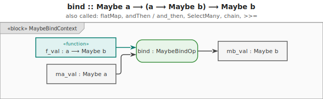
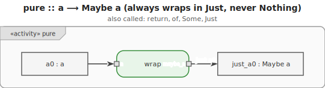
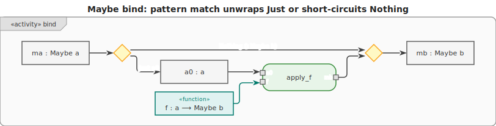
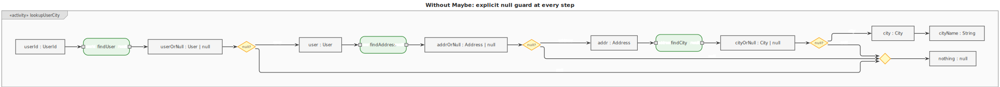
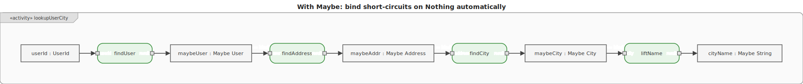

# Maybe Monad

The **Maybe monad** (`Option` in some languages) models computations that may **fail silently** —
producing either a value or nothing at all.








## Type

```text
Maybe<a> = Just a   -- a value is present
         | Nothing  -- absence of value / silent failure
```

## How bind works

| Input     | bind behaviour                                                   |
| --------- | ---------------------------------------------------------------- |
| `Just a`  | unwrap `a`, apply `f`, return the result (`Just b` or `Nothing`) |
| `Nothing` | **skip `f`**, propagate `Nothing` immediately                    |

This makes it impossible to accidentally call a function on an absent value. A chain short-circuits
at the first `Nothing`.

## Key use cases

- Safe dictionary lookup (key may not exist)
- Safe array indexing (index may be out of bounds)
- Parsing that may fail
- Any optional configuration value

## Motivation

Without Maybe, a chain of operations that may each return `null` requires a null check after every
single step. The business logic drowns in boilerplate.

```text
-- Without Maybe: explicit null guard at every step
function lookup_user_city(id):
    user    = find_user(id)
    if user    == null: return null
    address = find_address(user.address_id)
    if address == null: return null
    city    = find_city(address.city_id)
    if city    == null: return null
    return city.name
```

```text
-- With Maybe: bind handles the null check; only happy-path logic remains
lookup_user_city(id) =
    find_user(id)
        .bind(user    -> find_address(user.address_id))
        .bind(address -> find_city(address.city_id))
        .bind(city    -> pure(city.name))
```





## Examples

### C\#

```csharp
int? SafeDivide(int a, int b) => b == 0 ? null : a / b;

// Chain: 10 / 2 = 5, then 5 / 0 = Nothing, then Nothing / 1 = Nothing
int? result = SafeDivide(10, 2)
    .SelectMany(x => SafeDivide(x, 0))
    .SelectMany(x => SafeDivide(x, 1)); // null
```

### F\#

F# has a built-in `option` type and `Option.bind` for chaining. The `|>` pipe operator makes chains
read naturally left-to-right.

```fsharp
let safeDivide a b = if b = 0 then None else Some (a / b)

// Chain using Option.bind and |>
let result =
    safeDivide 10 2
    |> Option.bind (fun x -> safeDivide x 0)  // None (short-circuits)
    |> Option.bind (fun x -> safeDivide x 1)  // never reached
// result = None

// Using a computation expression (CE) for do-notation style
let maybe = OptionBuilder()  // or use a library like FSharpPlus
let result2 = maybe {
    let! x = safeDivide 10 2
    let! y = safeDivide x 0
    return! safeDivide y 1
}
// result2 = None
```

### Ruby

```ruby
def safe_divide(a, b)
  b.zero? ? nil : a / b
end

# && acts as bind: short-circuits on nil
x = safe_divide(10, 2)      # 5
y = x && safe_divide(x, 0)  # nil (short-circuits)
z = y && safe_divide(y, 1)  # nil (never reached)
# z = nil
```

### C++

```cpp
#include <optional>

auto safe_divide = [](int a, int b) -> std::optional<int> {
    return b == 0 ? std::nullopt : std::optional{a / b};
};

// C++23: and_then is bind for optional
auto result = safe_divide(10, 2)
    .and_then([&](int x) { return safe_divide(x, 0); })  // nullopt
    .and_then([&](int x) { return safe_divide(x, 1); }); // never reached
// result = std::nullopt
```

### JavaScript

```js
// Using a Maybe helper
const safeDivide = (b) => (a) => (b === 0 ? null : a / b);

const chain = (ma, f) => (ma === null ? null : f(ma));

const result = chain(chain(chain(10, safeDivide(2)), safeDivide(0)), safeDivide(1)); // null
```

### Python

```py
def safe_divide(b):
    return lambda a: None if b == 0 else a / b

def bind(ma, f):
    return None if ma is None else f(ma)

result = bind(bind(bind(10, safe_divide(2)), safe_divide(0)), safe_divide(1))  # None
```

### Haskell

```hs
safeDivide :: Int -> Int -> Maybe Int
safeDivide _ 0 = Nothing
safeDivide a b = Just (a `div` b)

result :: Maybe Int
result = do
    x <- safeDivide 10 2  -- Just 5
    y <- safeDivide x 0   -- Nothing (short-circuits here)
    safeDivide y 1        -- never reached
-- result = Nothing
```

### Rust

```rust
// Option<T> is Rust's built-in Maybe.
// and_then is bind; map is fmap; unwrap_or provides a default.

fn safe_divide(a: i32, b: i32) -> Option<i32> {
    if b == 0 { None } else { Some(a / b) }
}

let result = safe_divide(10, 2)         // Some(5)
    .and_then(|x| safe_divide(x, 0))    // None  — short-circuits
    .and_then(|x| safe_divide(x, 1));   // never reached
// result = None

// map: apply a plain function inside Option
let doubled = Some(5).map(|x| x * 2); // Some(10)
let none: Option<i32> = None;
none.map(|x| x * 2);                  // None

// unwrap_or: provide a fallback
let value = None::<i32>.unwrap_or(0);  // 0
```

### Go

```go
// Go has no built-in Maybe; use (value, bool) or (value, error).

type Option[T any] struct {
	Value T
	Valid bool
}

func Some[T any](x T) Option[T] { return Option[T]{Value: x, Valid: true} }
func None[T any]() Option[T]    { return Option[T]{} }

func AndThen[A, B any](m Option[A], f func(A) Option[B]) Option[B] {
	if !m.Valid {
		return Option[B]{}
	}
	return f(m.Value)
}

safeDivide := func(a, b int) Option[int] {
	if b == 0 {
		return None[int]()
	}
	return Some(a / b)
}

result := AndThen(
	AndThen(safeDivide(10, 2), func(x int) Option[int] { return safeDivide(x, 0) }),
	func(x int) Option[int] { return safeDivide(x, 1) },
) // {0, false}
```
