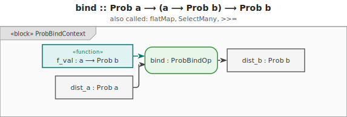
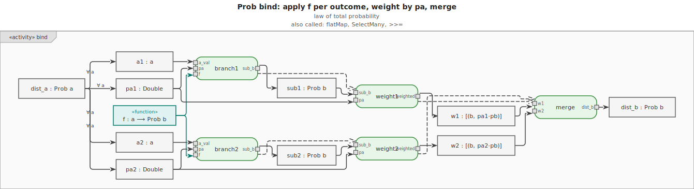
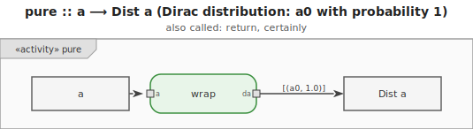
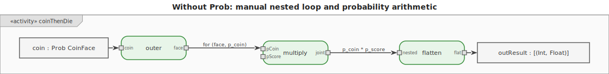
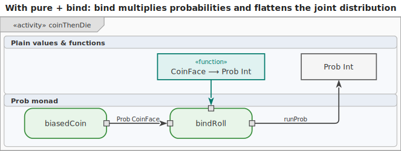

# Probability Monad

The **Probability monad** (also called the Distribution monad) models **discrete probability
distributions**. Each possible value is paired with its probability, and `bind` implements
conditional probability — weighting each outcome by the probability of reaching it.








## Type

```text
Prob a  =  [(a, Double)]
```

A `Prob a` value is a list of `(outcome, probability)` pairs. Probabilities should sum to 1.

## How bind works

```text
bind :: Prob a -> (a -> Prob b) -> Prob b
bind dist f = [(b, pa * pb) | (a, pa) <- dist, (b, pb) <- f a]
```

For each outcome `a` with probability `pa`, apply `f a` to get a new distribution over `b`. Weight
each `b` outcome by `pa * pb`. This is exactly **Bayes' rule** for conditional probability:

$$P(B = b) = \sum_{a} P(B = b \mid A = a) \cdot P(A = a)$$

## Key operations

| Operation               | Description                                            |
| ----------------------- | ------------------------------------------------------ |
| `pure x`                | The certain distribution: `[(x, 1.0)]`                 |
| `uniform xs`            | Equal weight over a list: `[(x, 1/n) for x in xs]`     |
| `probability pred dist` | `sum p` for all `(a, p)` where `pred a` holds          |
| `normalize dist`        | Scale probabilities so they sum to 1 (after filtering) |
| `expectedValue f dist`  | Weighted average: `sum (f(a) * p for (a, p) in dist)`  |
| `support dist`          | The list of possible outcomes (the `a` values)         |

## Key use cases

- Bayesian reasoning and belief updating
- Probabilistic programs and generative models
- Game theory and strategy evaluation
- Modelling dice rolls, card draws, and branching random processes
- Prior-to-posterior updates in machine learning

## Motivation

Without the monad, each conditional step requires a nested loop to multiply probabilities and
flatten the resulting list of distributions. With `bind`, the conditional structure reads exactly
like the probability model.

```text
-- Without Prob monad: explicit nested loop to compute conditional distribution
function score_distribution(coin_dist):
    result = []
    for (coin, p_coin) in coin_dist:
        die_dist = roll_die_given(coin)   -- depends on coin outcome
        for (score, p_score) in die_dist:
            result.append((score, p_coin * p_score))
    return result
```

```text
-- With Prob monad: reads like the probability model directly
score = do
    coin  <- biasedCoin             -- P(Heads)=0.7, P(Tails)=0.3
    score <- rollDie coin           -- die given coin outcome
    return score
```





## Examples

The running example: a **biased coin** (Heads 70%, Tails 30%). On Heads roll a fair d6; on Tails the
score is always 1. What is the probability distribution over scores, and what is P(score ≥ 4)?

$$
P(\text{score} \geq 4) = P(\text{Heads}) \cdot P(d6 \geq 4) + P(\text{Tails}) \cdot P(1 \geq 4)
= 0.7 \times \tfrac{3}{6} + 0.3 \times 0 = 0.35
$$

### C\#

```csharp
using System.Collections.Generic;
using System.Linq;

// Prob<T>: a discrete distribution as a list of (value, probability) pairs
record Outcome<T>(T Value, double Prob);

static class Prob
{
    public static List<Outcome<T>> Pure<T>(T value) =>
        new() { new(value, 1.0) };

    public static List<Outcome<B>> Bind<A, B>(
        List<Outcome<A>> dist,
        Func<A, List<Outcome<B>>> f) =>
        dist.SelectMany(a => f(a.Value).Select(b => new Outcome<B>(b.Value, a.Prob * b.Prob)))
            .ToList();

    public static List<Outcome<T>> Uniform<T>(IEnumerable<T> xs)
    {
        var list = xs.ToList();
        double p = 1.0 / list.Count;
        return list.Select(x => new Outcome<T>(x, p)).ToList();
    }

    public static double Probability<T>(List<Outcome<T>> dist, Func<T, bool> pred) =>
        dist.Where(o => pred(o.Value)).Sum(o => o.Prob);
}

// Biased coin
var coin = new List<Outcome<string>> { new("Heads", 0.7), new("Tails", 0.3) };

// Conditional die roll
var score = Prob.Bind(coin, c =>
    c == "Heads"
        ? Prob.Uniform(Enumerable.Range(1, 6))
        : Prob.Pure(1));

double pScoreGe4 = Prob.Probability(score, s => s >= 4);
// pScoreGe4 ≈ 0.35
```

### F\#

```fsharp
// Prob<'a>: list of (value, probability) pairs
type Dist<'a> = ('a * float) list

module Prob =
    let pure x : Dist<_> = [(x, 1.0)]

    let bind (dist: Dist<'a>) (f: 'a -> Dist<'b>) : Dist<'b> =
        [ for (a, pa) in dist do
            for (b, pb) in f a do
                yield (b, pa * pb) ]

    let uniform (xs: 'a list) : Dist<'a> =
        let p = 1.0 / float xs.Length
        xs |> List.map (fun x -> (x, p))

    let probability (pred: 'a -> bool) (dist: Dist<'a>) =
        dist |> List.sumBy (fun (a, p) -> if pred a then p else 0.0)

// Biased coin
let coin : Dist<string> = [("Heads", 0.7); ("Tails", 0.3)]

// Conditional die roll using bind (like a do-block)
let score =
    Prob.bind coin (fun c ->
        if c = "Heads" then Prob.uniform [1..6]
        else Prob.pure 1)

let pGe4 = Prob.probability (fun s -> s >= 4) score
// pGe4 ≈ 0.35
```

### Ruby

```ruby
# Prob: Array of [value, probability] pairs

module Prob
  def self.pure(value)
    [[value, 1.0]]
  end

  def self.uniform(xs)
    p = 1.0 / xs.length
    xs.map { |x| [x, p] }
  end

  def self.bind(dist, &f)
    dist.flat_map { |val, pa| f.call(val).map { |b, pb| [b, pa * pb] } }
  end

  def self.probability(dist, &pred)
    dist.sum { |val, p| pred.call(val) ? p : 0.0 }
  end
end

# Biased coin
coin = [['Heads', 0.7], ['Tails', 0.3]]

# Conditional die roll
score = Prob.bind(coin) do |c|
  c == 'Heads' ? Prob.uniform((1..6).to_a) : Prob.pure(1)
end

p_ge4 = Prob.probability(score) { |s| s >= 4 }
# p_ge4 ≈ 0.35
```

### C++

```cpp
#include <vector>
#include <utility>
#include <numeric>
#include <functional>

template <typename T>
using Dist = std::vector<std::pair<T, double>>;

template <typename T>
Dist<T> pure(T value) { return {{value, 1.0}}; }

template <typename T>
Dist<T> uniform(std::vector<T> xs) {
    double p = 1.0 / xs.size();
    Dist<T> result;
    for (auto& x : xs) result.push_back({x, p});
    return result;
}

template <typename A, typename B>
Dist<B> bind(const Dist<A>& dist, std::function<Dist<B>(A)> f) {
    Dist<B> result;
    for (auto& [a, pa] : dist)
        for (auto& [b, pb] : f(a))
            result.push_back({b, pa * pb});
    return result;
}

template <typename T>
double probability(const Dist<T>& dist, std::function<bool(T)> pred) {
    return std::accumulate(dist.begin(), dist.end(), 0.0,
        [&](double acc, const auto& pair) {
            return acc + (pred(pair.first) ? pair.second : 0.0);
        });
}

// Biased coin
Dist<std::string> coin = {{"Heads", 0.7}, {"Tails", 0.3}};

// Conditional die roll
auto score = bind<std::string, int>(coin, [](std::string c) -> Dist<int> {
    if (c == "Heads") return uniform(std::vector<int>{1, 2, 3, 4, 5, 6});
    return pure(1);
});

double pGe4 = probability<int>(score, [](int s) { return s >= 4; });
// pGe4 ≈ 0.35
```

### JavaScript

```js
// Dist: Array of {value, prob} objects

const pure = (value) => [{ value, prob: 1.0 }];
const uniform = (xs) => xs.map((value) => ({ value, prob: 1.0 / xs.length }));

const bind = (dist, f) =>
  dist.flatMap(({ value: a, prob: pa }) =>
    f(a).map(({ value: b, prob: pb }) => ({ value: b, prob: pa * pb })),
  );

const probability = (dist, pred) =>
  dist.reduce((acc, { value, prob }) => acc + (pred(value) ? prob : 0), 0);

// Biased coin
const coin = [
  { value: "Heads", prob: 0.7 },
  { value: "Tails", prob: 0.3 },
];

// Conditional die roll
const score = bind(coin, (c) => (c === "Heads" ? uniform([1, 2, 3, 4, 5, 6]) : pure(1)));

const pGe4 = probability(score, (s) => s >= 4);
// pGe4 ≈ 0.35
```

### Python

```py
from typing import Callable

# Dist[T] = list of (value, probability) pairs

def pure(value):
    return [(value, 1.0)]

def uniform(xs):
    p = 1.0 / len(xs)
    return [(x, p) for x in xs]

def bind(dist, f):
    return [(b, pa * pb) for a, pa in dist for b, pb in f(a)]

def probability(dist, pred):
    return sum(p for a, p in dist if pred(a))

# Biased coin
coin = [("Heads", 0.7), ("Tails", 0.3)]

# Conditional die roll
score = bind(coin, lambda c: uniform(range(1, 7)) if c == "Heads" else pure(1))

p_ge4 = probability(score, lambda s: s >= 4)
# p_ge4 ≈ 0.35
```

### Haskell

Haskell allows deriving a proper `Prob` monad with `do`-notation. The `mconcat . map normalize`
pattern collapses joint distributions.

```hs
import Data.List (nub)

newtype Prob a = Prob { runProb :: [(a, Double)] }
    deriving Show

instance Functor Prob where
    fmap f (Prob xs) = Prob [(f a, p) | (a, p) <- xs]

instance Applicative Prob where
    pure x    = Prob [(x, 1.0)]
    pf <*> px = Prob [(f a, pf_ * px_) | (f, pf_) <- runProb pf, (a, px_) <- runProb px]

instance Monad Prob where
    return = pure
    Prob xs >>= f = Prob [(b, pa * pb) | (a, pa) <- xs, (b, pb) <- runProb (f a)]

uniform :: [a] -> Prob a
uniform xs = Prob [(x, 1.0 / fromIntegral (length xs)) | x <- xs]

probability :: (a -> Bool) -> Prob a -> Double
probability pred (Prob xs) = sum [p | (a, p) <- xs, pred a]

-- Biased coin then conditional die roll using do-notation
data Coin = Heads | Tails

biasedCoin :: Prob Coin
biasedCoin = Prob [(Heads, 0.7), (Tails, 0.3)]

score :: Prob Int
score = do
    coin <- biasedCoin
    case coin of
        Heads -> uniform [1..6]
        Tails -> pure 1

pGe4 :: Double
pGe4 = probability (>= 4) score
-- pGe4 = 0.35
```

### Rust

```rust
// Prob<T>: Vec<(T, f64)> — a discrete distribution

fn pure<T>(value: T) -> Vec<(T, f64)> {
    vec![(value, 1.0)]
}

fn uniform<T: Clone>(xs: &[T]) -> Vec<(T, f64)> {
    let p = 1.0 / xs.len() as f64;
    xs.iter().map(|x| (x.clone(), p)).collect()
}

fn bind<A: Clone, B>(dist: &[(A, f64)], f: impl Fn(&A) -> Vec<(B, f64)>) -> Vec<(B, f64)> {
    dist.iter()
        .flat_map(|(a, pa)| f(a).into_iter().map(move |(b, pb)| (b, pa * pb)))
        .collect()
}

fn probability<T>(dist: &[(T, f64)], pred: impl Fn(&T) -> bool) -> f64 {
    dist.iter().filter(|(a, _)| pred(a)).map(|(_, p)| p).sum()
}

// Biased coin
let coin = vec![("Heads", 0.7_f64), ("Tails", 0.3_f64)];

// Conditional die roll
let score = bind(&coin, |c| {
    if *c == "Heads" {
        uniform(&[1u32, 2, 3, 4, 5, 6])
    } else {
        pure(1u32)
    }
});

let p_ge4 = probability(&score, |s| *s >= 4);
// p_ge4 ≈ 0.35
```

### Go

```go
import "math"

// Outcome pairs a value with its probability.
type Outcome[T any] struct {
	Value T
	Prob  float64
}

// Dist[T] is a discrete distribution.
type Dist[T any] []Outcome[T]

func Pure[T any](value T) Dist[T] {
	return Dist[T]{{Value: value, Prob: 1.0}}
}

func Uniform[T any](xs []T) Dist[T] {
	p := 1.0 / float64(len(xs))
	dist := make(Dist[T], len(xs))
	for i, x := range xs {
		dist[i] = Outcome[T]{Value: x, Prob: p}
	}
	return dist
}

func Bind[A, B any](dist Dist[A], f func(A) Dist[B]) Dist[B] {
	var result Dist[B]
	for _, a := range dist {
		for _, b := range f(a.Value) {
			result = append(result, Outcome[B]{Value: b.Value, Prob: a.Prob * b.Prob})
		}
	}
	return result
}

func Probability[T any](dist Dist[T], pred func(T) bool) float64 {
	var total float64
	for _, o := range dist {
		if pred(o.Value) {
			total += o.Prob
		}
	}
	return total
}

// Biased coin
coin := Dist[string]{{"Heads", 0.7}, {"Tails", 0.3}}

// Conditional die roll
dice := []int{1, 2, 3, 4, 5, 6}
score := Bind(coin, func(c string) Dist[int] {
	if c == "Heads" {
		return Uniform(dice)
	}
	return Pure(1)
})

pGe4 := Probability(score, func(s int) bool { return s >= 4 })
// pGe4 ≈ 0.35
```
