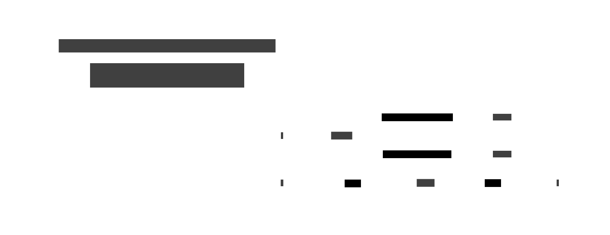

# Prism

A **Prism** is an optic that focuses on **one constructor of a sum type** (an enum / discriminated
union). Unlike a Lens, the focus is _partial_: a Prism can fail to match when the value is a
different constructor.



## Type

```text
Prism s a
-- s = the whole sum type ("source")
-- a = the value inside the matching constructor ("focus")

preview :: Prism s a -> s -> Maybe a   -- extract (partial get); Nothing if wrong constructor
review  :: Prism s a -> a -> s          -- construct: inject a into the sum type
over    :: Prism s a -> (a -> a) -> s -> s   -- modify only when the constructor matches

-- van Laarhoven / profunctor encoding (Haskell):
type Prism' s a = forall p f. (Choice p, Applicative f) => p a (f a) -> p s (f s)
-- Composition with (.) works identically to Lens:
-- _Just . _head  :: Prism' (Maybe [a]) a
```

## Laws

| Law           | Expression                               | Meaning                                                |
| ------------- | ---------------------------------------- | ------------------------------------------------------ |
| ReviewPreview | `preview p (review p a) = Just a`        | What you constructed, you can extract                  |
| PreviewReview | `preview p s = Just a => review p a = s` | If extraction succeeds, re-injection gives back `s`    |
| Idempotent    | `over p f (review p a) = review p (f a)` | Modifying the constructed value is the same as mapping |

## Key use cases

- Pattern-matching on one branch of a sum type in a composable way
- Safe downcasting (e.g. `_Circle :: Prism' Shape Double`)
- JSON path navigation where a field may hold different types
- Composing with Lens to reach inside a specific constructor's payload

## Motivation

Without a Prism, every function that needs to inspect or update one constructor of a sum type must
write the full `case`/`match` expression, even when only one branch matters. There is no reusable
handle to the branch.

```text
-- Without prism: full case expression every time
updateRadius shape =
    case shape of
        Circle r -> Circle (r * 2)
        _        -> shape   -- must handle every constructor

-- Every call site that wants to double a circle radius restates this pattern.
-- No reusable path; cannot compose with other optics.
```

```text
-- With prism: the path is a first-class value
_Circle :: Prism' Shape Double

over  _Circle (* 2) shape   -- double the radius; no-op for non-Circle
preview _Circle shape        -- Just r, or Nothing
review  _Circle 5.0          -- Circle 5.0

-- Compose with a Lens:
-- _Circle . radiusL :: Prism' Shape Double  (focus on radius inside Circle)
```


## Examples

### C\#

```csharp
// A Prism<S,A>: partial get (preview) + inject (review)
record Prism<S, A>(Func<S, A?> Preview, Func<A, S> Review)
    where A : class
{
    public S Over(Func<A, A> f, S s)
    {
        var a = Preview(s);
        return a is not null ? Review(f(a)) : s;
    }
}

abstract record Shape;
record Circle(double Radius) : Shape;
record Rect(double Width, double Height) : Shape;

var _circle = new Prism<Shape, Circle>(
    s => s as Circle,
    c => c);

Shape shape = new Circle(5.0);
var radius   = _circle.Preview(shape)?.Radius;                // 5.0
var doubled  = _circle.Over(c => c with { Radius = c.Radius * 2 }, shape);
// ((Circle)doubled).Radius == 10.0

var rect     = new Rect(3, 4);
var noMatch  = _circle.Preview(rect);                         // null
var unchanged = _circle.Over(c => c with { Radius = c.Radius * 2 }, rect);
// unchanged == rect (Rect is unchanged)
```

### F\#

```fsharp
type Prism<'s, 'a> = { Preview: 's -> 'a option; Review: 'a -> 's }

let over (p: Prism<'s,'a>) f s =
    match p.Preview s with
    | Some a -> p.Review (f a)
    | None   -> s

type Shape = Circle of double | Rect of double * double

let _circle : Prism<Shape, double> = {
    Preview = function Circle r -> Some r | _ -> None
    Review  = Circle
}

let shape   = Circle 5.0
let radius  = _circle.Preview shape                          // Some 5.0
let doubled = over _circle (fun r -> r * 2.0) shape         // Circle 10.0

let rect    = Rect(3.0, 4.0)
let noMatch = _circle.Preview rect                           // None
// over _circle ... rect  returns Rect(3.0, 4.0) unchanged

// Using Aether:
// open Aether
// let _circle_ = (function Circle r -> Some r | _ -> None), Circle
// Optic.get (Prism.ofPair _circle_) shape
```

### Ruby

```ruby
Prism = Struct.new(:preview, :review) do
  def over(f, s)
    a = preview.call(s)
    a ? review.call(f.call(a)) : s
  end
end

Circle = Struct.new(:radius)
Rect   = Struct.new(:width, :height)

_circle = Prism.new(
  ->(s) { s.is_a?(Circle) ? s : nil },
  ->(r) { r }
)

shape   = Circle.new(5.0)
radius  = _circle.preview.call(shape)&.radius   # 5.0
doubled = _circle.over(->(c) { Circle.new(c.radius * 2) }, shape)
# doubled.radius == 10.0

rect      = Rect.new(3, 4)
no_match  = _circle.preview.call(rect)           # nil
unchanged = _circle.over(->(c) { c }, rect)      # Rect unchanged
```

### C++

```cpp
#include <functional>
#include <optional>
#include <variant>

struct Circle { double radius; };
struct Rect   { double width, height; };
using Shape = std::variant<Circle, Rect>;

template <typename S, typename A>
struct Prism {
    std::function<std::optional<A>(const S&)> preview;
    std::function<S(A)> review;

    S over(std::function<A(A)> f, const S& s) const {
        auto a = preview(s);
        return a ? review(f(*a)) : s;
    }
};

Prism<Shape, Circle> _circle{
    [](const Shape& s) -> std::optional<Circle> {
        if (auto* c = std::get_if<Circle>(&s)) return *c;
        return std::nullopt;
    },
    [](Circle c) -> Shape { return c; }
};

Shape shape  = Circle{5.0};
auto radius  = _circle.preview(shape);                        // optional{Circle{5.0}}
auto doubled = _circle.over([](Circle c){ return Circle{c.radius * 2}; }, shape);
// std::get<Circle>(doubled).radius == 10.0

Shape rect      = Rect{3, 4};
auto noMatch    = _circle.preview(rect);                      // nullopt
auto unchanged  = _circle.over([](Circle c){ return c; }, rect);
// unchanged == Rect{3,4}
```

### JavaScript

```js
const Prism = (preview, review) => ({
  preview,
  review,
  over: (f, s) => {
    const a = preview(s);
    return a !== null ? review(f(a)) : s;
  },
});

// Shape as tagged objects
const circle = (radius) => ({ tag: "circle", radius });
const rect = (w, h) => ({ tag: "rect", width: w, height: h });

const _circle = Prism(
  (s) => (s.tag === "circle" ? s : null),
  (c) => c,
);

const shape = circle(5.0);
const radius = _circle.preview(shape)?.radius; // 5.0
const doubled = _circle.over((c) => circle(c.radius * 2), shape);
// doubled.radius === 10.0

const r = rect(3, 4);
const noMatch = _circle.preview(r); // null
const unchanged = _circle.over((c) => c, r); // rect unchanged
```

### Python

```python
from dataclasses import dataclass
from typing import Optional

@dataclass(frozen=True)
class Circle: radius: float
@dataclass(frozen=True)
class Rect:   width: float; height: float

Shape = Circle | Rect

class Prism:
    def __init__(self, preview, review):
        self._preview = preview
        self._review  = review

    def preview(self, s) -> Optional:
        return self._preview(s)

    def review(self, a):
        return self._review(a)

    def over(self, f, s):
        a = self.preview(s)
        return self.review(f(a)) if a is not None else s

_circle = Prism(
    lambda s: s if isinstance(s, Circle) else None,
    lambda c: c,
)

shape   = Circle(5.0)
radius  = _circle.preview(shape).radius if _circle.preview(shape) else None  # 5.0
doubled = _circle.over(lambda c: Circle(c.radius * 2), shape)
# doubled.radius == 10.0

rect      = Rect(3, 4)
no_match  = _circle.preview(rect)                             # None
unchanged = _circle.over(lambda c: c, rect)                   # Rect unchanged

# With the `lenses` package:
# from lenses import lens
# doubled = lens(shape).radius.set(shape.radius * 2)
```

### Haskell

```hs
import Control.Lens

data Shape = Circle Double | Rect Double Double deriving Show

-- Define a Prism with `prism'` (or derive with Template Haskell)
_Circle :: Prism' Shape Double
_Circle = prism' Circle (\case Circle r -> Just r; _ -> Nothing)

_Rect :: Prism' Shape (Double, Double)
_Rect = prism' (uncurry Rect) (\case Rect w h -> Just (w, h); _ -> Nothing)

shape :: Shape
shape = Circle 5.0

-- preview: partial extraction
radius :: Maybe Double
radius = preview _Circle shape          -- Just 5.0

noMatch :: Maybe Double
noMatch = preview _Circle (Rect 3 4)   -- Nothing

-- review: construction
s :: Shape
s = review _Circle 5.0                 -- Circle 5.0

-- over: modify only when constructor matches
doubled :: Shape
doubled = over _Circle (* 2) shape     -- Circle 10.0

unchanged :: Shape
unchanged = over _Circle (* 2) (Rect 3 4)  -- Rect 3.0 4.0

-- Compose Prism with Lens:
-- _Circle :: Prism' Shape Double
-- data Circle = CircleData { _radius :: Double }
-- makeLenses ''CircleData
-- (_Circle . radius) would focus on the radius inside a Circle
```

### Rust

```rust
// Rust: Prism as a pair of functions; enums + pattern matching are native.
// For the algebraic version, a Prism is most natural as a trait or helper struct.

#[derive(Debug, Clone, PartialEq)]
enum Shape {
    Circle(f64),
    Rect(f64, f64),
}

struct Prism<S, A> {
    preview: Box<dyn Fn(&S) -> Option<A>>,
    review:  Box<dyn Fn(A)  -> S>,
}

impl<S: Clone, A: Clone> Prism<S, A> {
    fn over(&self, f: impl Fn(A) -> A, s: S) -> S {
        match (self.preview)(&s) {
            Some(a) => (self.review)(f(a)),
            None    => s,
        }
    }
}

let circle_prism: Prism<Shape, f64> = Prism {
    preview: Box::new(|s| if let Shape::Circle(r) = s { Some(*r) } else { None }),
    review:  Box::new(|r| Shape::Circle(r)),
};

let shape   = Shape::Circle(5.0);
let radius  = (circle_prism.preview)(&shape);                  // Some(5.0)
let doubled = circle_prism.over(|r| r * 2.0, shape.clone());  // Shape::Circle(10.0)

let rect      = Shape::Rect(3.0, 4.0);
let no_match  = (circle_prism.preview)(&rect);                 // None
let unchanged = circle_prism.over(|r| r * 2.0, rect.clone()); // Shape::Rect(3.0, 4.0)

// For idiomatic Rust, direct match is often preferable:
// if let Shape::Circle(r) = shape { ... }
// The prism struct is useful when you need to pass the optic as a value.
```

### Go

```go
import "fmt"

type Shape interface{ shapeTag() }
type Circle struct{ Radius float64 }
type Rect   struct{ Width, Height float64 }

func (Circle) shapeTag() {}
func (Rect) shapeTag()   {}

// Prism[S,A]: partial extraction + injection
type Prism[S, A any] struct {
	Preview func(S) (A, bool)
	Review  func(A) S
}

func (p Prism[S, A]) Over(f func(A) A, s S) S {
	if a, ok := p.Preview(s); ok {
		return p.Review(f(a))
	}
	return s
}

circlePrism := Prism[Shape, Circle]{
	Preview: func(s Shape) (Circle, bool) {
		c, ok := s.(Circle)
		return c, ok
	},
	Review: func(c Circle) Shape { return c },
}

shape   := Shape(Circle{Radius: 5.0})
circle, ok := circlePrism.Preview(shape)
fmt.Println(circle.Radius, ok)                                 // 5 true

doubled := circlePrism.Over(func(c Circle) Circle {
	return Circle{c.Radius * 2}
}, shape)
fmt.Println(doubled)                                           // Circle{10}

rect      := Shape(Rect{3, 4})
_, noMatch := circlePrism.Preview(rect)                        // false
unchanged  := circlePrism.Over(func(c Circle) Circle { return c }, rect)
fmt.Println(unchanged)                                         // Rect{3 4}
```
