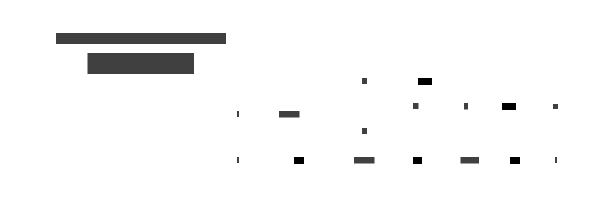

# Traversal

A **Traversal** is an optic that focuses on **zero or more targets** inside a structure. It
generalises both Lens (exactly one target) and Prism (zero or one target) by allowing any number of
foci.

A Traversal can _set_ or _modify_ all targets at once, and _fold_ over them — but it cannot `get` a
single value (there may be many, or none).



## Type

```text
Traversal s a
-- s = the container ("source")
-- a = the type of each focused element

-- Operations:
toListOf :: Traversal s a -> s -> [a]         -- collect all focused values
over     :: Traversal s a -> (a -> a) -> s -> s  -- modify all focused values
set      :: Traversal s a -> a -> s -> s       -- replace all focused values

-- van Laarhoven encoding (Haskell):
type Traversal' s a = forall f. Applicative f => (a -> f a) -> s -> f s
-- Choosing f = Identity    gives over/set.
-- Choosing f = Const [a]   gives toListOf.
-- Every Lens is also a valid Traversal (using the same encoding).
```

## Laws

| Law         | Expression                                        | Meaning                                               |
| ----------- | ------------------------------------------------- | ----------------------------------------------------- |
| Identity    | `over t id = id`                                  | Mapping identity changes nothing                      |
| Composition | `over t f . over t g = over t (f . g)`            | Two passes collapse into one                          |
| Naturality  | `f . toListOf t = toListOf t . over t f` (approx) | Collecting and then mapping = mapping then collecting |

## Key use cases

- Updating every element in a nested container (`traverse . traverse`)
- Focusing on all `Just` values in a `[Maybe a]`
- Modifying every leaf in a tree
- Composing Lens + Traversal to drill into a nested list field

## Motivation

Without a Traversal, updating every element in a nested structure requires manual recursion or
nested `map` calls written ad hoc at each call site. The traversal pattern and the transformation
are entangled.

```text
-- Without traversal: ad hoc double-nested map
doubled = map (map (*2)) [[1,2],[3,4]]
-- Works here, but cannot compose with a preceding Lens or follow a Prism.
-- Each combination requires a new bespoke function.
```

```text
-- With traversal: compose optics; traverse . traverse is a Traversal over every Int
-- traverse . traverse :: Traversal [[Int]] Int

doubled = over (traverse . traverse) (* 2) [[1,2],[3,4]]
-- [[2,4],[6,8]]

-- Or: reach into a record field first, then into the list inside it
-- orders . each . price :: Traversal Cart Double
-- over (orders . each . price) (* 1.1) cart  -- apply 10% markup to every price
```


## Examples

### C\#

```csharp
using System.Collections.Generic;
using System.Linq;

// A Traversal<S,A> for a list-bearing structure: over all elements.
// In C# without HKTs a Traversal is best represented as a LINQ pipeline.

record Order(string Item, double Price);
record Cart(IReadOnlyList<Order> Orders);

// "Traversal" via a functional helper that maps the focused field
Cart OverPrices(Cart cart, Func<double, double> f) =>
    cart with { Orders = cart.Orders.Select(o => o with { Price = f(o.Price) }).ToList() };

IEnumerable<double> GetPrices(Cart cart) =>
    cart.Orders.Select(o => o.Price);

var cart = new Cart(new[] {
    new Order("Book",   12.0),
    new Order("Pen",     2.5),
    new Order("Ruler",   3.0),
});

var prices  = GetPrices(cart).ToList();                        // [12.0, 2.5, 3.0]
var marked  = OverPrices(cart, p => Math.Round(p * 1.1, 2));  // 10% markup

// With LanguageExt or Mira optics libraries, Traversal is fully compositional.
```

### F\#

```fsharp
// F# Traversal: use List.map on a focused field, or compose with sequence/traverse.

type Order = { Item: string; Price: double }
type Cart  = { Orders: Order list }

// Manual traversal helpers for the 'price' field of each order
let overPrices f cart = { cart with Orders = cart.Orders |> List.map (fun o -> { o with Price = f o.Price }) }
let getPrices  cart   = cart.Orders |> List.map (fun o -> o.Price)

let cart = { Orders = [ { Item = "Book"; Price = 12.0 }
                         { Item = "Pen";  Price =  2.5 }
                         { Item = "Ruler";Price =  3.0 } ] }

let prices = getPrices cart                    // [12.0; 2.5; 3.0]
let marked = overPrices (fun p -> p * 1.1) cart

// Using Aether or FSharpPlus (Traversal with traverse):
// open FSharpPlus
// let prices2 = toList (traverse id cart.Orders |> List.map (fun o -> o.Price))

// Haskell-style traverse in F# via FSharpPlus:
// traverse (fun o -> { o with Price = o.Price * 1.1 }) cart.Orders
```

### Ruby

```ruby
# Ruby Traversal: functional helpers; Enumerable provides map/select for collection traversal.

Order = Struct.new(:item, :price)
Cart  = Struct.new(:orders)

def over_prices(cart, &f)
  Cart.new(cart.orders.map { |o| Order.new(o.item, f.call(o.price)) })
end

def get_prices(cart)
  cart.orders.map(&:price)
end

cart   = Cart.new([Order.new('Book', 12.0), Order.new('Pen', 2.5), Order.new('Ruler', 3.0)])
prices = get_prices(cart)                                    # [12.0, 2.5, 3.0]
marked = over_prices(cart) { |p| (p * 1.1).round(2) }

# Nested traversal:
nested = [[1, 2], [3, 4]]
doubled = nested.map { |row| row.map { |x| x * 2 } }
# [[2, 4], [6, 8]]
```

### C++

```cpp
#include <algorithm>
#include <vector>
#include <numeric>

struct Order { std::string item; double price; };
struct Cart  { std::vector<Order> orders; };

Cart overPrices(const Cart& cart, std::function<double(double)> f) {
    Cart result = cart;
    for (auto& o : result.orders) o.price = f(o.price);
    return result;
}

std::vector<double> getPrices(const Cart& cart) {
    std::vector<double> out;
    for (const auto& o : cart.orders) out.push_back(o.price);
    return out;
}

Cart cart{ { {"Book", 12.0}, {"Pen", 2.5}, {"Ruler", 3.0} } };
auto prices = getPrices(cart);                                 // {12.0, 2.5, 3.0}
auto marked = overPrices(cart, [](double p){ return p * 1.1; });

// Nested traversal:
std::vector<std::vector<int>> nested = {{1,2},{3,4}};
for (auto& row : nested)
    std::transform(row.begin(), row.end(), row.begin(), [](int x){ return x * 2; });
// {{2,4},{6,8}}
```

### JavaScript

```js
// Traversal as a higher-order helper that maps over focused elements.

const overPrices = (f, cart) => ({
  ...cart,
  orders: cart.orders.map((o) => ({ ...o, price: f(o.price) })),
});

const getPrices = (cart) => cart.orders.map((o) => o.price);

const cart = {
  orders: [
    { item: "Book", price: 12.0 },
    { item: "Pen", price: 2.5 },
    { item: "Ruler", price: 3.0 },
  ],
};

const prices = getPrices(cart); // [12.0, 2.5, 3.0]
const marked = overPrices((p) => +(p * 1.1).toFixed(2), cart);

// Nested traversal:
const nested = [
  [1, 2],
  [3, 4],
];
const doubled = nested.map((row) => row.map((x) => x * 2)); // [[2,4],[6,8]]

// With monocle-ts:
// import * as T from 'monocle-ts/Traversal'
// import * as L from 'monocle-ts/Lens'
// const prices = pipe(cartLens, L.prop('orders'), T.fromTraversable(A.Traversable), ...)
```

### Python

```python
from dataclasses import dataclass, replace
from typing import Callable, List

@dataclass(frozen=True)
class Order: item: str;  price: float
@dataclass(frozen=True)
class Cart:  orders: tuple  # tuple of Order (frozen)

def over_prices(f: Callable[[float], float], cart: Cart) -> Cart:
    return replace(cart, orders=tuple(replace(o, price=f(o.price)) for o in cart.orders))

def get_prices(cart: Cart) -> list:
    return [o.price for o in cart.orders]

cart   = Cart(orders=(Order("Book", 12.0), Order("Pen", 2.5), Order("Ruler", 3.0)))
prices = get_prices(cart)                                      # [12.0, 2.5, 3.0]
marked = over_prices(lambda p: round(p * 1.1, 2), cart)

# Nested traversal:
nested  = [[1, 2], [3, 4]]
doubled = [[x * 2 for x in row] for row in nested]
# [[2, 4], [6, 8]]

# With the `lenses` package:
# from lenses import lens
# doubled = lens(nested).each().each().modify(lambda x: x * 2)
```

### Haskell

```hs
import Control.Lens

data Order = Order { _item :: String, _price :: Double } deriving Show
data Cart  = Cart  { _orders :: [Order] }                deriving Show

makeLenses ''Order
makeLenses ''Cart

cart :: Cart
cart = Cart [ Order "Book" 12.0, Order "Pen" 2.5, Order "Ruler" 3.0 ]

-- Traverse all prices: orders . each . price :: Traversal' Cart Double
prices :: [Double]
prices = toListOf (orders . each . price) cart
-- [12.0, 2.5, 3.0]

marked :: Cart
marked = over (orders . each . price) (* 1.1) cart

-- Nested list traversal: traverse . traverse :: Traversal' [[a]] a
nested :: [[Int]]
nested = [[1,2],[3,4]]

doubled :: [[Int]]
doubled = over (traverse . traverse) (* 2) nested
-- [[2,4],[6,8]]

-- Traversal is a generalisation of Lens and Prism:
-- every Lens   is a valid Traversal (one target)
-- every Prism  is a valid Traversal (zero or one target)
-- traverse     is the canonical Traversal for any Traversable
```

### Rust

```rust
// Rust: Traversal via iter/map; there is no single trait for "optic traversal",
// but the pattern is expressible with closures and iterators.

#[derive(Debug, Clone)]
struct Order { item: String, price: f64 }
#[derive(Debug, Clone)]
struct Cart  { orders: Vec<Order> }

impl Cart {
    fn over_prices(mut self, f: impl Fn(f64) -> f64) -> Self {
        for o in &mut self.orders { o.price = f(o.price); }
        self
    }
    fn get_prices(&self) -> Vec<f64> {
        self.orders.iter().map(|o| o.price).collect()
    }
}

let cart = Cart { orders: vec![
    Order { item: "Book".into(),  price: 12.0 },
    Order { item: "Pen".into(),   price:  2.5 },
    Order { item: "Ruler".into(), price:  3.0 },
]};
let prices = cart.get_prices();                                // [12.0, 2.5, 3.0]
let marked = cart.clone().over_prices(|p| (p * 1.1 * 100.0).round() / 100.0);

// Nested vec traversal:
let nested: Vec<Vec<i32>> = vec![vec![1, 2], vec![3, 4]];
let doubled: Vec<Vec<i32>> = nested.iter()
    .map(|row| row.iter().map(|&x| x * 2).collect())
    .collect();
// [[2, 4], [6, 8]]
```

### Go

```go
import "fmt"

type Order struct{ Item string; Price float64 }
type Cart  struct{ Orders []Order }

func OverPrices(cart Cart, f func(float64) float64) Cart {
	out := Cart{Orders: make([]Order, len(cart.Orders))}
	for i, o := range cart.Orders {
		out.Orders[i] = Order{o.Item, f(o.Price)}
	}
	return out
}

func GetPrices(cart Cart) []float64 {
	prices := make([]float64, len(cart.Orders))
	for i, o := range cart.Orders {
		prices[i] = o.Price
	}
	return prices
}

cart := Cart{Orders: []Order{
	{"Book", 12.0}, {"Pen", 2.5}, {"Ruler", 3.0},
}}
prices := GetPrices(cart)                                      // [12 2.5 3]
marked := OverPrices(cart, func(p float64) float64 { return p * 1.1 })

// Nested traversal:
nested := [][]int{{1, 2}, {3, 4}}
doubled := make([][]int, len(nested))
for i, row := range nested {
	doubled[i] = make([]int, len(row))
	for j, x := range row {
		doubled[i][j] = x * 2
	}
}
fmt.Println(doubled) // [[2 4] [6 8]]
```
